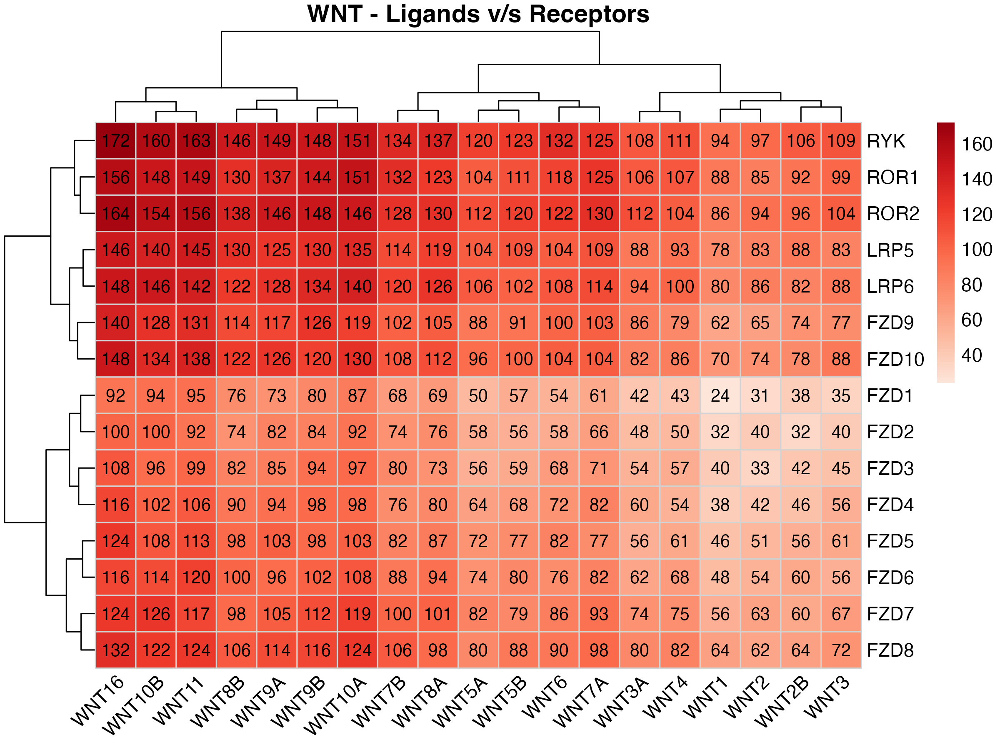

# PubMatrixR with Ligand Receptors


## Introduction

This vignette applies PubMatrixR to a real biology question: how do WNT
ligands and their receptors show up together in the literature? WNT
signaling touches cell fate, tissue patterning, and stem cell
maintenance, and the ligand-receptor pairings are not one-to-one. Some
ligands are studied constantly alongside certain receptors and barely
mentioned with others.

The example below compares 19 WNT ligands against 15 receptors (FZD1-10,
LRP5/6, ROR1/2, RYK), producing a 15x19 grid of PubMed co-occurrence
counts.

``` r

library(PubMatrixR)
library(knitr)
library(kableExtra)
library(dplyr)
library(pheatmap)
library(ggplot2)
```

``` r

A <- c(
  "WNT1", "WNT2", "WNT2B", "WNT3", "WNT3A", "WNT4", "WNT5A", "WNT5B",
  "WNT6", "WNT7A", "WNT7B", "WNT8A", "WNT8B", "WNT9A", "WNT9B",
  "WNT10A", "WNT10B", "WNT11", "WNT16"
)

B <- c(
  "FZD1", "FZD2", "FZD3", "FZD4", "FZD5", "FZD6", "FZD7",
  "FZD8", "FZD9", "FZD10", "LRP5", "LRP6", "ROR1", "ROR2", "RYK"
)
```

## Running the search

The live call below queries PubMed directly. A grid this size means 285
pairwise searches, so it can take a while. This vignette skips the live
call and uses a synthetic matrix instead, so the page builds without
depending on NCBI being reachable. Swap in your own gene lists and run
the live version for real numbers.

### NCBI API Key (Recommended)

For better performance and higher rate limits, we recommend obtaining an
NCBI API key:

- **Without API key**: 3 requests per second
- **With API key**: 10 requests per second

To obtain your free NCBI API key, visit:
<https://support.nlm.nih.gov/kbArticle/?pn=KA-05317>

Once you have your API key, pass it to
[`PubMatrix()`](https://toledoem.github.io/pubmatrixr/reference/PubMatrix.md)
like this:

``` r

result <- PubMatrix(
  A = A,
  B = B,
  API.key = "your_api_key_here",
  Database = "pubmed"
)
```

For live rendering, this vignette picks up the key from the
`NCBI_API_KEY` environment variable instead of hardcoding it, so no key
is stored in the file:

``` bash
NCBI_API_KEY=your_api_key_here PUBMATRIX_LIVE_VIGNETTE=true \
  Rscript -e 'pkgdown::build_site()'
```

``` r

current_year <- as.integer(format(Sys.Date(), "%Y"))
result <- PubMatrix(
  A = A,
  B = B,
  API.key = ncbi_api_key,
  Database = "pubmed",
  daterange = c(1990, current_year),
  outfile = "pubmatrix_result"
)
```

``` r

# Offline deterministic example used for vignette rendering/package checks.
result <- outer(seq_along(B), seq_along(A), function(i, j) {
  10 + (i * 5) + (j * 4) + ((i + j) %% 5) * 2 + ((i * j) %% 6)
})
result <- as.data.frame(result, check.names = FALSE)
colnames(result) <- A
rownames(result) <- B
```

## Which genes get the most attention

Before the pairwise grid, it’s worth checking which individual genes are
studied the most. The bar charts sum each gene’s row or column and color
it by its strongest partner on the other list, which shows which
receptor tends to dominate the literature for a given ligand, and the
reverse.

``` r

# Create data frame for List A genes (rows) colored by List B genes (columns)
a_genes_data <- data.frame(
  gene = rownames(result),
  total_pubs = rowSums(result),
  stringsAsFactors = FALSE
)

# Add color coding based on max overlap with B genes
a_genes_data$max_b_gene <- apply(result, 1, function(x) colnames(result)[which.max(x)])
a_genes_data$max_overlap <- apply(result, 1, max)

# Create data frame for List B genes (columns) colored by List A genes (rows)
b_genes_data <- data.frame(
  gene = colnames(result),
  total_pubs = colSums(result),
  stringsAsFactors = FALSE
)

# Add color coding based on max overlap with A genes
b_genes_data$max_a_gene <- apply(result, 2, function(x) rownames(result)[which.max(x)])
b_genes_data$max_overlap <- apply(result, 2, max)

# Plot A genes colored by their strongest B gene partner
p1 <- ggplot(a_genes_data, aes(x = reorder(gene, total_pubs), y = total_pubs, fill = max_b_gene)) +
  geom_bar(stat = "identity") +
  coord_flip() +
  labs(
    title = "List A Genes by Publication Count",
    subtitle = "Colored by strongest List B gene partner",
    x = "Genes (List A)",
    y = "Total Publications",
    fill = "Strongest B Partner"
  ) +
  theme_minimal() +
  theme(legend.position = "bottom") +
  scale_fill_viridis_d()


# Plot B genes colored by their strongest A gene partner
p2 <- ggplot(b_genes_data, aes(x = reorder(gene, total_pubs), y = total_pubs, fill = max_a_gene)) +
  geom_bar(stat = "identity") +
  coord_flip() +
  labs(
    title = "List B Genes by Publication Count",
    subtitle = "Colored by strongest List A gene partner",
    x = "Genes (List B)",
    y = "Total Publications",
    fill = "Strongest A Partner"
  ) +
  theme_minimal() +
  theme(legend.position = "bottom") +
  scale_fill_viridis_d()


print(p1)
```


``` r

print(p2)
```


## The full matrix

Raw PubMed publication counts for every ligand-receptor pair. Rows are
FZD/LRP/ROR/RYK receptors, columns are WNT ligands.

``` r

kable(result,
  caption = "Co-occurrence Matrix: WNT Genes (Publication Counts)",
  align = "c",
  format = if (knitr::pandoc_to() == "html") "html" else "markdown"
) %>%
  kableExtra::kable_styling(
    bootstrap_options = c("striped", "hover", "condensed"),
    full_width = FALSE,
    position = "center"
  ) %>%
  kableExtra::add_header_above(c(" " = 1, "Wnt Genes" = length(A)))
```

[TABLE]

Co-occurrence Matrix: WNT Genes (Publication Counts) {.table .table
.table-striped .table-hover .table-condensed
style="width: auto !important; margin-left: auto; margin-right: auto;"}

## Heatmaps

A 15x19 table of numbers is hard to scan, so the heatmap below shows the
same data with color instead. `show_numbers = TRUE` keeps the counts
visible in each cell for reference.

``` r

plot_pubmatrix_heatmap(
  matrix = result,
  title = "WNT - Ligands v/s Receptors",
  show_numbers = TRUE
)
```



Dropping the numbers makes the overall pattern easier to read at a
glance, which is useful when the shape of the relationship matters more
than exact counts.

``` r

pubmatrix_heatmap(matrix = result)
```


## System Information

``` r

sessionInfo()
```

    ## R version 4.6.0 (2026-04-24)
    ## Platform: aarch64-apple-darwin23
    ## Running under: macOS Tahoe 26.5.1
    ## 
    ## Matrix products: default
    ## BLAS:   /Library/Frameworks/R.framework/Versions/4.6/Resources/lib/libRblas.0.dylib 
    ## LAPACK: /Library/Frameworks/R.framework/Versions/4.6/Resources/lib/libRlapack.dylib;  LAPACK version 3.12.1
    ## 
    ## locale:
    ## [1] C.UTF-8/C.UTF-8/C.UTF-8/C/C.UTF-8/C.UTF-8
    ## 
    ## time zone: Europe/London
    ## tzcode source: internal
    ## 
    ## attached base packages:
    ## [1] stats     graphics  grDevices utils     datasets  methods   base     
    ## 
    ## other attached packages:
    ## [1] ggplot2_4.0.3    pheatmap_1.0.13  dplyr_1.2.1      kableExtra_1.4.0
    ## [5] knitr_1.51       PubMatrixR_1.0.0
    ## 
    ## loaded via a namespace (and not attached):
    ##  [1] sass_0.4.10        generics_0.1.4     xml2_1.6.0         stringi_1.8.7     
    ##  [5] digest_0.6.39      magrittr_2.0.5     evaluate_1.0.5     grid_4.6.0        
    ##  [9] RColorBrewer_1.1-3 fastmap_1.2.0      jsonlite_2.0.0     viridisLite_0.4.3 
    ## [13] scales_1.4.0       pbapply_1.7-4      textshaping_1.0.5  jquerylib_0.1.4   
    ## [17] cli_3.6.6          rlang_1.2.0        withr_3.0.3        cachem_1.1.0      
    ## [21] yaml_2.3.12        otel_0.2.0         tools_4.6.0        parallel_4.6.0    
    ## [25] readODS_2.3.5      curl_7.1.0         vctrs_0.7.3        R6_2.6.1          
    ## [29] lifecycle_1.0.5    stringr_1.6.0      fs_2.1.0           htmlwidgets_1.6.4 
    ## [33] ragg_1.5.2         pkgconfig_2.0.3    desc_1.4.3         pkgdown_2.2.0     
    ## [37] bslib_0.11.0       pillar_1.11.1      gtable_0.3.6       glue_1.8.1        
    ## [41] systemfonts_1.3.2  xfun_0.59          tibble_3.3.1       tidyselect_1.2.1  
    ## [45] rstudioapi_0.19.0  farver_2.1.2       htmltools_0.5.9    labeling_0.4.3    
    ## [49] rmarkdown_2.31     svglite_2.2.2      compiler_4.6.0     S7_0.2.2
