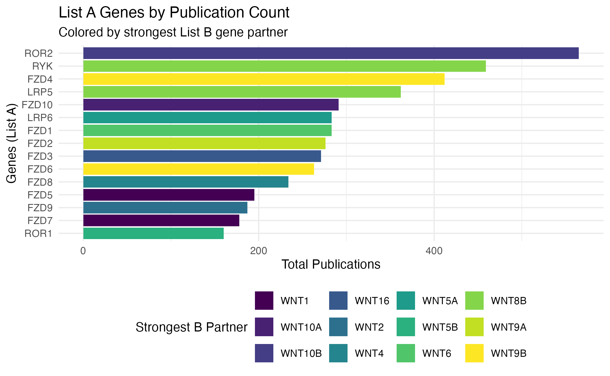
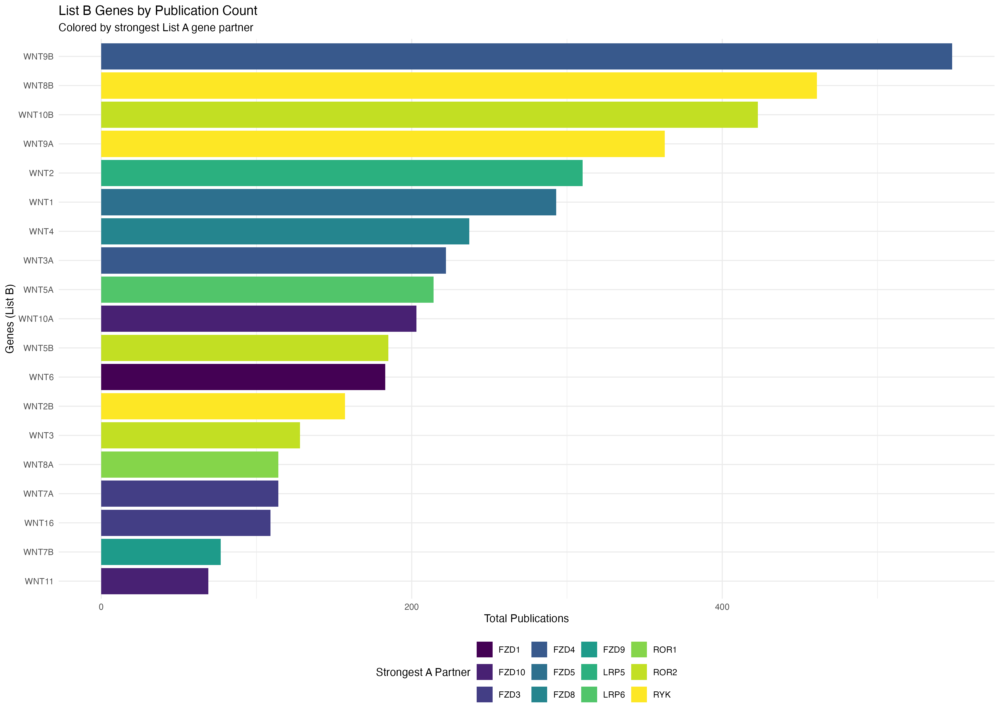
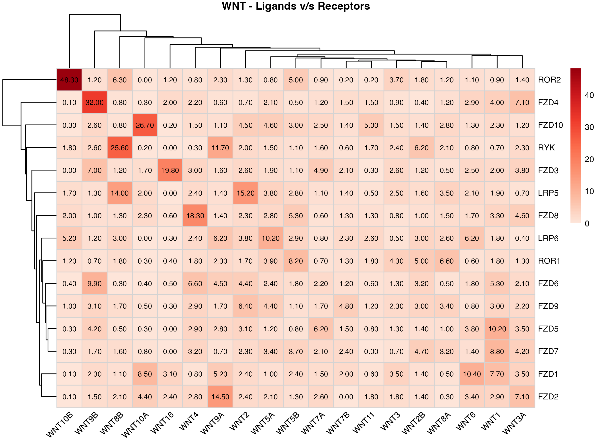
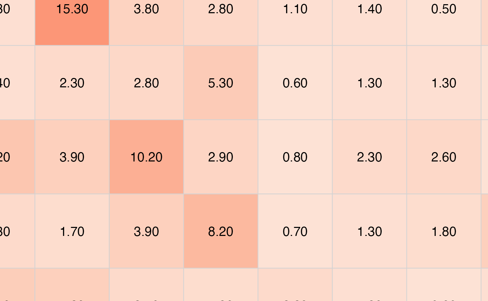

# PubMatrixR with Ligand Receptors

``` r

library(PubMatrixR)
library(knitr)
library(kableExtra)
#library(msigdf)
library(dplyr)
```

    ## 
    ## Attaching package: 'dplyr'

    ## The following object is masked from 'package:kableExtra':
    ## 
    ##     group_rows

    ## The following objects are masked from 'package:stats':
    ## 
    ##     filter, lag

    ## The following objects are masked from 'package:base':
    ## 
    ##     intersect, setdiff, setequal, union

``` r

library(pheatmap)
library(ggplot2)
```

``` r

A <- c("WNT1", "WNT2", "WNT2B", "WNT3", "WNT3A", "WNT4", "WNT5A", "WNT5B", 
       "WNT6", "WNT7A", "WNT7B", "WNT8A", "WNT8B", "WNT9A", "WNT9B", 
       "WNT10A", "WNT10B", "WNT11", "WNT16")

B <- c("FZD1", "FZD2", "FZD3", "FZD4", "FZD5", "FZD6", "FZD7", 
       "FZD8", "FZD9", "FZD10", "LRP5", "LRP6", "ROR1", "ROR2", "RYK")


current_year <- format(Sys.Date(), "%Y")
result <- PubMatrix(A = A,
                    B = B,
                    Database = "pubmed",
                    daterange = c(1990, current_year),
                    outfile = "pubmatrix_result")
```

    ## [1] "https://eutils.ncbi.nlm.nih.gov/entrez/eutils/esearch.fcgi?db=pubmed&datetype=pdat&mindate=1990&maxdate=2025"
    ## [1] "<b><a href=\"https://www.ncbi.nlm.nih.gov/pubmed/?term=1990:2025[DP]+AND+"

``` r

# Create data frame for List A genes (rows) colored by List B genes (columns)
a_genes_data <- data.frame(
  gene = rownames(result),
  total_pubs = rowSums(result),
  stringsAsFactors = FALSE
)

# Add color coding based on max overlap with B genes
a_genes_data$max_b_gene <- apply(result, 1, function(x) colnames(result)[which.max(x)])
a_genes_data$max_overlap <- apply(result, 1, max)

# Create data frame for List B genes (columns) colored by List A genes (rows)  
b_genes_data <- data.frame(
  gene = colnames(result),
  total_pubs = colSums(result),
  stringsAsFactors = FALSE
)

# Add color coding based on max overlap with A genes
b_genes_data$max_a_gene <- apply(result, 2, function(x) rownames(result)[which.max(x)])
b_genes_data$max_overlap <- apply(result, 2, max)

# Plot A genes colored by their strongest B gene partner
p1 <- ggplot(a_genes_data, aes(x = reorder(gene, total_pubs), y = total_pubs, fill = max_b_gene)) +
  geom_bar(stat = "identity")+
  coord_flip() +
  labs(title = "List A Genes by Publication Count",
       subtitle = "Colored by strongest List B gene partner",
       x = "Genes (List A)", 
       y = "Total Publications",
       fill = "Strongest B Partner") +
  theme_minimal() +
  theme(legend.position = "bottom") +
  scale_fill_viridis_d()


# Plot B genes colored by their strongest A gene partner  
p2 <- ggplot(b_genes_data, aes(x = reorder(gene, total_pubs), y = total_pubs, fill = max_a_gene)) +
  geom_bar(stat = "identity") +
  coord_flip() +
  labs(title = "List B Genes by Publication Count", 
       subtitle = "Colored by strongest List A gene partner",
       x = "Genes (List B)",
       y = "Total Publications", 
       fill = "Strongest A Partner")+
  theme_minimal() +
  theme(legend.position = "bottom") +
  scale_fill_viridis_d()


print(p1)
```



``` r

print(p2)
```



``` r

kable(result, 
        caption = "Co-occurrence Matrix: WNT Genes (Publication Counts)",
        align = "c",
        format = "html") %>%
    kableExtra::kable_styling(bootstrap_options = c("striped", "hover", "condensed"),
                             full_width = FALSE,
                             position = "center") %>%
    kableExtra::add_header_above(c(" " = 1, "Wnt Genes" = length(A)))
```

[TABLE]

Co-occurrence Matrix: WNT Genes (Publication Counts) {.table .table
.table-striped .table-hover .table-condensed
style="width: auto !important; margin-left: auto; margin-right: auto;"}

``` r

plot_pubmatrix_heatmap(matrix = result, 
                       title = "WNT - Ligands v/s Receptors",
                       show_numbers = TRUE)
```



``` r

pubmatrix_heatmap(matrix = result)
```

 \## System
Information

``` r

sessionInfo()
```

    ## R version 4.5.1 (2025-06-13)
    ## Platform: aarch64-apple-darwin20
    ## Running under: macOS Tahoe 26.1
    ## 
    ## Matrix products: default
    ## BLAS:   /Library/Frameworks/R.framework/Versions/4.5-arm64/Resources/lib/libRblas.0.dylib 
    ## LAPACK: /Library/Frameworks/R.framework/Versions/4.5-arm64/Resources/lib/libRlapack.dylib;  LAPACK version 3.12.1
    ## 
    ## locale:
    ## [1] C.UTF-8/C.UTF-8/C.UTF-8/C/C.UTF-8/C.UTF-8
    ## 
    ## time zone: Europe/London
    ## tzcode source: internal
    ## 
    ## attached base packages:
    ## [1] stats     graphics  grDevices utils     datasets  methods   base     
    ## 
    ## other attached packages:
    ## [1] ggplot2_4.0.0    pheatmap_1.0.13  dplyr_1.1.4      kableExtra_1.4.0
    ## [5] knitr_1.50       PubMatrixR_2.0  
    ## 
    ## loaded via a namespace (and not attached):
    ##  [1] sass_0.4.10        generics_0.1.4     xml2_1.4.1         stringi_1.8.7     
    ##  [5] digest_0.6.37      magrittr_2.0.4     evaluate_1.0.5     grid_4.5.1        
    ##  [9] RColorBrewer_1.1-3 fastmap_1.2.0      jsonlite_2.0.0     viridisLite_0.4.2 
    ## [13] scales_1.4.0       pbapply_1.7-4      textshaping_1.0.4  jquerylib_0.1.4   
    ## [17] cli_3.6.5          rlang_1.1.6        withr_3.0.2        cachem_1.1.0      
    ## [21] yaml_2.3.10        tools_4.5.1        parallel_4.5.1     curl_7.0.0        
    ## [25] vctrs_0.6.5        R6_2.6.1           lifecycle_1.0.4    stringr_1.6.0     
    ## [29] fs_1.6.6           htmlwidgets_1.6.4  ragg_1.5.0         pkgconfig_2.0.3   
    ## [33] desc_1.4.3         pkgdown_2.2.0      pillar_1.11.1      bslib_0.9.0       
    ## [37] gtable_0.3.6       glue_1.8.0         systemfonts_1.3.1  xfun_0.54         
    ## [41] tibble_3.3.0       tidyselect_1.2.1   rstudioapi_0.17.1  farver_2.1.2      
    ## [45] htmltools_0.5.8.1  rmarkdown_2.30     svglite_2.2.2      labeling_0.4.3    
    ## [49] compiler_4.5.1     S7_0.2.0

``` r

# Additional system details
cat("Date generated:", format(Sys.time(), "%Y-%m-%d %H:%M:%S %Z"), "\n")
```

    ## Date generated: 2025-11-15 10:14:02 GMT

``` r

cat("R version:", R.version.string, "\n")
```

    ## R version: R version 4.5.1 (2025-06-13)

``` r

cat("Platform:", R.version$platform, "\n")
```

    ## Platform: aarch64-apple-darwin20

``` r

cat("Operating System:", Sys.info()["sysname"], Sys.info()["release"], "\n")
```

    ## Operating System: Darwin 25.1.0
