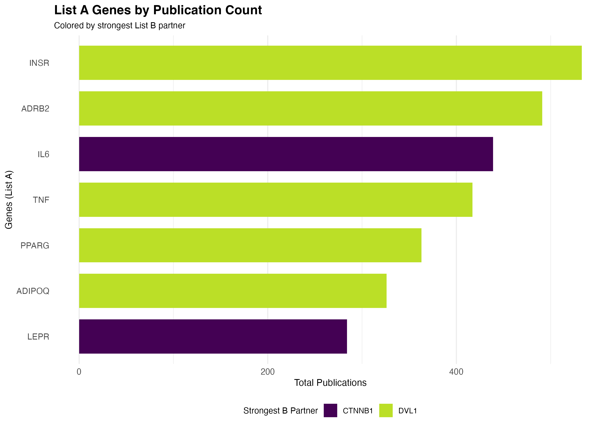
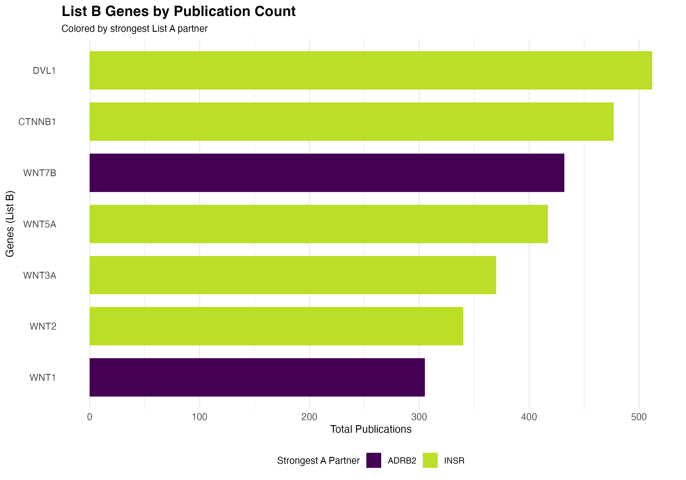
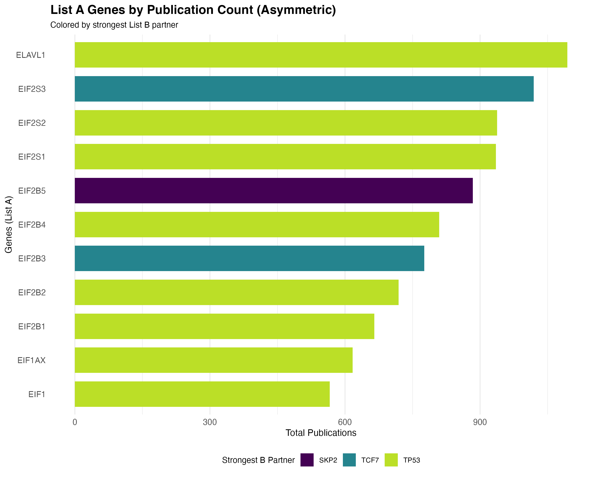
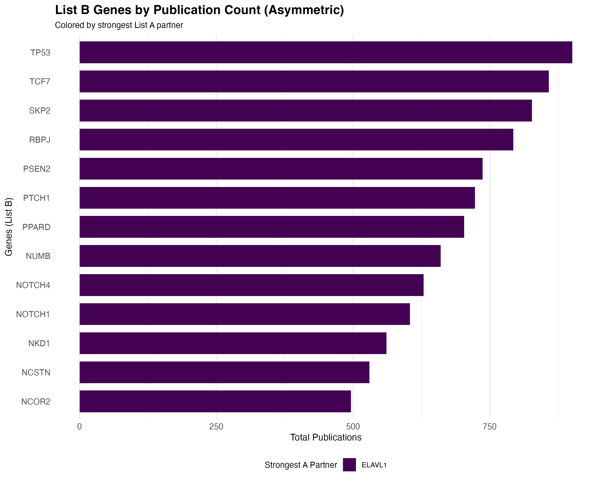

# PubMatrixR: Literature Co-occurrence Analysis

[`library`](https://rdrr.io/r/base/library.html)`(`[`PubMatrixR`](https://github.com/ToledoEM/PubMatrixR-v2)`)`` `[`library`](https://rdrr.io/r/base/library.html)`(`[`knitr`](https://yihui.org/knitr/)`)`` `[`library`](https://rdrr.io/r/base/library.html)`(`[`kableExtra`](https://haozhu233.github.io/kableExtra/)`)`` `[`library`](https://rdrr.io/r/base/library.html)`(`[`dplyr`](https://dplyr.tidyverse.org)`)`` `[`library`](https://rdrr.io/r/base/library.html)`(``pheatmap``)`` `[`library`](https://rdrr.io/r/base/library.html)`(`[`ggplot2`](https://ggplot2.tidyverse.org)`)`

## Introduction

PubMatrixR is an R package designed to analyze literature co-occurrence
patterns by systematically searching PubMed and PMC databases. This
vignette demonstrates how to:

- Create co-occurrence matrices from literature searches
- Visualize results using custom heatmaps with overlap percentage
  clustering
- Work with gene sets from MSigDB
- Create bar plots showing publication patterns by gene
- Export results for further analysis

### Acknowledgments

This package is a heavy fork of the original
[PubMatrixR](https://github.com/tslaird/PubMatrixR) by tslaird. Our
gratitude to the original author.

### NCBI API Key (Recommended)

For better performance and higher rate limits, we recommend obtaining an
NCBI API key:

- **Without API key**: 3 requests per second
- **With API key**: 10 requests per second

To obtain your free NCBI API key, visit:
<https://support.nlm.nih.gov/kbArticle/?pn=KA-05317>

Once you have your API key, you can use it in PubMatrixR like this:

`result`` ``<-`` `[`PubMatrix`](https://toledoem.github.io/pubmatrixr/reference/PubMatrix.md)`(`` `` A ``=`` ``gene_set_1``,`` `` B ``=`` ``gene_set_2``,`` `` API.key ``=`` ``"your_api_key_here"``,`` `` Database ``=`` ``"pubmed"`` ``)`

## Preparing Gene Sets

### Making the gene lists from MSigDB

For this example, we’ll extract genes related to WNT signaling and
obesity from the MSigDB database:

`msigdf` is optional and not required to build this vignette. The
example below is shown for reference only and is not executed during
package checks.

`# Extract WNT-related genes`` ``A`` ``<-`` ``msigdf``::`[`msigdf.human`](https://toledoem.github.io/msigdf/reference/msigdf.human.html)` `[`%>%`](https://magrittr.tidyverse.org/reference/pipe.html)` `` ``dplyr``::`[`filter`](https://dplyr.tidyverse.org/reference/filter.html)`(`[`grepl`](https://rdrr.io/r/base/grep.html)`(``geneset``, pattern ``=`` ``"wnt"``, ignore.case ``=`` ``TRUE``)``)`` `[`%>%`](https://magrittr.tidyverse.org/reference/pipe.html)` `` ``dplyr``::`[`pull`](https://dplyr.tidyverse.org/reference/pull.html)`(``symbol``)`` `[`%>%`](https://magrittr.tidyverse.org/reference/pipe.html)` `` `[`unique`](https://rdrr.io/r/base/unique.html)`(``)`` `` ``# Extract obesity-related genes`` ``B`` ``<-`` ``msigdf``::`[`msigdf.human`](https://toledoem.github.io/msigdf/reference/msigdf.human.html)` `[`%>%`](https://magrittr.tidyverse.org/reference/pipe.html)` `` ``dplyr``::`[`filter`](https://dplyr.tidyverse.org/reference/filter.html)`(`[`grepl`](https://rdrr.io/r/base/grep.html)`(``geneset``, pattern ``=`` ``"obesity"``, ignore.case ``=`` ``TRUE``)``)`` `[`%>%`](https://magrittr.tidyverse.org/reference/pipe.html)` `` ``dplyr``::`[`pull`](https://dplyr.tidyverse.org/reference/pull.html)`(``symbol``)`` `[`%>%`](https://magrittr.tidyverse.org/reference/pipe.html)` `` `[`unique`](https://rdrr.io/r/base/unique.html)`(``)`` `` ``# Sample genes for demonstration (making them equal in length)`` ``A`` ``<-`` `[`sample`](https://rdrr.io/r/base/sample.html)`(``A``, ``10``, replace ``=`` ``FALSE``)`` ``B`` ``<-`` `[`sample`](https://rdrr.io/r/base/sample.html)`(``B``, ``10``, replace ``=`` ``FALSE``)`

### Fallback Example Dataset

When MSigDB is not available, we use these representative gene sets:

`# WNT signaling pathway genes`` ``A`` ``<-`` `[`c`](https://rdrr.io/r/base/c.html)`(``"WNT1"``, ``"WNT2"``, ``"WNT3A"``, ``"WNT5A"``, ``"WNT7B"``, ``"CTNNB1"``, ``"DVL1"``)`` `` ``# Obesity-related genes`` ``B`` ``<-`` `[`c`](https://rdrr.io/r/base/c.html)`(``"LEPR"``, ``"ADIPOQ"``, ``"PPARG"``, ``"TNF"``, ``"IL6"``, ``"ADRB2"``, ``"INSR"``)`

## Literature Analysis

### Running PubMatrixR

Now we’ll search for co-occurrences between our gene sets in PubMed
literature:

`# Run actual PubMatrix analysis`` ``current_year`` ``<-`` `[`as.integer`](https://rdrr.io/r/base/integer.html)`(`[`format`](https://rdrr.io/r/base/format.html)`(`[`Sys.Date`](https://rdrr.io/r/base/Sys.time.html)`(``)``, ``"%Y"``)``)`` ``result`` ``<-`` `[`PubMatrix`](https://toledoem.github.io/pubmatrixr/reference/PubMatrix.md)`(`` `` A ``=`` ``A``,`` `` B ``=`` ``B``,`` `` Database ``=`` ``"pubmed"``,`` `` daterange ``=`` `[`c`](https://rdrr.io/r/base/c.html)`(``2020``, ``current_year``)``,`` `` outfile ``=`` ``"pubmatrix_result"`` ``)`

`# Offline deterministic example used for vignette rendering/package checks.`` ``result`` ``<-`` `[`outer`](https://rdrr.io/r/base/outer.html)`(`[`seq_along`](https://rdrr.io/r/base/seq.html)`(``B``)``, `[`seq_along`](https://rdrr.io/r/base/seq.html)`(``A``)``, ``function``(``i``, ``j``)`` ``{`` `` ``8`` ``+`` ``(``i`` ``*`` ``6``)`` ``+`` ``(``j`` ``*`` ``5``)`` ``+`` ``(``(``i`` ``+`` ``j``)`` `[`%%`](https://rdrr.io/r/base/Arithmetic.html)` ``4``)`` ``*`` ``3`` ``+`` ``(``(``i`` ``*`` ``j``)`` `[`%%`](https://rdrr.io/r/base/Arithmetic.html)` ``5``)`` ``}``)`` ``result`` ``<-`` `[`as.data.frame`](https://rdrr.io/r/base/as.data.frame.html)`(``result``, check.names ``=`` ``FALSE``)`` `[`colnames`](https://rdrr.io/r/base/colnames.html)`(``result``)`` ``<-`` ``A`` `[`rownames`](https://rdrr.io/r/base/colnames.html)`(``result``)`` ``<-`` ``B`

### Results Table

The co-occurrence matrix shows the number of publications mentioning
each pair of genes:

[`kable`](https://rdrr.io/pkg/knitr/man/kable.html)`(``result``,`` `` caption ``=`` ``"Co-occurrence Matrix: WNT Genes vs Obesity Genes (Publication Counts)"``,`` `` align ``=`` ``"c"``,`` `` format ``=`` ``if`` ``(``knitr``::`[`pandoc_to`](https://rdrr.io/pkg/knitr/man/output_type.html)`(``)`` ``==`` ``"html"``)`` ``"html"`` ``else`` ``"markdown"`` ``)`` `[`%>%`](https://magrittr.tidyverse.org/reference/pipe.html)` `` ``kableExtra``::`[`kable_styling`](https://rdrr.io/pkg/kableExtra/man/kable_styling.html)`(`` `` bootstrap_options ``=`` `[`c`](https://rdrr.io/r/base/c.html)`(``"striped"``, ``"hover"``, ``"condensed"``)``,`` `` full_width ``=`` ``FALSE``,`` `` position ``=`` ``"center"`` `` ``)`` `[`%>%`](https://magrittr.tidyverse.org/reference/pipe.html)` `` ``kableExtra``::`[`add_header_above`](https://rdrr.io/pkg/kableExtra/man/add_header_above.html)`(`[`c`](https://rdrr.io/r/base/c.html)`(``" "`` ``=`` ``1``, ``"Obesity Genes"`` ``=`` `[`length`](https://rdrr.io/r/base/length.html)`(``B``)``)``)`

[TABLE]

Co-occurrence Matrix: WNT Genes vs Obesity Genes (Publication Counts)
{.table .table .table-striped .table-hover .table-condensed
style="width: auto !important; margin-left: auto; margin-right: auto;"}

## Visualization

### Publication Count Bar Plots

Let’s first examine which genes have the highest publication counts:

`# Create data frame for List A genes (rows) colored by List B genes (columns)`` ``a_genes_data`` ``<-`` `[`data.frame`](https://rdrr.io/r/base/data.frame.html)`(`` `` gene ``=`` `[`rownames`](https://rdrr.io/r/base/colnames.html)`(``result``)``,`` `` total_pubs ``=`` `[`rowSums`](https://rdrr.io/r/base/colSums.html)`(``result``)``,`` `` stringsAsFactors ``=`` ``FALSE`` ``)`` `` ``# Add color coding based on max overlap with B genes`` ``a_genes_data``$``max_b_gene`` ``<-`` `[`apply`](https://rdrr.io/r/base/apply.html)`(``result``, ``1``, ``function``(``x``)`` `[`colnames`](https://rdrr.io/r/base/colnames.html)`(``result``)``[`[`which.max`](https://rdrr.io/r/base/which.min.html)`(``x``)``]``)`` ``a_genes_data``$``max_overlap`` ``<-`` `[`apply`](https://rdrr.io/r/base/apply.html)`(``result``, ``1``, ``max``)`` `` ``# Create data frame for List B genes (columns) colored by List A genes (rows)`` ``b_genes_data`` ``<-`` `[`data.frame`](https://rdrr.io/r/base/data.frame.html)`(`` `` gene ``=`` `[`colnames`](https://rdrr.io/r/base/colnames.html)`(``result``)``,`` `` total_pubs ``=`` `[`colSums`](https://rdrr.io/r/base/colSums.html)`(``result``)``,`` `` stringsAsFactors ``=`` ``FALSE`` ``)`` `` ``# Add color coding based on max overlap with A genes`` ``b_genes_data``$``max_a_gene`` ``<-`` `[`apply`](https://rdrr.io/r/base/apply.html)`(``result``, ``2``, ``function``(``x``)`` `[`rownames`](https://rdrr.io/r/base/colnames.html)`(``result``)``[`[`which.max`](https://rdrr.io/r/base/which.min.html)`(``x``)``]``)`` ``b_genes_data``$``max_overlap`` ``<-`` `[`apply`](https://rdrr.io/r/base/apply.html)`(``result``, ``2``, ``max``)`` `` ``bar_plot_theme`` ``<-`` `[`theme_minimal`](https://ggplot2.tidyverse.org/reference/ggtheme.html)`(``base_size ``=`` ``12``)`` ``+`` `` `[`theme`](https://ggplot2.tidyverse.org/reference/theme.html)`(`` `` plot.title ``=`` `[`element_text`](https://ggplot2.tidyverse.org/reference/element.html)`(``face ``=`` ``"bold"``, size ``=`` ``15``)``,`` `` plot.subtitle ``=`` `[`element_text`](https://ggplot2.tidyverse.org/reference/element.html)`(``size ``=`` ``10``)``,`` `` axis.title ``=`` `[`element_text`](https://ggplot2.tidyverse.org/reference/element.html)`(``size ``=`` ``11``)``,`` `` axis.text ``=`` `[`element_text`](https://ggplot2.tidyverse.org/reference/element.html)`(``size ``=`` ``10``)``,`` `` panel.grid.major.y ``=`` `[`element_blank`](https://ggplot2.tidyverse.org/reference/element.html)`(``)``,`` `` legend.position ``=`` ``"bottom"``,`` `` legend.title ``=`` `[`element_text`](https://ggplot2.tidyverse.org/reference/element.html)`(``size ``=`` ``10``)``,`` `` legend.text ``=`` `[`element_text`](https://ggplot2.tidyverse.org/reference/element.html)`(``size ``=`` ``9``)``,`` `` legend.box ``=`` ``"vertical"`` `` ``)`` `` ``n_fill_a`` ``<-`` `[`length`](https://rdrr.io/r/base/length.html)`(`[`unique`](https://rdrr.io/r/base/unique.html)`(``a_genes_data``$``max_b_gene``)``)`` ``n_fill_b`` ``<-`` `[`length`](https://rdrr.io/r/base/length.html)`(`[`unique`](https://rdrr.io/r/base/unique.html)`(``b_genes_data``$``max_a_gene``)``)`` `` ``# Plot A genes colored by their strongest B gene partner`` ``p1`` ``<-`` `[`ggplot`](https://ggplot2.tidyverse.org/reference/ggplot.html)`(``a_genes_data``, `[`aes`](https://ggplot2.tidyverse.org/reference/aes.html)`(``x ``=`` `[`reorder`](https://rdrr.io/r/stats/reorder.factor.html)`(``gene``, ``total_pubs``)``, y ``=`` ``total_pubs``, fill ``=`` ``max_b_gene``)``)`` ``+`` `` `[`geom_col`](https://ggplot2.tidyverse.org/reference/geom_bar.html)`(``width ``=`` ``0.75``)`` ``+`` `` `[`coord_flip`](https://ggplot2.tidyverse.org/reference/coord_flip.html)`(``)`` ``+`` `` `[`labs`](https://ggplot2.tidyverse.org/reference/labs.html)`(`` `` title ``=`` ``"List A Genes by Publication Count"``,`` `` subtitle ``=`` ``"Colored by strongest List B partner"``,`` `` x ``=`` ``"Genes (List A)"``,`` `` y ``=`` ``"Total Publications"``,`` `` fill ``=`` ``"Strongest B Partner"`` `` ``)`` ``+`` `` `[`scale_fill_viridis_d`](https://ggplot2.tidyverse.org/reference/scale_viridis.html)`(``option ``=`` ``"D"``, end ``=`` ``0.9``)`` ``+`` `` `[`guides`](https://ggplot2.tidyverse.org/reference/guides.html)`(``fill ``=`` `[`guide_legend`](https://ggplot2.tidyverse.org/reference/guide_legend.html)`(``nrow ``=`` `[`max`](https://rdrr.io/r/base/Extremes.html)`(``1``, `[`ceiling`](https://rdrr.io/r/base/Round.html)`(``n_fill_a`` ``/`` ``4``)``)``, byrow ``=`` ``TRUE``)``)`` ``+`` `` ``bar_plot_theme`` `` `` ``# Plot B genes colored by their strongest A gene partner`` ``p2`` ``<-`` `[`ggplot`](https://ggplot2.tidyverse.org/reference/ggplot.html)`(``b_genes_data``, `[`aes`](https://ggplot2.tidyverse.org/reference/aes.html)`(``x ``=`` `[`reorder`](https://rdrr.io/r/stats/reorder.factor.html)`(``gene``, ``total_pubs``)``, y ``=`` ``total_pubs``, fill ``=`` ``max_a_gene``)``)`` ``+`` `` `[`geom_col`](https://ggplot2.tidyverse.org/reference/geom_bar.html)`(``width ``=`` ``0.75``)`` ``+`` `` `[`coord_flip`](https://ggplot2.tidyverse.org/reference/coord_flip.html)`(``)`` ``+`` `` `[`labs`](https://ggplot2.tidyverse.org/reference/labs.html)`(`` `` title ``=`` ``"List B Genes by Publication Count"``,`` `` subtitle ``=`` ``"Colored by strongest List A partner"``,`` `` x ``=`` ``"Genes (List B)"``,`` `` y ``=`` ``"Total Publications"``,`` `` fill ``=`` ``"Strongest A Partner"`` `` ``)`` ``+`` `` `[`scale_fill_viridis_d`](https://ggplot2.tidyverse.org/reference/scale_viridis.html)`(``option ``=`` ``"D"``, end ``=`` ``0.9``)`` ``+`` `` `[`guides`](https://ggplot2.tidyverse.org/reference/guides.html)`(``fill ``=`` `[`guide_legend`](https://ggplot2.tidyverse.org/reference/guide_legend.html)`(``nrow ``=`` `[`max`](https://rdrr.io/r/base/Extremes.html)`(``1``, `[`ceiling`](https://rdrr.io/r/base/Round.html)`(``n_fill_b`` ``/`` ``4``)``)``, byrow ``=`` ``TRUE``)``)`` ``+`` `` ``bar_plot_theme`` `` `` `[`print`](https://rdrr.io/r/base/print.html)`(``p1``)`

[`print`](https://rdrr.io/r/base/print.html)`(``p2``)`

### Heatmap with Overlap Percentages

The heatmap displays overlap percentages calculated from the publication
co-occurrence counts:

[`plot_pubmatrix_heatmap`](https://toledoem.github.io/pubmatrixr/reference/plot_pubmatrix_heatmap.md)`(``result``,`` `` title ``=`` ``"WNT-Obesity Overlap (%)"``,`` `` show_numbers ``=`` ``TRUE``,`` `` cellwidth ``=`` ``44``,`` `` cellheight ``=`` ``32``,`` `` width ``=`` ``12``,`` `` height ``=`` ``10`` ``)`

Overlap percentage heatmap with values displayed in each cell

### Clean Heatmap

For a cleaner visualization without numbers, useful for presentations:

[`plot_pubmatrix_heatmap`](https://toledoem.github.io/pubmatrixr/reference/plot_pubmatrix_heatmap.md)`(``result``,`` `` title ``=`` ``"WNT-Obesity Co-occurrence (Clean)"``,`` `` show_numbers ``=`` ``FALSE``,`` `` cellwidth ``=`` ``44``,`` `` cellheight ``=`` ``32``,`` `` width ``=`` ``12``,`` `` height ``=`` ``10`` ``)`

Co-occurrence heatmap without numbers for better visual clarity

Asymmetric lists

`A`` ``<-`` `[`c`](https://rdrr.io/r/base/c.html)`(``"NCOR2"``, ``"NCSTN"``, ``"NKD1"``, ``"NOTCH1"``, ``"NOTCH4"``, ``"NUMB"``, ``"PPARD"``, ``"PSEN2"``, ``"PTCH1"``, ``"RBPJ"``, ``"SKP2"``, ``"TCF7"``, ``"TP53"``)`` `` `` ``B`` ``<-`` `[`c`](https://rdrr.io/r/base/c.html)`(``"EIF1"``, ``"EIF1AX"``, ``"EIF2B1"``, ``"EIF2B2"``, ``"EIF2B3"``, ``"EIF2B4"``, ``"EIF2B5"``, ``"EIF2S1"``, ``"EIF2S2"``, ``"EIF2S3"``, ``"ELAVL1"``)`` `` `` ``# Run actual PubMatrix analysis`` ``current_year`` ``<-`` `[`as.integer`](https://rdrr.io/r/base/integer.html)`(`[`format`](https://rdrr.io/r/base/format.html)`(`[`Sys.Date`](https://rdrr.io/r/base/Sys.time.html)`(``)``, ``"%Y"``)``)`` ``result`` ``<-`` `[`PubMatrix`](https://toledoem.github.io/pubmatrixr/reference/PubMatrix.md)`(`` `` A ``=`` ``A``,`` `` B ``=`` ``B``,`` `` Database ``=`` ``"pubmed"``,`` `` daterange ``=`` `[`c`](https://rdrr.io/r/base/c.html)`(``2020``, ``current_year``)``,`` `` outfile ``=`` ``"pubmatrix_result"`` ``)`

`# Offline deterministic example used for vignette rendering/package checks.`` ``A`` ``<-`` `[`c`](https://rdrr.io/r/base/c.html)`(``"NCOR2"``, ``"NCSTN"``, ``"NKD1"``, ``"NOTCH1"``, ``"NOTCH4"``, ``"NUMB"``, ``"PPARD"``, ``"PSEN2"``, ``"PTCH1"``, ``"RBPJ"``, ``"SKP2"``, ``"TCF7"``, ``"TP53"``)`` ``B`` ``<-`` `[`c`](https://rdrr.io/r/base/c.html)`(``"EIF1"``, ``"EIF1AX"``, ``"EIF2B1"``, ``"EIF2B2"``, ``"EIF2B3"``, ``"EIF2B4"``, ``"EIF2B5"``, ``"EIF2S1"``, ``"EIF2S2"``, ``"EIF2S3"``, ``"ELAVL1"``)`` `` ``result`` ``<-`` `[`outer`](https://rdrr.io/r/base/outer.html)`(`[`seq_along`](https://rdrr.io/r/base/seq.html)`(``B``)``, `[`seq_along`](https://rdrr.io/r/base/seq.html)`(``A``)``, ``function``(``i``, ``j``)`` ``{`` `` ``12`` ``+`` ``(``i`` ``*`` ``4``)`` ``+`` ``(``j`` ``*`` ``3``)`` ``+`` ``(``(``i`` ``*`` ``j``)`` `[`%%`](https://rdrr.io/r/base/Arithmetic.html)` ``9``)`` ``+`` ``(``(``i`` ``+`` ``2`` ``*`` ``j``)`` `[`%%`](https://rdrr.io/r/base/Arithmetic.html)` ``6``)`` ``}``)`` ``result`` ``<-`` `[`as.data.frame`](https://rdrr.io/r/base/as.data.frame.html)`(``result``, check.names ``=`` ``FALSE``)`` `[`colnames`](https://rdrr.io/r/base/colnames.html)`(``result``)`` ``<-`` ``A`` `[`rownames`](https://rdrr.io/r/base/colnames.html)`(``result``)`` ``<-`` ``B`

### Results Table

The co-occurrence matrix shows the number of publications mentioning
each pair of genes:

[`kable`](https://rdrr.io/pkg/knitr/man/kable.html)`(``result``,`` `` caption ``=`` ``"Co-occurrence Matrix: Longer Lists (Publication Counts)"``,`` `` align ``=`` ``"c"``,`` `` format ``=`` ``if`` ``(``knitr``::`[`pandoc_to`](https://rdrr.io/pkg/knitr/man/output_type.html)`(``)`` ``==`` ``"html"``)`` ``"html"`` ``else`` ``"markdown"`` ``)`` `[`%>%`](https://magrittr.tidyverse.org/reference/pipe.html)` `` ``kableExtra``::`[`kable_styling`](https://rdrr.io/pkg/kableExtra/man/kable_styling.html)`(`` `` bootstrap_options ``=`` `[`c`](https://rdrr.io/r/base/c.html)`(``"striped"``, ``"hover"``, ``"condensed"``)``,`` `` full_width ``=`` ``FALSE``,`` `` position ``=`` ``"center"`` `` ``)`` `[`%>%`](https://magrittr.tidyverse.org/reference/pipe.html)` `` ``kableExtra``::`[`add_header_above`](https://rdrr.io/pkg/kableExtra/man/add_header_above.html)`(`[`c`](https://rdrr.io/r/base/c.html)`(``" "`` ``=`` ``1``, ``"A Genes"`` ``=`` `[`length`](https://rdrr.io/r/base/length.html)`(``A``)``)``)`

[TABLE]

Co-occurrence Matrix: Longer Lists (Publication Counts) {.table .table
.table-striped .table-hover .table-condensed
style="width: auto !important; margin-left: auto; margin-right: auto;"}

### Bar Plots for Asymmetric Lists

`# Create data frame for List A genes (rows) colored by List B genes (columns)`` ``a_genes_data2`` ``<-`` `[`data.frame`](https://rdrr.io/r/base/data.frame.html)`(`` `` gene ``=`` `[`rownames`](https://rdrr.io/r/base/colnames.html)`(``result``)``,`` `` total_pubs ``=`` `[`rowSums`](https://rdrr.io/r/base/colSums.html)`(``result``)``,`` `` stringsAsFactors ``=`` ``FALSE`` ``)`` `` ``# Add color coding based on max overlap with B genes`` ``a_genes_data2``$``max_b_gene`` ``<-`` `[`apply`](https://rdrr.io/r/base/apply.html)`(``result``, ``1``, ``function``(``x``)`` `[`colnames`](https://rdrr.io/r/base/colnames.html)`(``result``)``[`[`which.max`](https://rdrr.io/r/base/which.min.html)`(``x``)``]``)`` ``a_genes_data2``$``max_overlap`` ``<-`` `[`apply`](https://rdrr.io/r/base/apply.html)`(``result``, ``1``, ``max``)`` `` ``# Create data frame for List B genes (columns) colored by List A genes (rows)`` ``b_genes_data2`` ``<-`` `[`data.frame`](https://rdrr.io/r/base/data.frame.html)`(`` `` gene ``=`` `[`colnames`](https://rdrr.io/r/base/colnames.html)`(``result``)``,`` `` total_pubs ``=`` `[`colSums`](https://rdrr.io/r/base/colSums.html)`(``result``)``,`` `` stringsAsFactors ``=`` ``FALSE`` ``)`` `` ``# Add color coding based on max overlap with A genes`` ``b_genes_data2``$``max_a_gene`` ``<-`` `[`apply`](https://rdrr.io/r/base/apply.html)`(``result``, ``2``, ``function``(``x``)`` `[`rownames`](https://rdrr.io/r/base/colnames.html)`(``result``)``[`[`which.max`](https://rdrr.io/r/base/which.min.html)`(``x``)``]``)`` ``b_genes_data2``$``max_overlap`` ``<-`` `[`apply`](https://rdrr.io/r/base/apply.html)`(``result``, ``2``, ``max``)`` `` ``bar_plot_theme`` ``<-`` `[`theme_minimal`](https://ggplot2.tidyverse.org/reference/ggtheme.html)`(``base_size ``=`` ``12``)`` ``+`` `` `[`theme`](https://ggplot2.tidyverse.org/reference/theme.html)`(`` `` plot.title ``=`` `[`element_text`](https://ggplot2.tidyverse.org/reference/element.html)`(``face ``=`` ``"bold"``, size ``=`` ``15``)``,`` `` plot.subtitle ``=`` `[`element_text`](https://ggplot2.tidyverse.org/reference/element.html)`(``size ``=`` ``10``)``,`` `` axis.title ``=`` `[`element_text`](https://ggplot2.tidyverse.org/reference/element.html)`(``size ``=`` ``11``)``,`` `` axis.text ``=`` `[`element_text`](https://ggplot2.tidyverse.org/reference/element.html)`(``size ``=`` ``10``)``,`` `` panel.grid.major.y ``=`` `[`element_blank`](https://ggplot2.tidyverse.org/reference/element.html)`(``)``,`` `` legend.position ``=`` ``"bottom"``,`` `` legend.title ``=`` `[`element_text`](https://ggplot2.tidyverse.org/reference/element.html)`(``size ``=`` ``10``)``,`` `` legend.text ``=`` `[`element_text`](https://ggplot2.tidyverse.org/reference/element.html)`(``size ``=`` ``8.5``)``,`` `` legend.box ``=`` ``"vertical"`` `` ``)`` `` ``n_fill_a2`` ``<-`` `[`length`](https://rdrr.io/r/base/length.html)`(`[`unique`](https://rdrr.io/r/base/unique.html)`(``a_genes_data2``$``max_b_gene``)``)`` ``n_fill_b2`` ``<-`` `[`length`](https://rdrr.io/r/base/length.html)`(`[`unique`](https://rdrr.io/r/base/unique.html)`(``b_genes_data2``$``max_a_gene``)``)`` `` ``# Plot A genes colored by their strongest B gene partner`` ``p3`` ``<-`` `[`ggplot`](https://ggplot2.tidyverse.org/reference/ggplot.html)`(``a_genes_data2``, `[`aes`](https://ggplot2.tidyverse.org/reference/aes.html)`(``x ``=`` `[`reorder`](https://rdrr.io/r/stats/reorder.factor.html)`(``gene``, ``total_pubs``)``, y ``=`` ``total_pubs``, fill ``=`` ``max_b_gene``)``)`` ``+`` `` `[`geom_col`](https://ggplot2.tidyverse.org/reference/geom_bar.html)`(``width ``=`` ``0.75``)`` ``+`` `` `[`coord_flip`](https://ggplot2.tidyverse.org/reference/coord_flip.html)`(``)`` ``+`` `` `[`labs`](https://ggplot2.tidyverse.org/reference/labs.html)`(`` `` title ``=`` ``"List A Genes by Publication Count (Asymmetric)"``,`` `` subtitle ``=`` ``"Colored by strongest List B partner"``,`` `` x ``=`` ``"Genes (List A)"``,`` `` y ``=`` ``"Total Publications"``,`` `` fill ``=`` ``"Strongest B Partner"`` `` ``)`` ``+`` `` `[`scale_fill_viridis_d`](https://ggplot2.tidyverse.org/reference/scale_viridis.html)`(``option ``=`` ``"D"``, end ``=`` ``0.9``)`` ``+`` `` `[`guides`](https://ggplot2.tidyverse.org/reference/guides.html)`(``fill ``=`` `[`guide_legend`](https://ggplot2.tidyverse.org/reference/guide_legend.html)`(``nrow ``=`` `[`max`](https://rdrr.io/r/base/Extremes.html)`(``1``, `[`ceiling`](https://rdrr.io/r/base/Round.html)`(``n_fill_a2`` ``/`` ``4``)``)``, byrow ``=`` ``TRUE``)``)`` ``+`` `` ``bar_plot_theme`` `` `` ``# Plot B genes colored by their strongest A gene partner`` ``p4`` ``<-`` `[`ggplot`](https://ggplot2.tidyverse.org/reference/ggplot.html)`(``b_genes_data2``, `[`aes`](https://ggplot2.tidyverse.org/reference/aes.html)`(``x ``=`` `[`reorder`](https://rdrr.io/r/stats/reorder.factor.html)`(``gene``, ``total_pubs``)``, y ``=`` ``total_pubs``, fill ``=`` ``max_a_gene``)``)`` ``+`` `` `[`geom_col`](https://ggplot2.tidyverse.org/reference/geom_bar.html)`(``width ``=`` ``0.75``)`` ``+`` `` `[`coord_flip`](https://ggplot2.tidyverse.org/reference/coord_flip.html)`(``)`` ``+`` `` `[`labs`](https://ggplot2.tidyverse.org/reference/labs.html)`(`` `` title ``=`` ``"List B Genes by Publication Count (Asymmetric)"``,`` `` subtitle ``=`` ``"Colored by strongest List A partner"``,`` `` x ``=`` ``"Genes (List B)"``,`` `` y ``=`` ``"Total Publications"``,`` `` fill ``=`` ``"Strongest A Partner"`` `` ``)`` ``+`` `` `[`scale_fill_viridis_d`](https://ggplot2.tidyverse.org/reference/scale_viridis.html)`(``option ``=`` ``"D"``, end ``=`` ``0.9``)`` ``+`` `` `[`guides`](https://ggplot2.tidyverse.org/reference/guides.html)`(``fill ``=`` `[`guide_legend`](https://ggplot2.tidyverse.org/reference/guide_legend.html)`(``nrow ``=`` `[`max`](https://rdrr.io/r/base/Extremes.html)`(``1``, `[`ceiling`](https://rdrr.io/r/base/Round.html)`(``n_fill_b2`` ``/`` ``4``)``)``, byrow ``=`` ``TRUE``)``)`` ``+`` `` ``bar_plot_theme`` `` `` `[`print`](https://rdrr.io/r/base/print.html)`(``p3``)`

[`print`](https://rdrr.io/r/base/print.html)`(``p4``)`

### Heatmap with Overlap Percentages

The heatmap displays overlap percentages calculated from the publication
co-occurrence counts:

[`plot_pubmatrix_heatmap`](https://toledoem.github.io/pubmatrixr/reference/plot_pubmatrix_heatmap.md)`(``result``,`` `` title ``=`` ``"Asymmetric Lists Overlap (%)"``,`` `` show_numbers ``=`` ``TRUE``,`` `` cellwidth ``=`` ``44``,`` `` cellheight ``=`` ``32``,`` `` width ``=`` ``12``,`` `` height ``=`` ``10`` ``)`

Overlap percentage heatmap with values displayed in each cell

### Clean Heatmap

For a cleaner visualization without numbers, useful for presentations:

[`plot_pubmatrix_heatmap`](https://toledoem.github.io/pubmatrixr/reference/plot_pubmatrix_heatmap.md)`(``result``,`` `` title ``=`` ``"Asymmetric Lists Co-occurrence (Clean)"``,`` `` show_numbers ``=`` ``FALSE``,`` `` cellwidth ``=`` ``44``,`` `` cellheight ``=`` ``32``,`` `` width ``=`` ``12``,`` `` height ``=`` ``10`` ``)`

Co-occurrence heatmap without numbers for better visual clarity

## Summary

This vignette demonstrated:

1.  **Gene Set Preparation**: Using MSigDB or manual curation to create
    meaningful gene lists
2.  **Literature Analysis**: Running PubMatrixR to generate
    co-occurrence matrices
3.  **Data Visualization**: Creating publication-ready heatmaps with
    custom color schemes and bar plots
4.  **Results Interpretation**: Understanding co-occurrence patterns in
    the literature

The resulting matrices and visualizations can help identify: - Strong
literature connections between gene sets - Potential research gaps (low
co-occurrence pairs) - Patterns in publication trends over time - Most
studied genes and their strongest literature partners

## System Information

[`sessionInfo`](https://rdrr.io/r/utils/sessionInfo.html)`(``)`` ``#> R version 4.6.1 (2026-06-24)`` ``#> Platform: aarch64-apple-darwin23`` ``#> Running under: macOS Tahoe 26.6.2`` ``#> `` ``#> Matrix products: default`` ``#> BLAS: /Library/Frameworks/R.framework/Versions/4.6/Resources/lib/libRblas.0.dylib `` ``#> LAPACK: /Library/Frameworks/R.framework/Versions/4.6/Resources/lib/libRlapack.dylib; LAPACK version 3.12.1`` ``#> `` ``#> locale:`` ``#> [1] C.UTF-8/C.UTF-8/C.UTF-8/C/C.UTF-8/C.UTF-8`` ``#> `` ``#> time zone: Europe/London`` ``#> tzcode source: internal`` ``#> `` ``#> attached base packages:`` ``#> [1] stats graphics grDevices utils datasets methods base `` ``#> `` ``#> other attached packages:`` ``#> [1] ggplot2_4.0.3 pheatmap_1.0.13 dplyr_1.2.1 kableExtra_1.4.1`` ``#> [5] knitr_1.51 PubMatrixR_1.0.1`` ``#> `` ``#> loaded via a namespace (and not attached):`` ``#> [1] sass_0.4.10 generics_0.1.4 xml2_1.6.0 stringi_1.8.9 `` ``#> [5] digest_0.6.39 magrittr_2.0.5 evaluate_1.0.5 grid_4.6.1 `` ``#> [9] RColorBrewer_1.1-3 fastmap_1.2.0 jsonlite_2.0.0 viridisLite_0.4.3 `` ``#> [13] scales_1.4.0 pbapply_1.7-4 textshaping_1.0.5 jquerylib_0.1.4 `` ``#> [17] cli_3.6.6 rlang_1.3.0 withr_3.0.3 cachem_1.1.0 `` ``#> [21] yaml_2.3.12 otel_0.2.0 tools_4.6.1 parallel_4.6.1 `` ``#> [25] readODS_2.3.5 vctrs_0.7.3 R6_2.6.1 lifecycle_1.0.5 `` ``#> [29] stringr_1.6.0 fs_2.1.0 htmlwidgets_1.6.4 ragg_1.5.2 `` ``#> [33] pkgconfig_2.0.3 desc_1.4.3 pkgdown_2.2.1 bslib_0.12.0 `` ``#> [37] pillar_1.11.1 gtable_0.3.6 glue_1.8.1 systemfonts_1.3.2 `` ``#> [41] xfun_0.60 tibble_3.3.1 tidyselect_1.2.1 rstudioapi_0.19.0 `` ``#> [45] farver_2.1.2 htmltools_0.5.9 rmarkdown_2.31 svglite_2.2.2 `` ``#> [49] labeling_0.4.3 compiler_4.6.1 S7_0.2.2`
