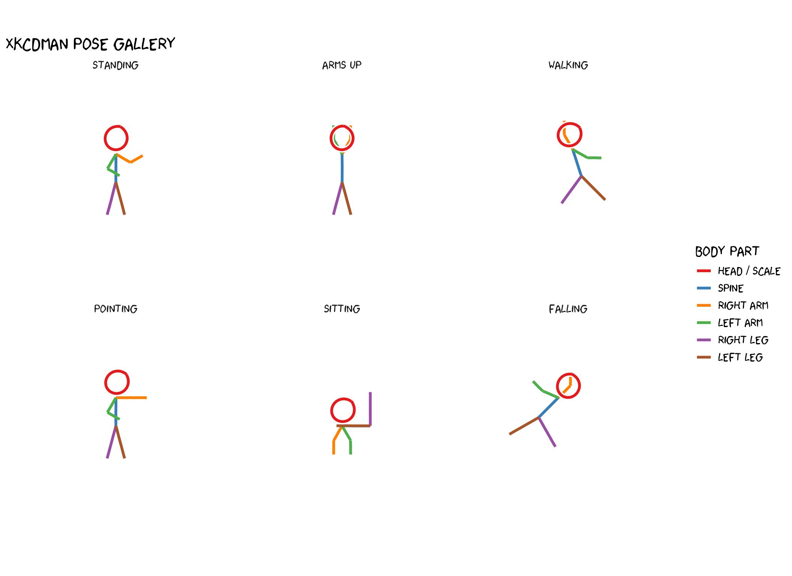
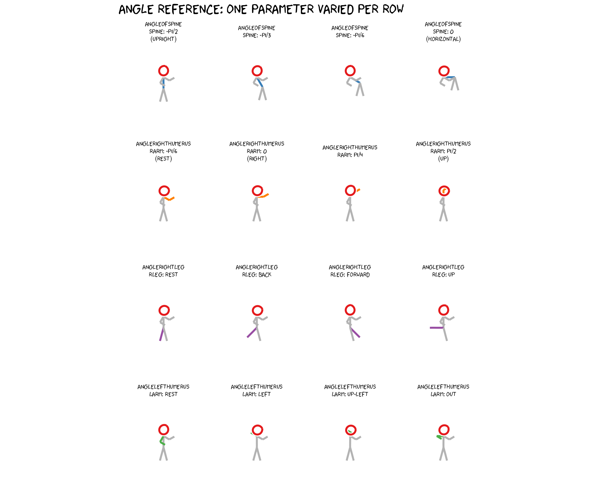

# xkcd figure: The Stick Figure Guide

``` r

library(xkcd)
library(ggplot2)
```

## How xkcdman works

The wild anatomy of a stick figure.

[`xkcdman()`](https://toledoem.github.io/xkcd/reference/xkcdman.md)
draws a stick figure defined entirely by **angles** (in radians) for
each body segment. The figure has 8 parts:

| Parameter           | Body part                            |
|---------------------|--------------------------------------|
| `angleofneck`       | neck — connects head to top of spine |
| `angleofspine`      | spine — main torso                   |
| `anglerighthumerus` | right upper arm                      |
| `anglerightradius`  | right forearm                        |
| `anglelefthumerus`  | left upper arm                       |
| `angleleftradius`   | left forearm                         |
| `anglerightleg`     | right leg                            |
| `angleleftleg`      | left leg                             |

Two other parameters control **size and proportion**:

- `scale` — diameter of the head (all other segments are proportional to
  it). Set it to roughly 10–15% of `diff(yrange)`.
- `ratioxy` — `diff(xrange) / diff(yrange)`. Corrects for axis scaling
  so the figure is not stretched horizontally or vertically.

All angles follow the standard mathematical convention: **0 = right, π/2
= up, π = left, 3π/2 (or −π/2) = down**.

------------------------------------------------------------------------

## Part 1 — Anatomy diagram

Each bone is drawn separately with its own color so you can see exactly
what each parameter controls. The helper below draws a single labeled
figure with colored segments.

``` r

# --- geometry helper: compute bone endpoints from the same formulas as xkcdman
make_figure <- function(x, y, scale, ratioxy,
                        angleofneck, angleofspine,
                        anglerighthumerus, anglerightradius,
                        anglelefthumerus,  angleleftradius,
                        anglerightleg,     angleleftleg) {

  dh  <- scale                    # head diameter
  ls  <- dh                       # spine length
  ll  <- ls * 1.2                 # leg length
  lh  <- ls * 0.6                 # humerus length
  lr  <- ls * 0.5                 # radius length

  # key joint positions
  shoulder <- c(x, y) +
    (dh / 2) * c(cos(angleofneck) * ratioxy, sin(angleofneck))
  hip <- shoulder +
    ls * c(cos(angleofspine) * ratioxy, sin(angleofspine))
  end_rh <- shoulder +
    lh * c(cos(anglerighthumerus) * ratioxy, sin(anglerighthumerus))
  end_lh <- shoulder +
    lh * c(cos(anglelefthumerus)  * ratioxy, sin(anglelefthumerus))

  seg <- function(from, angle, dist)
    data.frame(
      x    = from[1],
      y    = from[2],
      xend = from[1] + dist * cos(angle) * ratioxy,
      yend = from[2] + dist * sin(angle)
    )

  list(
    head    = data.frame(x = x, y = y, diameter = dh),
    spine   = seg(shoulder, angleofspine,       ls),
    rarm1   = seg(shoulder, anglerighthumerus,  lh),
    rarm2   = seg(end_rh,   anglerightradius,   lr),
    larm1   = seg(shoulder, anglelefthumerus,   lh),
    larm2   = seg(end_lh,   angleleftradius,    lr),
    rleg    = seg(hip,      anglerightleg,       ll),
    lleg    = seg(hip,      angleleftleg,        ll)
  )
}

# Standard upright pose — large figure centred in the plot
xrange <- c(0, 10)
yrange <- c(0, 10)
rxy    <- diff(xrange) / diff(yrange)
sc     <- 2.5   # bigger figure fills the space

f <- make_figure(
  x = 5, y = 7.2, scale = sc, ratioxy = rxy,
  angleofneck       = -pi / 2,
  angleofspine      = -pi / 2,
  anglerighthumerus = -pi / 6,
  anglerightradius  =  pi / 6,
  anglelefthumerus  = -pi / 2 - pi / 6,
  angleleftradius   = -pi / 6,
  anglerightleg     =  3 * pi / 2 - pi / 12,
  angleleftleg      =  3 * pi / 2 + pi / 12
)

colours <- c(
  head  = "#e41a1c",
  spine = "#377eb8",
  rarm1 = "#ff7f00",
  rarm2 = "#ff7f00",
  larm1 = "#4daf4a",
  larm2 = "#4daf4a",
  rleg  = "#984ea3",
  lleg  = "#a65628"
)

set.seed(99)
p_anat <- ggplot() + coord_fixed(xlim = xrange, ylim = yrange)

# head
p_anat <- p_anat +
  geom_xkcdpath(aes(x = x, y = y, diameter = diameter),
                data = f$head, colour = colours["head"],
                linewidth = 1.4, ratioxy = rxy, mask = FALSE)

# bones
bones <- c("spine", "rarm1", "rarm2", "larm1", "larm2", "rleg", "lleg")
for (b in bones) {
  p_anat <- p_anat +
    geom_xkcdpath(aes(x = x, y = y, xend = xend, yend = yend),
                  data = f[[b]], colour = colours[b],
                  linewidth = 1.4, mask = FALSE,
                  xjitteramount = 0.02, yjitteramount = 0.02)
}

library(ggrepel)

# Label origins at bone midpoints, nudged outward from figure centre
labels_df <- data.frame(
  x = c(
    f$head$x,
    (f$spine$x  + f$spine$xend)  / 2,
    (f$rarm1$x  + f$rarm1$xend)  / 2,
    (f$rarm2$x  + f$rarm2$xend)  / 2,
    (f$larm1$x  + f$larm1$xend)  / 2,
    (f$larm2$x  + f$larm2$xend)  / 2,
    (f$rleg$x   + f$rleg$xend)   / 2,
    (f$lleg$x   + f$lleg$xend)   / 2
  ),
  y = c(
    f$head$y,
    (f$spine$y  + f$spine$yend)  / 2,
    (f$rarm1$y  + f$rarm1$yend)  / 2,
    (f$rarm2$y  + f$rarm2$yend)  / 2,
    (f$larm1$y  + f$larm1$yend)  / 2,
    (f$larm2$y  + f$larm2$yend)  / 2,
    (f$rleg$y   + f$rleg$yend)   / 2,
    (f$lleg$y   + f$lleg$yend)   / 2
  ),
  label = c("head / scale", "angleofspine",
            "anglerighthumerus", "anglerightradius",
            "anglelefthumerus",  "angleleftradius",
            "anglerightleg",     "angleleftleg"),
  col   = unname(colours[c("head","spine","rarm1","rarm2","larm1","larm2","rleg","lleg")]),
  # nudge labels away from figure: right side +x, left side -x, head up
  nx    = c( 2.0,  0.3,  2.5,  2.8, -2.5, -2.8, -2.0,  2.0),
  ny    = c( 1.2,  0,    0.4, -0.5,  0.4, -0.5, -0.5, -0.8)
)

p_anat <- p_anat +
  geom_text_repel(
    aes(x = x, y = y, label = label, colour = col),
    data               = labels_df,
    nudge_x            = labels_df$nx,
    nudge_y            = labels_df$ny,
    family             = "xkcd",
    size               = 4,
    box.padding        = unit(0.1, "lines"),
    point.padding      = unit(0.1, "lines"),
    force              = 1,
    min.segment.length = 0.3,
    segment.size       = 0.4,
    segment.colour     = "grey50",
    seed               = 42,
    show.legend        = FALSE
  ) +
  scale_colour_identity()

p_anat <- p_anat +
  annotate("text", x = 5, y = 9.3,
           label = "xkcdman anatomy", family = "xkcd", size = 6) +
  annotate("text", x = 5, y = 8.9,
           label = "angleofneck connects head to shoulder",
           family = "xkcd", size = 3, colour = "grey40") +
  theme_xkcd() +
  theme(axis.text = element_blank(), axis.ticks = element_blank(),
        axis.title = element_blank())

p_anat
```


------------------------------------------------------------------------

## Part 2 — Pose gallery

Six figures in a faceted layout, each with a different pose. Every
figure uses the same helper so we only specify the angles that change.

``` r

# Helper: return list(segs = df, head = df) for one pose
pose_segments <- function(pose_name, x, y, scale, ratioxy,
                          angleofneck, angleofspine,
                          anglerighthumerus, anglerightradius,
                          anglelefthumerus,  angleleftradius,
                          anglerightleg,     angleleftleg) {

  f <- make_figure(x, y, scale, ratioxy,
                   angleofneck, angleofspine,
                   anglerighthumerus, anglerightradius,
                   anglelefthumerus,  angleleftradius,
                   anglerightleg,     angleleftleg)

  segs <- do.call(rbind, lapply(
    c("spine","rarm1","rarm2","larm1","larm2","rleg","lleg"),
    function(b) { d <- f[[b]]; d$part <- b; d }
  ))
  segs$pose <- pose_name

  head_df <- data.frame(x = f$head$x, y = f$head$y,
                        diameter = f$head$diameter,
                        xend = NA_real_, yend = NA_real_,
                        part = "head", pose = pose_name)

  list(segs = segs, head = head_df)
}

# Helper: vary one angle across values, return list(segs=df, heads=df)
vary_angle <- function(param, values, labels) {
  all_segs  <- NULL
  all_heads <- NULL
  for (i in seq_along(values)) {
    args <- neutral
    args[[param]] <- values[i]
    r <- pose_segments(
      pose_name         = labels[i],
      x = 5, y = 7.2, scale = 1.4, ratioxy = 1,
      angleofneck       = args$angleofneck,
      angleofspine      = args$angleofspine,
      anglerighthumerus = args$anglerighthumerus,
      anglerightradius  = args$anglerightradius,
      anglelefthumerus  = args$anglelefthumerus,
      angleleftradius   = args$angleleftradius,
      anglerightleg     = args$anglerightleg,
      angleleftleg      = args$angleleftleg
    )
    all_segs  <- rbind(all_segs,  r$segs)
    all_heads <- rbind(all_heads, r$head)
  }
  list(segs = all_segs, heads = all_heads)
}

# Common geometry: square data space
xr  <- c(0, 10); yr <- c(0, 10); rxy <- 1; sc <- 1.4

poses <- list(
  # 1. Standing at rest
  pose_segments("Standing",
    x = 5, y = 7.2, scale = sc, ratioxy = rxy,
    angleofneck       = -pi/2,
    angleofspine      = -pi/2,
    anglerighthumerus = -pi/6,
    anglerightradius  =  pi/6,
    anglelefthumerus  = -pi/2 - pi/6,
    angleleftradius   = -pi/6,
    anglerightleg     =  3*pi/2 - pi/12,
    angleleftleg      =  3*pi/2 + pi/12),

  # 2. Arms raised (cheering)
  pose_segments("Arms up",
    x = 5, y = 7.2, scale = sc, ratioxy = rxy,
    angleofneck       = -pi/2,
    angleofspine      = -pi/2,
    anglerighthumerus =  pi/3,
    anglerightradius  =  pi/2,
    anglelefthumerus  =  pi - pi/3,
    angleleftradius   =  pi/2,
    anglerightleg     =  3*pi/2 - pi/12,
    angleleftleg      =  3*pi/2 + pi/12),

  # 3. Walking (leaning forward, legs apart)
  pose_segments("Walking",
    x = 5, y = 7.4, scale = sc, ratioxy = rxy,
    angleofneck       = -pi/2 + pi/10,
    angleofspine      = -pi/2 + pi/10,
    anglerighthumerus =  pi/2 + pi/6,
    anglerightradius  =  pi/2,
    anglelefthumerus  = -pi/6,
    angleleftradius   =  0,
    anglerightleg     =  3*pi/2 - pi/5,
    angleleftleg      =  3*pi/2 + pi/4),

  # 4. Pointing right
  pose_segments("Pointing",
    x = 5, y = 7.2, scale = sc, ratioxy = rxy,
    angleofneck       = -pi/2,
    angleofspine      = -pi/2,
    anglerighthumerus =  0,
    anglerightradius  =  0,
    anglelefthumerus  = -pi/2 - pi/6,
    angleleftradius   = -pi/6,
    anglerightleg     =  3*pi/2 - pi/12,
    angleleftleg      =  3*pi/2 + pi/12),

  # 5. Sitting (spine horizontal, legs bent)
  pose_segments("Sitting",
    x = 5, y = 5.8, scale = sc, ratioxy = rxy,
    angleofneck       = -pi/2,
    angleofspine      =  0,
    anglerighthumerus = -pi/2 - pi/6,
    anglerightradius  = -pi/2,
    anglelefthumerus  = -pi/2 + pi/6,
    angleleftradius   = -pi/2,
    anglerightleg     =  pi/2,
    angleleftleg      =  pi/2 + pi/2),

  # 6. Falling / off-balance
  pose_segments("Falling",
    x = 5, y = 7.0, scale = sc, ratioxy = rxy,
    angleofneck       = -pi/2 - pi/4,
    angleofspine      = -pi/2 - pi/4,
    anglerighthumerus =  pi/4,
    anglerightradius  =  pi/2,
    anglelefthumerus  =  pi - pi/8,
    angleleftradius   =  pi/2 + pi/4,
    anglerightleg     =  3*pi/2 + pi/6,
    angleleftleg      =  3*pi/2 - pi/3)
)

# Combine into one data frame
all_segs <- do.call(rbind, lapply(poses, `[[`, "segs"))
all_heads <- do.call(rbind, lapply(poses, `[[`, "head"))

part_colours <- c(
  head  = "#e41a1c",
  spine = "#377eb8",
  rarm1 = "#ff7f00", rarm2 = "#ff7f00",
  larm1 = "#4daf4a", larm2 = "#4daf4a",
  rleg  = "#984ea3",
  lleg  = "#a65628"
)

all_segs$colour  <- part_colours[all_segs$part]
all_heads$colour <- part_colours["head"]

# Fix facet order
pose_order <- c("Standing","Arms up","Walking","Pointing","Sitting","Falling")
all_segs$pose  <- factor(all_segs$pose,  levels = pose_order)
all_heads$pose <- factor(all_heads$pose, levels = pose_order)

set.seed(42)

p_poses <- ggplot() +
  # draw each bone segment
  geom_xkcdpath(
    aes(x = x, y = y, xend = xend, yend = yend, colour = colour),
    data = all_segs,
    linewidth = 1.3, mask = FALSE,
    xjitteramount = 0.04, yjitteramount = 0.04,
    inherit.aes = FALSE
  ) +
  # draw each head circle
  geom_xkcdpath(
    aes(x = x, y = y, diameter = diameter, colour = colour),
    data = all_heads,
    linewidth = 1.3, ratioxy = 1, mask = FALSE,
    inherit.aes = FALSE
  ) +
  scale_colour_identity(
    guide  = "legend",
    name   = "Body part",
    breaks = part_colours[c("head","spine","rarm1","larm1","rleg","lleg")],
    labels = c("head / scale","spine","right arm","left arm","right leg","left leg")
  ) +
  facet_wrap(~ pose, ncol = 3) +
  coord_fixed(xlim = xr, ylim = yr) +
  theme_xkcd() +
  theme(
    axis.text  = element_blank(),
    axis.ticks = element_blank(),
    axis.title = element_blank(),
    strip.text = element_text(family = "xkcd", size = 13)
  ) +
  labs(title = "xkcdman pose gallery")

p_poses
```



------------------------------------------------------------------------

## Part 3 — Angle reference

The figure below shows the same upright figure four times, varying one
parameter at a time across a row, so you can see directly how each angle
value changes the pose.

``` r

# Neutral (upright) pose used as baseline
neutral <- list(
  angleofneck       = -pi/2,
  angleofspine      = -pi/2,
  anglerighthumerus = -pi/6,
  anglerightradius  =  pi/6,
  anglelefthumerus  = -pi/2 - pi/6,
  angleleftradius   = -pi/6,
  anglerightleg     =  3*pi/2 - pi/12,
  angleleftleg      =  3*pi/2 + pi/12
)

params_to_vary <- list(
  list(p = "angleofspine",
       v = c(-pi/2, -pi/2 + pi/6, -pi/2 + pi/3, 0),
       l = c("spine: -pi/2\n(upright)", "spine: -pi/3", "spine: -pi/6", "spine: 0\n(horizontal)")),
  list(p = "anglerighthumerus",
       v = c(-pi/6, 0, pi/4, pi/2),
       l = c("rarm: -pi/6\n(rest)", "rarm: 0\n(right)", "rarm: pi/4", "rarm: pi/2\n(up)")),
  list(p = "anglerightleg",
       v = c(3*pi/2 - pi/12, 3*pi/2 - pi/4, 3*pi/2 + pi/4, 3*pi/2 - pi/2),
       l = c("rleg: rest", "rleg: back", "rleg: forward", "rleg: up")),
  list(p = "anglelefthumerus",
       v = c(-pi/2-pi/6, pi-pi/6, pi/2+pi/6, pi),
       l = c("larm: rest", "larm: left", "larm: up-left", "larm: out"))
)

ref_segs  <- do.call(rbind, lapply(params_to_vary, function(pv) {
  r <- vary_angle(pv$p, pv$v, pv$l)
  r$segs$group_param <- pv$p
  r$segs
}))

ref_heads <- do.call(rbind, lapply(params_to_vary, function(pv) {
  r <- vary_angle(pv$p, pv$v, pv$l)
  r$heads$group_param <- pv$p
  r$heads
}))

ref_segs$colour  <- part_colours[ref_segs$part]
ref_heads$colour <- part_colours["head"]

# highlighted part per param group
highlight_map <- c(
  angleofspine      = "#377eb8",
  anglerighthumerus = "#ff7f00",
  anglerightleg     = "#984ea3",
  anglelefthumerus  = "#4daf4a"
)

ref_segs$colour <- ifelse(
  (ref_segs$part == "spine"  & ref_segs$group_param == "angleofspine") |
  (ref_segs$part == "rarm1"  & ref_segs$group_param == "anglerighthumerus") |
  (ref_segs$part == "rarm2"  & ref_segs$group_param == "anglerighthumerus") |
  (ref_segs$part == "rleg"   & ref_segs$group_param == "anglerightleg") |
  (ref_segs$part == "larm1"  & ref_segs$group_param == "anglelefthumerus") |
  (ref_segs$part == "larm2"  & ref_segs$group_param == "anglelefthumerus"),
  ref_segs$colour,
  "grey70"
)

# Facet label: combine group_param + pose
ref_segs$facet_label  <- paste0(ref_segs$group_param,  "\n", ref_segs$pose)
ref_heads$facet_label <- paste0(ref_heads$group_param, "\n", ref_heads$pose)

# Build ordered factor across all 16 facets
facet_order <- unlist(lapply(params_to_vary, function(pv)
  paste0(pv$p, "\n", pv$l)
))
ref_segs$facet_label  <- factor(ref_segs$facet_label,  levels = facet_order)
ref_heads$facet_label <- factor(ref_heads$facet_label, levels = facet_order)

set.seed(7)

p_ref <- ggplot() +
  geom_xkcdpath(
    aes(x = x, y = y, xend = xend, yend = yend, colour = colour),
    data = ref_segs,
    linewidth = 1.2, mask = FALSE,
    xjitteramount = 0.03, yjitteramount = 0.03,
    inherit.aes = FALSE
  ) +
  geom_xkcdpath(
    aes(x = x, y = y, diameter = diameter),
    data = ref_heads,
    linewidth = 1.2, colour = "#e41a1c", ratioxy = 1, mask = FALSE,
    inherit.aes = FALSE
  ) +
  scale_colour_identity() +
  facet_wrap(~ facet_label, ncol = 4) +
  coord_fixed(xlim = xr, ylim = yr) +
  theme_xkcd() +
  theme(
    axis.text  = element_blank(),
    axis.ticks = element_blank(),
    axis.title = element_blank(),
    strip.text = element_text(family = "xkcd", size = 9)
  ) +
  labs(title = "Angle reference: one parameter varied per row")

p_ref
```



------------------------------------------------------------------------

## Quick reference card

    angleofspine      -pi/2  upright  |  0  horizontal  |  pi/2  upside down
    angleofneck       match angleofspine for natural look
    anglerighthumerus -pi/6  hanging  |  0  right  |  pi/2  raised
    anglerightradius  follow anglerighthumerus + pi/6 for natural elbow bend
    anglelefthumerus  mirror of right: -pi/2 - anglerighthumerus
    angleleftradius   mirror of right
    anglerightleg     3*pi/2 - pi/12   (slight outward spread)
    angleleftleg      3*pi/2 + pi/12   (slight outward spread)

    scale     ~10-15% of diff(yrange)
    ratioxy   diff(xrange) / diff(yrange)   -- always set this!
