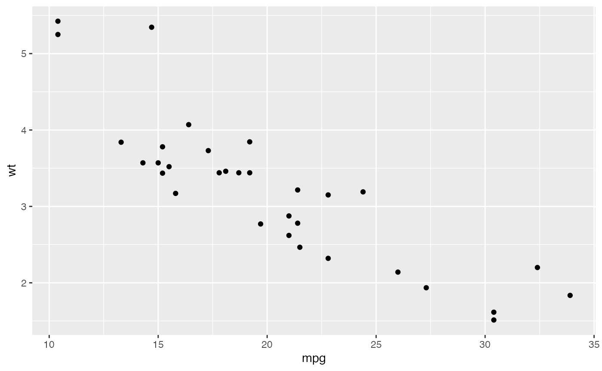
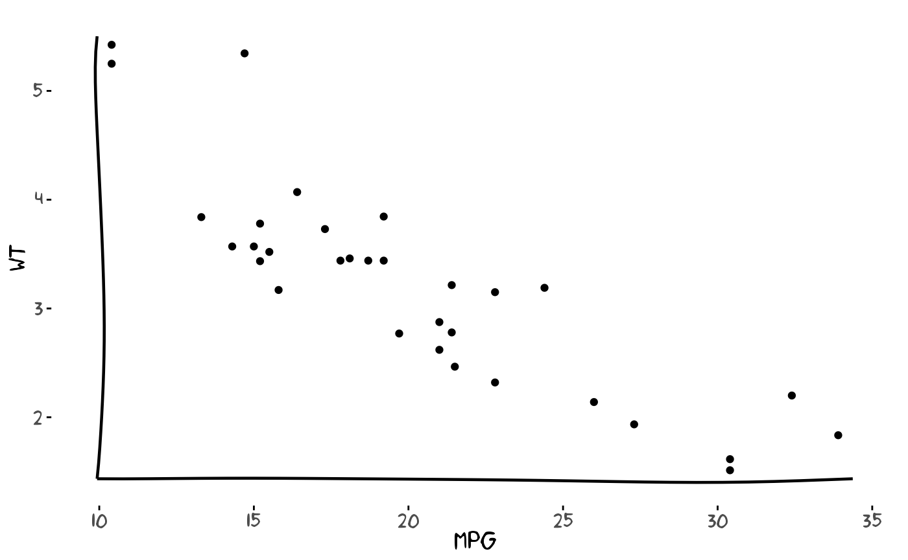
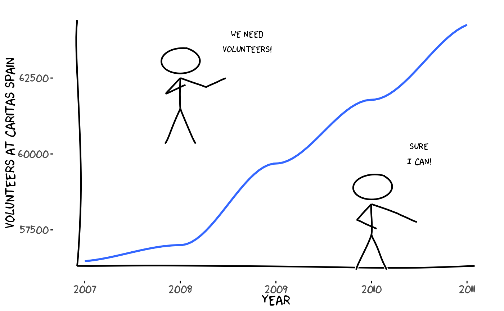
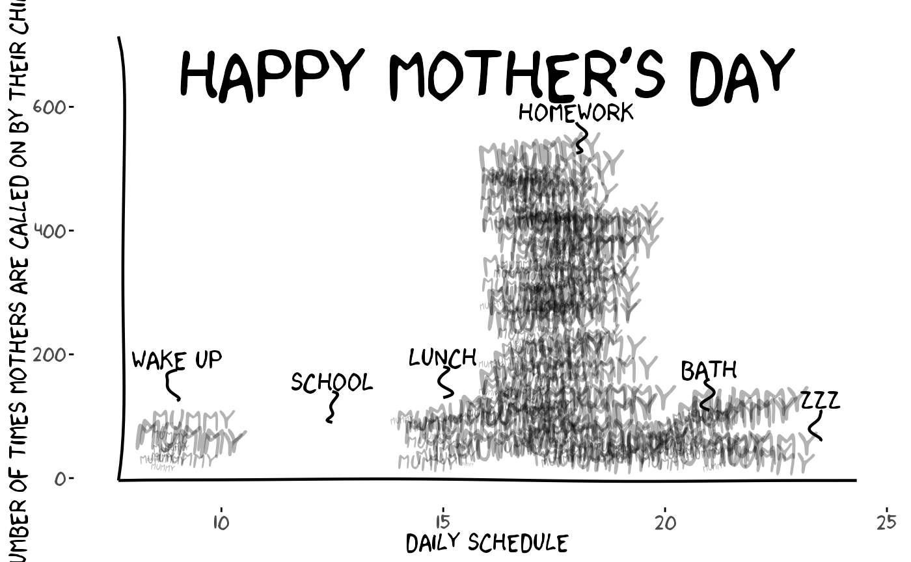
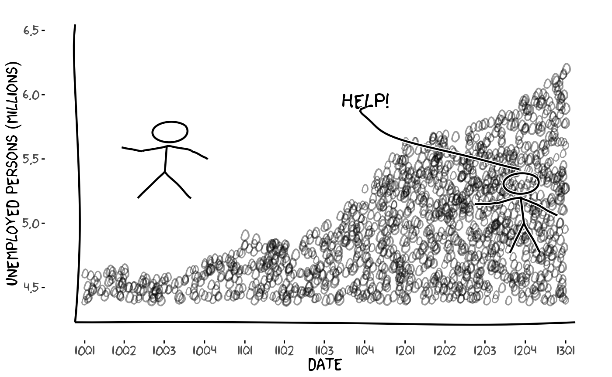
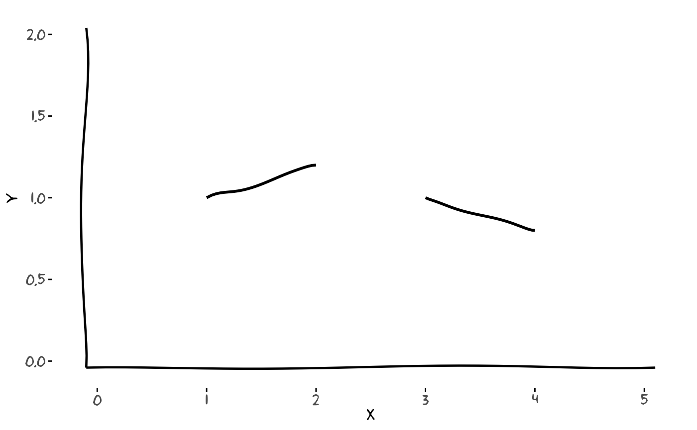
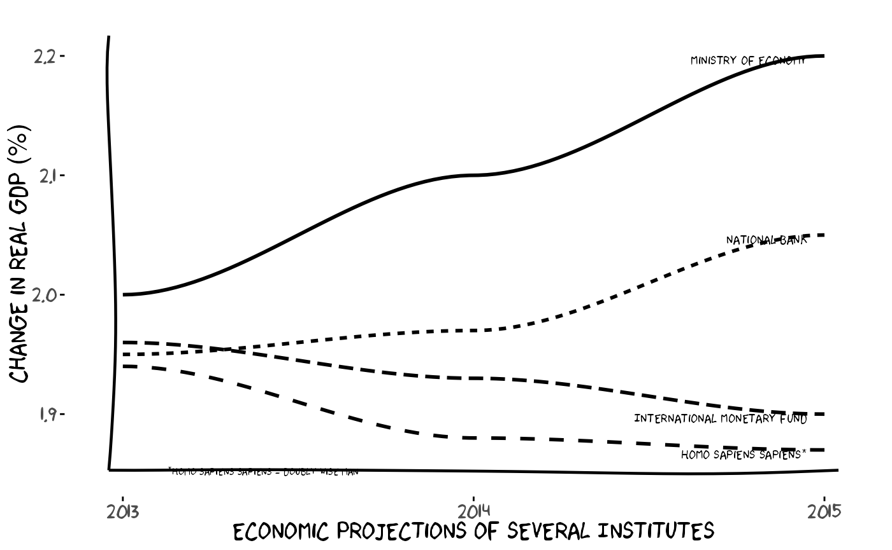
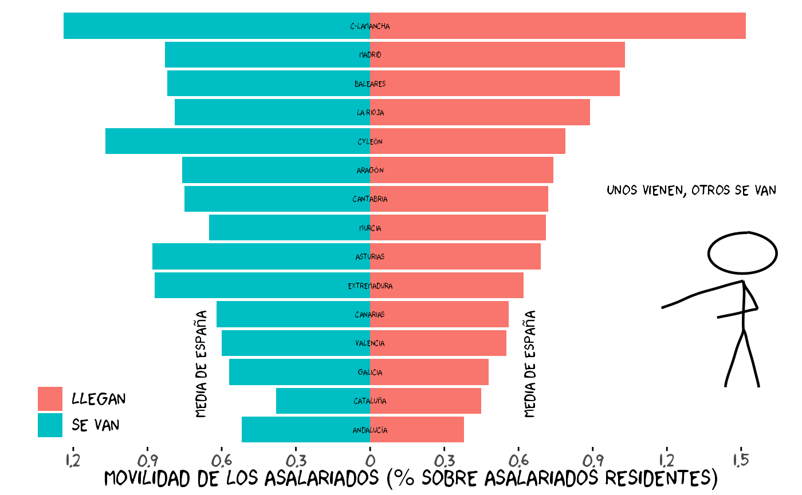
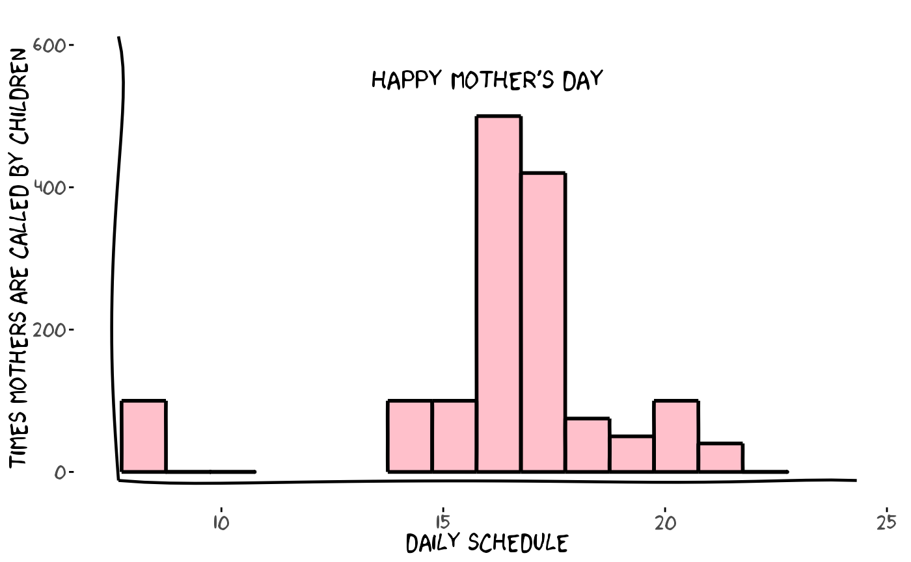

# xkcd: An R Package for Plotting XKCD Graphs

## Introduction and Main Motivation

Original from author: “Emilio Torres-Manzanera” pulled from
<https://github.com/cran/xkcd/>\*

The [XKCD](https://xkcd.com) web site is a web comic created by [Randall
Munroe](https://xkcd.com), who described it as a web comic of romance,
sarcasm, math, and language. He uses stick figures, very simple drawings
composed of a few lines and curves, in his comics strips, that are
available under the Creative Commons Attribution-NonCommercial 2.5
License.

Due to the popularity of Randall Munroe’s work, several questions about
how to draw XKCD style graphs using different programming languages were
posted in Stack Overflow. Many authors tried to replicate such style
using different programming languages. For instance, there are
implementations in Mathematica and Matlab using image processing
distortion; a Python library focused on this style; and proposals in
LaTeX.

The R language, despite being a software environment for statistical
computing and graphics, lacked a specific package devoted to plot graphs
in an XKCD style. To the best of our knowledge, there was not a
satisfactory response to the question “How can we make xkcd style graphs
in R?” published in Stack Overflow.

Fortunately, R is rich with facilities for creating and developing
interesting graphics. In particular, the implementation of the grammar
of graphics in R by ggplot2 allows the design of XKCD style graphs. The
package xkcd presented in this paper develops several functions to plot
statistical graphs in a freehand sketch style following the guidelines
of the XKCD web site.

In this paper, an introduction to plot such graphs in R is detailed. The
following section deals with installing xkcd fonts and saving graphs, a
step that raised several questions among users. In the next section,
some basic examples are explained, and the graph gallery section shows
several complex plots. Finally, the article ends with a discussion
concerning statistical information and creative drawing.

## The XKCD Fonts

The package xkcd uses the XKCD fonts, so you must install them on your
computer. An easy way to check whether these fonts are installed on the
computer or not is typing the following code and comparing the results:

`# Download xkcd font to a temporary location (do not ship the font with the package)`` `[`library`](https://rdrr.io/r/base/library.html)`(`[`extrafont`](https://github.com/fbertran/extrafont)`)`` `[`tryCatch`](https://rdrr.io/r/base/conditions.html)`(``{`` `` ``temp_font`` ``<-`` `[`file.path`](https://rdrr.io/r/base/file.path.html)`(`[`tempdir`](https://rdrr.io/r/base/tempfile.html)`(``)``, ``"xkcd.ttf"``)`` `` `[`download.file`](https://rdrr.io/r/utils/download.file.html)`(``"https://toledoem.github.io/img/xkcd.ttf"``,`` `` destfile ``=`` ``temp_font``, mode ``=`` ``"wb"``, timeout ``=`` ``60``)`` ``}``, error ``=`` ``function``(``e``)`` ``{`` `` `[`warning`](https://rdrr.io/r/base/warning.html)`(``"Failed to download xkcd font. See https://github.com/ipython/xkcd-font"``)`` ``}``)`` `` ``# If downloaded, copy into the user's fonts directory for registration (not packaged)`` ``fonts_dir`` ``<-`` `[`path.expand`](https://rdrr.io/r/base/path.expand.html)`(``"~/.fonts"``)`` ``if`` ``(``!`[`dir.exists`](https://rdrr.io/r/base/files2.html)`(``fonts_dir``)``)`` `[`dir.create`](https://rdrr.io/r/base/files2.html)`(``fonts_dir``, recursive ``=`` ``TRUE``)`` ``if`` ``(`[`exists`](https://rdrr.io/r/base/exists.html)`(``"temp_font"``)`` ``&&`` `[`file.exists`](https://rdrr.io/r/base/files.html)`(``temp_font``)``)`` ``{`` `` `[`file.copy`](https://rdrr.io/r/base/files.html)`(``temp_font``, `[`file.path`](https://rdrr.io/r/base/file.path.html)`(``fonts_dir``, ``"xkcd.ttf"``)``, overwrite ``=`` ``TRUE``)`` ``}`` `` ``# Register fonts (import only when needed)`` `[`font_import`](https://rdrr.io/pkg/extrafont/man/font_import.html)`(``pattern ``=`` ``"[X/x]kcd"``, prompt ``=`` ``FALSE``)`` `[`fonts`](https://rdrr.io/pkg/extrafont/man/fonts.html)`(``)`` `[`fonttable`](https://rdrr.io/pkg/extrafont/man/fonttable.html)`(``)`` ``if`` ``(``.Platform``$``OS.type`` ``!=`` ``"unix"``)`` ``{`` `` `[`loadfonts`](https://rdrr.io/pkg/extrafont/man/loadfonts.html)`(``device ``=`` ``"win"``)`` ``}`` ``else`` ``{`` `` `[`loadfonts`](https://rdrr.io/pkg/extrafont/man/loadfonts.html)`(``)`` ``}`

`# Small font-check plot: uses installed xkcd font if available`` `[`library`](https://rdrr.io/r/base/library.html)`(`[`extrafont`](https://github.com/fbertran/extrafont)`)`` `[`library`](https://rdrr.io/r/base/library.html)`(`[`ggplot2`](https://ggplot2.tidyverse.org)`)`` ``if`` ``(``'xkcd'`` `[`%in%`](https://rdrr.io/r/base/match.html)` ``extrafont``::`[`fonts`](https://rdrr.io/pkg/extrafont/man/fonts.html)`(``)``)`` ``{`` `` ``p`` ``<-`` `[`ggplot`](https://ggplot2.tidyverse.org/reference/ggplot.html)`(``)`` ``+`` `[`geom_point`](https://ggplot2.tidyverse.org/reference/geom_point.html)`(`[`aes`](https://ggplot2.tidyverse.org/reference/aes.html)`(``x ``=`` ``mpg``, y ``=`` ``wt``)``, data ``=`` ``mtcars``)`` ``+`` `` `[`theme`](https://ggplot2.tidyverse.org/reference/theme.html)`(``text ``=`` `[`element_text`](https://ggplot2.tidyverse.org/reference/element.html)`(``size ``=`` ``16``, family ``=`` ``"xkcd"``)``)`` ``}`` ``else`` ``{`` `` `[`warning`](https://rdrr.io/r/base/warning.html)`(``"Not xkcd fonts installed!"``)`` `` ``p`` ``<-`` `[`ggplot`](https://ggplot2.tidyverse.org/reference/ggplot.html)`(``)`` ``+`` `[`geom_point`](https://ggplot2.tidyverse.org/reference/geom_point.html)`(`[`aes`](https://ggplot2.tidyverse.org/reference/aes.html)`(``x ``=`` ``mpg``, y ``=`` ``wt``)``, data ``=`` ``mtcars``)`` ``}`` ``p`

`# # Save initial font-check plot for README (if possible)`` ``# try({`` ``# ggsave(filename = file.path("vignettes", "font_check.png"), plot = p, width = 6, height = 4)`` ``# }, silent = TRUE)`

If you want to modify these fonts, you may use the spline font database
file format (sfd), the official xkcd font created by the IPython project
and distributed under a Creative Commons Attribution-NonCommercial 3.0
License, which can be opened with FontForge, an open-source font editor.

### Saving the Graphs

[`ggsave()`](https://ggplot2.tidyverse.org/reference/ggsave.html) is the
preferred function for saving a ggplot2 plot. For instance, the
following instruction saves the graph as a bitmap file:

[`ggsave`](https://ggplot2.tidyverse.org/reference/ggsave.html)`(``"gr1.png"``, ``p``)`

If you want to save this chart as PDF you should embed the fonts into
the PDF file, using
[`embed_fonts()`](https://rdrr.io/pkg/extrafont/man/embed_fonts.html).
First, if you are running Windows, you may need to tell it where the
Ghostscript program is, for embedding fonts.

[`ggsave`](https://ggplot2.tidyverse.org/reference/ggsave.html)`(``"gr1.pdf"``, plot ``=`` ``p``, width ``=`` ``12``, height ``=`` ``4``)`` ``if`` ``(``.Platform``$``OS.type`` ``!=`` ``"unix"``)`` ``{`` `` ``## Needed for Windows. Make sure you have the correct path`` `` `[`Sys.setenv`](https://rdrr.io/r/base/Sys.setenv.html)`(``R_GSCMD ``=`` `` ``"C:\\Program Files (x86)\\gs\\gs9.06\\bin\\gswin32c.exe"``)`` ``}`` `[`embed_fonts`](https://rdrr.io/pkg/extrafont/man/embed_fonts.html)`(``"gr1.pdf"``)`

See the development site of extrafont for additional instructions and
examples of using fonts other than the standard PostScript fonts.

## Installing xkcd

The package xkcd is available on CRAN. From within R, you can install it
with the following instruction:

[`install.packages`](https://rdrr.io/r/utils/install.packages.html)`(``"xkcd"``, dependencies ``=`` ``TRUE``)`

Once the package has been installed, it can be loaded by typing:

[`library`](https://rdrr.io/r/base/library.html)`(`[`xkcd`](https://github.com/ToledoEM/xkcd)`)`

Automatically, it loads the packages ggplot2 and extrafont. The most
relevant functions are
[`xkcdaxis()`](https://toledoem.github.io/xkcd/reference/xkcdaxis.md),
that plots axis in a handwritten style,
[`xkcdman()`](https://toledoem.github.io/xkcd/reference/xkcdman.md),
that draws stick figures, and
[`xkcdrect()`](https://toledoem.github.io/xkcd/reference/xkcdrect.md),
that creates fuzzy rectangles. These functions are compatible with the
grammar of graphics proposed by ggplot2.

From a technical point of view, lines plotted with the xkcd package are
jittered with white noise and then smoothed using Bezier curves with the
`bezier()` function from Hmisc.

## Axis, Stick Figures, and Facets

In order to get a handmade drawing of the axis and an XKCD theme, a
specific function based on the ggplot2 framework was created,
[`xkcdaxis()`](https://toledoem.github.io/xkcd/reference/xkcdaxis.md):

`xrange`` ``<-`` `[`range`](https://rdrr.io/r/base/range.html)`(``mtcars``$``mpg``)`` ``yrange`` ``<-`` `[`range`](https://rdrr.io/r/base/range.html)`(``mtcars``$``wt``)`` `[`set.seed`](https://rdrr.io/r/base/Random.html)`(``123``)`` ``p`` ``<-`` `[`ggplot`](https://ggplot2.tidyverse.org/reference/ggplot.html)`(``)`` ``+`` `[`geom_point`](https://ggplot2.tidyverse.org/reference/geom_point.html)`(`[`aes`](https://ggplot2.tidyverse.org/reference/aes.html)`(``mpg``, ``wt``)``, data ``=`` ``mtcars``)`` ``+`` `` `[`xkcdaxis`](https://toledoem.github.io/xkcd/reference/xkcdaxis.md)`(``xrange``, ``yrange``)`` ``p`

Due to the fact that white random noise is used in the picture, it is
convenient to fix a seed for reproducing the same figure
([`set.seed()`](https://rdrr.io/r/base/Random.html)).

Maybe the most flashy function is
[`xkcdman()`](https://toledoem.github.io/xkcd/reference/xkcdman.md),
that draws a stick figure with different positions, angles, and lengths:

ightleg, angleleftleg = angleleftleg, angleofneck = angleofneck)

[`set.seed`](https://rdrr.io/r/base/Random.html)`(``123``)`` ``p`` ``<-`` `[`ggplot`](https://ggplot2.tidyverse.org/reference/ggplot.html)`(``)`` ``+`` `[`geom_point`](https://ggplot2.tidyverse.org/reference/geom_point.html)`(`[`aes`](https://ggplot2.tidyverse.org/reference/aes.html)`(``x ``=`` ``mpg``, y ``=`` ``wt``, colour ``=`` `[`as.character`](https://rdrr.io/r/base/character.html)`(``vs``)``)``, data ``=`` ``mtcars``)`` ``+`` `` `[`xkcdaxis`](https://toledoem.github.io/xkcd/reference/xkcdaxis.md)`(``xrange``, ``yrange``)`` ``+`` `` `[`xkcdman`](https://toledoem.github.io/xkcd/reference/xkcdman.md)`(``mapping``, ``dataman``)`` ``p`

Additionally, you may use the facet option of ggplot2 to split up your
data by one or more variables and plot the subsets of data together.

`p`` ``+`` `[`facet_grid`](https://ggplot2.tidyverse.org/reference/facet_grid.html)`(`` ``~`` ``vs``)`

## Some Basic Examples

In this section, the code to plot a line graph and a bar chart is
detailed. Remember to set the seed if you want to replicate your own
figures.

### Line chart with stick figures

`volunteers`` ``<-`` `[`data.frame`](https://rdrr.io/r/base/data.frame.html)`(``year ``=`` `[`c`](https://rdrr.io/r/base/c.html)`(``2007``:``2011``)``,`` `` number ``=`` `[`c`](https://rdrr.io/r/base/c.html)`(``56470``, ``56998``, ``59686``, ``61783``, ``64251``)``)`` ``xrange`` ``<-`` `[`range`](https://rdrr.io/r/base/range.html)`(``volunteers``$``year``)`` ``yrange`` ``<-`` `[`range`](https://rdrr.io/r/base/range.html)`(``volunteers``$``number``)`` ``ratioxy`` ``<-`` `[`diff`](https://rdrr.io/r/base/diff.html)`(``xrange``)`` ``/`` `[`diff`](https://rdrr.io/r/base/diff.html)`(``yrange``)`` `` ``dataman`` ``<-`` `[`data.frame`](https://rdrr.io/r/base/data.frame.html)`(``x ``=`` `[`c`](https://rdrr.io/r/base/c.html)`(``2008``, ``2010``)``, `` `` y ``=`` `[`c`](https://rdrr.io/r/base/c.html)`(``63000``, ``58850``)``,`` `` scale ``=`` ``1000``,`` `` ratioxy ``=`` ``ratioxy``,`` `` angleofspine ``=`` ``-``pi`` ``/`` ``2``,`` `` anglerighthumerus ``=`` `[`c`](https://rdrr.io/r/base/c.html)`(``-``pi`` ``/`` ``6``, ``-``pi`` ``/`` ``6``)``,`` `` anglelefthumerus ``=`` `[`c`](https://rdrr.io/r/base/c.html)`(``-``pi`` ``/`` ``2`` ``-`` ``pi`` ``/`` ``6``, ``-``pi`` ``/`` ``2`` ``-`` ``pi`` ``/`` ``6``)``,`` `` anglerightradius ``=`` `[`c`](https://rdrr.io/r/base/c.html)`(``pi`` ``/`` ``5``, ``-``pi`` ``/`` ``5``)``,`` `` angleleftradius ``=`` `[`c`](https://rdrr.io/r/base/c.html)`(``pi`` ``/`` ``5``, ``-``pi`` ``/`` ``5``)``,`` `` anglerightleg ``=`` ``3`` ``*`` ``pi`` ``/`` ``2`` ``-`` ``pi`` ``/`` ``12``,`` `` angleleftleg ``=`` ``3`` ``*`` ``pi`` ``/`` ``2`` ``+`` ``pi`` ``/`` ``12``,`` `` angleofneck ``=`` ``-``pi`` ``/`` ``2``)`` `` ``mapping`` ``<-`` `[`aes`](https://ggplot2.tidyverse.org/reference/aes.html)`(``x ``=`` ``x``, y ``=`` ``y``, scale ``=`` ``scale``, ratioxy ``=`` ``ratioxy``, `` `` angleofspine ``=`` ``angleofspine``,`` `` anglerighthumerus ``=`` ``anglerighthumerus``, `` `` anglelefthumerus ``=`` ``anglelefthumerus``,`` `` anglerightradius ``=`` ``anglerightradius``, `` `` angleleftradius ``=`` ``angleleftradius``,`` `` anglerightleg ``=`` ``anglerightleg``, `` `` angleleftleg ``=`` ``angleleftleg``, `` `` angleofneck ``=`` ``angleofneck``)`` `` `[`set.seed`](https://rdrr.io/r/base/Random.html)`(``123``)`` ``p`` ``<-`` `[`ggplot`](https://ggplot2.tidyverse.org/reference/ggplot.html)`(``)`` ``+`` `` `` `[`geom_smooth`](https://ggplot2.tidyverse.org/reference/geom_smooth.html)`(``mapping ``=`` `[`aes`](https://ggplot2.tidyverse.org/reference/aes.html)`(``x ``=`` ``year``, y ``=`` ``number``)``,`` `` data ``=`` ``volunteers``, method ``=`` ``"loess"``, se ``=`` ``FALSE``)`` ``+`` `` `[`xkcdaxis`](https://toledoem.github.io/xkcd/reference/xkcdaxis.md)`(``xrange``, ``yrange``)`` ``+`` `` `[`ylab`](https://ggplot2.tidyverse.org/reference/labs.html)`(``"Volunteers at Caritas Spain"``)`` ``+`` `` `[`xkcdman`](https://toledoem.github.io/xkcd/reference/xkcdman.md)`(``mapping``, ``dataman``)`` ``+`` `` `[`annotate`](https://ggplot2.tidyverse.org/reference/annotate.html)`(``"text"``, x ``=`` ``2008.7``, y ``=`` ``63700``,`` `` label ``=`` ``"We Need\nVolunteers!"``, family ``=`` ``"xkcd"``)`` ``+`` `` `[`annotate`](https://ggplot2.tidyverse.org/reference/annotate.html)`(``"text"``, x ``=`` ``2010.5``, y ``=`` ``60000``,`` `` label ``=`` ``"Sure\nI can!"``, family ``=`` ``"xkcd"``)`` `` ``p`

`# Save a representative plot for README`` `[`try`](https://rdrr.io/r/base/try.html)`(``{`` `` `[`ggsave`](https://ggplot2.tidyverse.org/reference/ggsave.html)`(``filename ``=`` `[`file.path`](https://rdrr.io/r/base/file.path.html)`(``"caritas_plot.png"``)``, plot ``=`` ``p``, width ``=`` ``9``, height ``=`` ``5``)`` ``}``, silent ``=`` ``TRUE``)`

One interesting property of these charts is that when xkcd lines
intersect, there is a space in blank in the crossing, following XKCD
style.

### Mommy jittered-text example

`# Adapted from a legacy example: draw jittered 'Mummy' labels inside`` ``# time-of-day boxes, add small xkcd-style ticks and save the figure as a PNG`` ``mommy`` ``<-`` `[`read.table`](https://rdrr.io/r/utils/read.table.html)`(``sep``=``" "``,text ``=``"`` ``8 100`` ``9 0`` ``10 0`` ``11 0`` ``12 0`` ``13 0`` ``14 100`` ``15 100`` ``16 500`` ``17 420`` ``18 75`` ``19 50`` ``20 100`` ``21 40`` ``22 0`` ``"``)`` `[`names`](https://rdrr.io/r/base/names.html)`(``mommy``)`` ``<-`` `[`c`](https://rdrr.io/r/base/c.html)`(``"hour"``,``"number"``)`` ``data`` ``<-`` ``mommy`` ``data``$``xmin`` ``<-`` ``data``$``hour`` ``-`` ``0.25`` ``data``$``xmax`` ``<-`` ``data``$``xmin`` ``+`` ``1`` ``data``$``ymin`` ``<-`` ``0`` ``data``$``ymax`` ``<-`` ``data``$``number`` ``xrange`` ``<-`` `[`range`](https://rdrr.io/r/base/range.html)`(``8``, ``24``)`` ``yrange`` ``<-`` `[`range`](https://rdrr.io/r/base/range.html)`(`[`min`](https://rdrr.io/r/base/Extremes.html)`(``data``$``ymin``)`` ``+`` ``10`` , `[`max`](https://rdrr.io/r/base/Extremes.html)`(``data``$``ymax``)`` ``+`` ``200``)`` ``ratioxy`` ``<-`` `[`diff`](https://rdrr.io/r/base/diff.html)`(``xrange``)``/`[`diff`](https://rdrr.io/r/base/diff.html)`(``yrange``)`` `` ``timelabel`` ``<-`` ``function``(``text``,``x``,``y``)`` ``{`` `` ``te1`` ``<-`` `[`annotate`](https://ggplot2.tidyverse.org/reference/annotate.html)`(``"text"``, x``=``x``, y ``=`` ``y`` ``+`` ``65``, label``=``text``, size ``=`` ``6``,family ``=``"xkcd"``)`` `` `[`list`](https://rdrr.io/r/base/list.html)`(``te1``,`` `` `[`geom_xkcdpath`](https://toledoem.github.io/xkcd/reference/geom_xkcdpath.md)`(``mapping ``=`` `[`aes`](https://ggplot2.tidyverse.org/reference/aes.html)`(``x ``=`` ``xbegin``, y ``=`` ``ybegin``, xend ``=`` ``xend``, yend ``=`` ``yend``)``,`` `` data ``=`` `[`data.frame`](https://rdrr.io/r/base/data.frame.html)`(``xbegin ``=`` ``x``, ybegin ``=`` ``y`` ``+`` ``50``, xend ``=`` ``x``, yend ``=`` ``y``)``,`` `` xjitteramount ``=`` ``0.5``, linewidth ``=`` ``0.8``, mask ``=`` ``FALSE``)``)`` ``}`` `` ``n`` ``<-`` ``1800`` `[`set.seed`](https://rdrr.io/r/base/Random.html)`(``123``)`` ``x`` ``<-`` `[`runif`](https://rdrr.io/r/stats/Uniform.html)`(``n``, ``xrange``[``1``]``,``xrange``[``2``]`` ``)`` ``y`` ``<-`` `[`runif`](https://rdrr.io/r/stats/Uniform.html)`(``n``, ``yrange``[``1``]``,``yrange``[``2``]`` ``)`` ``inside`` ``<-`` `[`unlist`](https://rdrr.io/r/base/unlist.html)`(`[`lapply`](https://rdrr.io/r/base/lapply.html)`(``1``:``n``, ``function``(``i``)`` `[`any`](https://rdrr.io/r/base/any.html)`(``data``$``xmin`` ``<=`` ``x``[``i``]`` ``&`` ``x``[``i``]`` ``<`` ``data``$``xmax`` ``&`` `` ``data``$``ymin`` ``<=`` ``y``[``i``]`` ``&`` ``y``[``i``]`` ``<`` ``data``$``ymax``)``)``)`` ``x`` ``<-`` ``x``[``inside``]`` ``y`` ``<-`` ``y``[``inside``]`` `` ``nman`` ``<-`` `[`length`](https://rdrr.io/r/base/length.html)`(``x``)`` ``sizer`` ``<-`` `[`round`](https://rdrr.io/r/base/Round.html)`(`[`runif`](https://rdrr.io/r/stats/Uniform.html)`(``nman``, ``1``, ``10``)``,``0``)`` ``angler`` ``<-`` `[`runif`](https://rdrr.io/r/stats/Uniform.html)`(``nman``, ``-``10``,``10``)`` `` ``p`` ``<-`` `[`ggplot`](https://ggplot2.tidyverse.org/reference/ggplot.html)`(``)`` ``+`` `` `[`geom_text`](https://ggplot2.tidyverse.org/reference/geom_text.html)`(`[`aes`](https://ggplot2.tidyverse.org/reference/aes.html)`(``x``,``y``,label``=``"Mummy"``,angle``=``angler``,hjust``=``0``, vjust``=``0``)``,`` `` family``=``"xkcd"``,size``=``sizer``,alpha``=``0.3``)`` ``+`` `` `[`xkcdaxis`](https://toledoem.github.io/xkcd/reference/xkcdaxis.md)`(``xrange``,``yrange``)`` ``+`` `` `[`annotate`](https://ggplot2.tidyverse.org/reference/annotate.html)`(``"text"``, x``=``16``, y ``=`` ``650``,`` `` label``=``"Happy Mother's day"``, size ``=`` ``16``,family ``=``"xkcd"``)`` ``+`` `` `[`xlab`](https://ggplot2.tidyverse.org/reference/labs.html)`(``"daily schedule"``)`` ``+`` `` `[`ylab`](https://ggplot2.tidyverse.org/reference/labs.html)`(``"Number of times mothers are called on by their children"``)`` ``+`` `` ``timelabel``(``"Wake up"``, ``9``, ``125``)`` ``+`` ``timelabel``(``"School"``, ``12.5``, ``90``)`` ``+`` `` ``timelabel``(``"Lunch"``, ``15``, ``130``)`` ``+`` `` ``timelabel``(``"Homework"``, ``18``, ``525``)`` ``+`` `` ``timelabel``(``"Bath"``, ``21``, ``110``)`` ``+`` `` ``timelabel``(``"zzz"``, ``23.5``, ``60``)`` `` `[`print`](https://rdrr.io/r/base/print.html)`(``p``)`

`# Save a PNG into the vignette folder so it can be used in the README`` ``out_png`` ``<-`` `[`file.path`](https://rdrr.io/r/base/file.path.html)`(``"mommy_plot.png"``)`` `[`ggsave`](https://ggplot2.tidyverse.org/reference/ggsave.html)`(``filename ``=`` ``out_png``, plot ``=`` ``p``, width ``=`` ``9``, height ``=`` ``6``)`

You may specify the width, the height, and colors of the bars.

## Graph Gallery

This gallery provides a variety of complex charts designed to address
different visualization needs.

### Unemployment with Text Fill

[`library`](https://rdrr.io/r/base/library.html)`(`[`zoo`](https://zeileis.codeberg.page/zoo/)`)`` `[`library`](https://rdrr.io/r/base/library.html)`(`[`splancs`](https://www.maths.lancs.ac.uk/~rowlings/Splancs/)`)`` `` ``mydatar`` ``<-`` `[`read.table`](https://rdrr.io/r/utils/read.table.html)`(``text``=``"`` ``6.202`` ``5.965`` ``5.778`` ``5.693`` ``5.639`` ``5.273`` ``4.978`` ``4.833`` ``4.910`` ``4.696`` ``4.574`` ``4.645`` ``4.612`` ``"``)`` `` ``mydata1`` ``<-`` ``mydatar``[`[`dim`](https://rdrr.io/r/base/dim.html)`(``mydatar``)``[``1``]``:``1``,``]`` ``z`` ``<-`` `[`zooreg`](https://rdrr.io/pkg/zoo/man/zooreg.html)`(``mydata1``, end ``=`` `[`as.yearqtr`](https://rdrr.io/pkg/zoo/man/yearqtr.html)`(``"2013-1"``)``, frequency ``=`` ``4``)`` `` ``mydata`` ``<-`` `[`data.frame`](https://rdrr.io/r/base/data.frame.html)`(``parados ``=`` ``z``)`` ``mydata``$``year`` ``<-`` `[`as.numeric`](https://rdrr.io/r/base/numeric.html)`(`[`as.Date`](https://rdrr.io/pkg/zoo/man/yearmon.html)`(`[`as.yearqtr`](https://rdrr.io/pkg/zoo/man/yearqtr.html)`(`[`rownames`](https://rdrr.io/r/base/colnames.html)`(``mydata``)``)``)``)`` ``mydata``$``label`` ``<-`` `[`paste`](https://rdrr.io/r/base/paste.html)`(`[`substr`](https://rdrr.io/r/base/substr.html)`(`[`rownames`](https://rdrr.io/r/base/colnames.html)`(``mydata``)``, ``3``, ``4``)``, `[`substr`](https://rdrr.io/r/base/substr.html)`(`[`rownames`](https://rdrr.io/r/base/colnames.html)`(``mydata``)``, ``6``, ``7``)``, sep ``=`` ``""``)`` `` ``xrange`` ``<-`` `[`range`](https://rdrr.io/r/base/range.html)`(``mydata``$``year``)`` ``yrange`` ``<-`` `[`range`](https://rdrr.io/r/base/range.html)`(``mydata``$``parados``)`` ``+`` `[`c`](https://rdrr.io/r/base/c.html)`(``-``0.3``, ``0.3``)`` ``ratioxy`` ``<-`` `[`diff`](https://rdrr.io/r/base/diff.html)`(``xrange``)`` ``/`` `[`diff`](https://rdrr.io/r/base/diff.html)`(``yrange``)`` `` `[`set.seed`](https://rdrr.io/r/base/Random.html)`(``123``)`` ``n`` ``<-`` ``3200`` ``poligono`` ``<-`` ``mydata``[``, `[`c`](https://rdrr.io/r/base/c.html)`(``"year"``, ``"parados"``)``]`` `[`names`](https://rdrr.io/r/base/names.html)`(``poligono``)`` ``<-`` `[`c`](https://rdrr.io/r/base/c.html)`(``"x"``, ``"y"``)`` ``poligono`` ``<-`` `[`rbind`](https://rdrr.io/r/base/cbind.html)`(``poligono``, `[`c`](https://rdrr.io/r/base/c.html)`(`[`max`](https://rdrr.io/r/base/Extremes.html)`(``poligono``$``x``)``, ``4.4``)``)`` ``poligono`` ``<-`` `[`rbind`](https://rdrr.io/r/base/cbind.html)`(``poligono``, `[`c`](https://rdrr.io/r/base/c.html)`(`[`min`](https://rdrr.io/r/base/Extremes.html)`(``poligono``$``x``)``, ``4.4``)``)`` ``points`` ``<-`` `[`data.frame`](https://rdrr.io/r/base/data.frame.html)`(``x ``=`` `[`runif`](https://rdrr.io/r/stats/Uniform.html)`(``n``, `[`range`](https://rdrr.io/r/base/range.html)`(``poligono``$``x``)``[``1``]``, `[`range`](https://rdrr.io/r/base/range.html)`(``poligono``$``x``)``[``2``]``)``,`` `` y ``=`` `[`runif`](https://rdrr.io/r/stats/Uniform.html)`(``n``, `[`range`](https://rdrr.io/r/base/range.html)`(``poligono``$``y``)``[``1``]``, `[`range`](https://rdrr.io/r/base/range.html)`(``poligono``$``y``)``[``2``]``)``)`` ``kk`` ``<-`` `[`inout`](https://rsbivand.github.io/splancs/reference/inout.html)`(``points``, ``poligono``)`` ``points`` ``<-`` ``points``[``kk``, ``]`` ``points`` ``<-`` `[`rbind`](https://rdrr.io/r/base/cbind.html)`(``points``, ``poligono``)`` `` ``x`` ``<-`` ``points``$``x`` ``y`` ``<-`` ``points``$``y`` ``nman`` ``<-`` `[`length`](https://rdrr.io/r/base/length.html)`(``x``)`` ``sizer`` ``<-`` `[`runif`](https://rdrr.io/r/stats/Uniform.html)`(``nman``, ``4``, ``6``)`` `` ``n`` ``<-`` ``2`` ``dataman`` ``<-`` `[`data.frame`](https://rdrr.io/r/base/data.frame.html)`(`` `` x ``=`` `[`c`](https://rdrr.io/r/base/c.html)`(``15600``, ``14800``)``,`` `` y ``=`` `[`c`](https://rdrr.io/r/base/c.html)`(``5.3``, ``5.7``)``,`` `` scale ``=`` ``0.2``,`` `` ratioxy ``=`` ``ratioxy``,`` `` angleofspine ``=`` `[`runif`](https://rdrr.io/r/stats/Uniform.html)`(``n``, ``-``pi`` ``/`` ``2`` ``-`` ``pi`` ``/`` ``10``, ``-``pi`` ``/`` ``2`` ``+`` ``pi`` ``/`` ``10``)``,`` `` anglerighthumerus ``=`` `[`runif`](https://rdrr.io/r/stats/Uniform.html)`(``n``, ``-``pi`` ``/`` ``6`` ``-`` ``pi`` ``/`` ``10``, ``-``pi`` ``/`` ``6`` ``+`` ``pi`` ``/`` ``10``)``,`` `` anglelefthumerus ``=`` `[`runif`](https://rdrr.io/r/stats/Uniform.html)`(``n``, ``pi`` ``+`` ``pi`` ``/`` ``6`` ``-`` ``pi`` ``/`` ``10``, ``pi`` ``+`` ``pi`` ``/`` ``6`` ``+`` ``pi`` ``/`` ``10``)``,`` `` anglerightradius ``=`` `[`runif`](https://rdrr.io/r/stats/Uniform.html)`(``n``, ``-``pi`` ``/`` ``4``, ``pi`` ``/`` ``4``)``,`` `` angleleftradius ``=`` `[`runif`](https://rdrr.io/r/stats/Uniform.html)`(``n``, ``pi`` ``-`` ``pi`` ``/`` ``4``, ``pi`` ``+`` ``pi`` ``/`` ``4``)``,`` `` anglerightleg ``=`` `[`runif`](https://rdrr.io/r/stats/Uniform.html)`(``n``, ``3`` ``*`` ``pi`` ``/`` ``2`` ``+`` ``pi`` ``/`` ``12``, ``3`` ``*`` ``pi`` ``/`` ``2`` ``+`` ``pi`` ``/`` ``12`` ``+`` ``pi`` ``/`` ``10``)``,`` `` angleleftleg ``=`` `[`runif`](https://rdrr.io/r/stats/Uniform.html)`(``n``, ``3`` ``*`` ``pi`` ``/`` ``2`` ``-`` ``pi`` ``/`` ``12`` ``-`` ``pi`` ``/`` ``10``, ``3`` ``*`` ``pi`` ``/`` ``2`` ``-`` ``pi`` ``/`` ``12``)``,`` `` angleofneck ``=`` `[`runif`](https://rdrr.io/r/stats/Uniform.html)`(``n``, ``-``pi`` ``/`` ``2`` ``-`` ``pi`` ``/`` ``10``, ``-``pi`` ``/`` ``2`` ``+`` ``pi`` ``/`` ``10``)`` ``)`` `` ``mapping`` ``<-`` `[`aes`](https://ggplot2.tidyverse.org/reference/aes.html)`(``x ``=`` ``x``, y ``=`` ``y``, scale ``=`` ``scale``, ratioxy ``=`` ``ratioxy``,`` `` angleofspine ``=`` ``angleofspine``,`` `` anglerighthumerus ``=`` ``anglerighthumerus``,`` `` anglelefthumerus ``=`` ``anglelefthumerus``,`` `` anglerightradius ``=`` ``anglerightradius``,`` `` angleleftradius ``=`` ``angleleftradius``,`` `` anglerightleg ``=`` ``anglerightleg``,`` `` angleleftleg ``=`` ``angleleftleg``,`` `` angleofneck ``=`` ``angleofneck``)`` `` `[`set.seed`](https://rdrr.io/r/base/Random.html)`(``123``)`` ``p1`` ``<-`` `[`ggplot`](https://ggplot2.tidyverse.org/reference/ggplot.html)`(``)`` ``+`` `` `` `[`geom_text`](https://ggplot2.tidyverse.org/reference/geom_text.html)`(`[`aes`](https://ggplot2.tidyverse.org/reference/aes.html)`(``x ``=`` ``x``, y ``=`` ``y``, label ``=`` ``"0"``)``, `` `` data ``=`` `[`data.frame`](https://rdrr.io/r/base/data.frame.html)`(``x ``=`` ``x``, y ``=`` ``y``)``, family ``=`` ``"xkcd"``, alpha ``=`` ``0.4``, size ``=`` ``sizer``)`` ``+`` `` `[`xkcdaxis`](https://toledoem.github.io/xkcd/reference/xkcdaxis.md)`(``xrange``, ``yrange``)`` ``+`` `` `[`ylab`](https://ggplot2.tidyverse.org/reference/labs.html)`(``"Unemployed persons (millions)"``)`` ``+`` `` `` `[`xlab`](https://ggplot2.tidyverse.org/reference/labs.html)`(``"Date"``)`` ``+`` `` `[`annotate`](https://ggplot2.tidyverse.org/reference/annotate.html)`(``"text"``, x ``=`` ``15250``, y ``=`` ``5.95``, label ``=`` ``"Help!"``, family ``=`` ``"xkcd"``, size ``=`` ``7``)`` ``+`` `` `[`geom_xkcdpath`](https://toledoem.github.io/xkcd/reference/geom_xkcdpath.md)`(``mapping ``=`` `[`aes`](https://ggplot2.tidyverse.org/reference/aes.html)`(``x ``=`` ``xbegin``, y ``=`` ``ybegin``, xend ``=`` ``xend``, yend ``=`` ``yend``, group ``=`` ``1``)``,`` `` data ``=`` `[`data.frame`](https://rdrr.io/r/base/data.frame.html)`(``xbegin ``=`` ``15600``, ybegin ``=`` ``5.42``, xend ``=`` ``15250``, yend ``=`` ``5.902``, group ``=`` ``1``)``,`` `` xjitteramount ``=`` ``200``)`` ``+`` `` `` `[`theme`](https://ggplot2.tidyverse.org/reference/theme.html)`(``legend.position ``=`` ``"none"``)`` `` ``p2`` ``<-`` ``p1`` ``+`` `[`scale_x_continuous`](https://ggplot2.tidyverse.org/reference/scale_continuous.html)`(``breaks ``=`` `[`as.numeric`](https://rdrr.io/r/base/numeric.html)`(``mydata``$``year``)``, label ``=`` ``mydata``$``label``)`` `` ``p2`` ``+`` `[`xkcdman`](https://toledoem.github.io/xkcd/reference/xkcdman.md)`(``mapping``, ``dataman``)`

`# Grouping example: provide a group aesthetic to geom_xkcdpath() when`` ``df`` ``<-`` `[`data.frame`](https://rdrr.io/r/base/data.frame.html)`(``x ``=`` `[`c`](https://rdrr.io/r/base/c.html)`(``1``, ``3``)``, y ``=`` `[`c`](https://rdrr.io/r/base/c.html)`(``1``, ``1``)``, xend ``=`` `[`c`](https://rdrr.io/r/base/c.html)`(``2``, ``4``)``, yend ``=`` `[`c`](https://rdrr.io/r/base/c.html)`(``1.2``, ``0.8``)``, group ``=`` ``1``)`` `[`ggplot`](https://ggplot2.tidyverse.org/reference/ggplot.html)`(``)`` ``+`` `` `[`geom_xkcdpath`](https://toledoem.github.io/xkcd/reference/geom_xkcdpath.md)`(`[`aes`](https://ggplot2.tidyverse.org/reference/aes.html)`(``x ``=`` ``x``, y ``=`` ``y``, xend ``=`` ``xend``, yend ``=`` ``yend``, group ``=`` ``group``)``,`` `` data ``=`` ``df``, linewidth ``=`` ``1``, xjitteramount ``=`` ``0.05``, yjitteramount ``=`` ``0.05``)`` ``+`` `` `[`xkcdaxis`](https://toledoem.github.io/xkcd/reference/xkcdaxis.md)`(`[`c`](https://rdrr.io/r/base/c.html)`(``0``,``5``)``, `[`c`](https://rdrr.io/r/base/c.html)`(``0``,``2``)``)`` ``+`` `[`theme_xkcd`](https://toledoem.github.io/xkcd/reference/theme_xkcd.md)`(``)`

### Economic Projections

[`library`](https://rdrr.io/r/base/library.html)`(`[`reshape`](http://had.co.nz/reshape)`)`` `` ``mydata`` ``<-`` `[`data.frame`](https://rdrr.io/r/base/data.frame.html)`(`` `` year ``=`` `[`c`](https://rdrr.io/r/base/c.html)`(``2013``, ``2014``, ``2015``)``,`` `` ministerio ``=`` `[`c`](https://rdrr.io/r/base/c.html)`(``2``, ``2.1``, ``2.2``)``,`` `` banco ``=`` `[`c`](https://rdrr.io/r/base/c.html)`(``1.95``, ``1.97``, ``2.05``)``,`` `` fmi ``=`` `[`c`](https://rdrr.io/r/base/c.html)`(``1.96``, ``1.93``, ``1.90``)``,`` `` homo ``=`` `[`c`](https://rdrr.io/r/base/c.html)`(``1.94``, ``1.88``, ``1.87``)`` ``)`` `` ``mydatalong`` ``<-`` `[`melt`](https://rdrr.io/pkg/reshape/man/melt-24.html)`(``mydata``, id ``=`` ``"year"``, `` `` measure.vars ``=`` `[`c`](https://rdrr.io/r/base/c.html)`(``"ministerio"``, ``"banco"``, ``"fmi"``, ``"homo"``)``)`` `` ``xrange`` ``<-`` `[`c`](https://rdrr.io/r/base/c.html)`(``2013``, ``2015``)`` ``yrange`` ``<-`` `[`c`](https://rdrr.io/r/base/c.html)`(``1.86``, ``2.21``)`` `` `[`set.seed`](https://rdrr.io/r/base/Random.html)`(``123``)`` ``p`` ``<-`` `[`ggplot`](https://ggplot2.tidyverse.org/reference/ggplot.html)`(``)`` ``+`` `` `` `[`geom_smooth`](https://ggplot2.tidyverse.org/reference/geom_smooth.html)`(`[`aes`](https://ggplot2.tidyverse.org/reference/aes.html)`(``x ``=`` ``year``, y ``=`` ``value``, group ``=`` ``variable``, linetype ``=`` ``variable``)``, `` `` data ``=`` ``mydatalong``, color ``=`` ``"black"``, se ``=`` ``FALSE``)`` ``+`` `` `` `[`theme`](https://ggplot2.tidyverse.org/reference/theme.html)`(``legend.position ``=`` ``"none"``)`` ``+`` `` `` `[`xkcdaxis`](https://toledoem.github.io/xkcd/reference/xkcdaxis.md)`(``xrange``, ``yrange``)`` ``+`` `` `[`ylab`](https://ggplot2.tidyverse.org/reference/labs.html)`(``"Change in real GDP (%)"``)`` ``+`` `` `` `[`xlab`](https://ggplot2.tidyverse.org/reference/labs.html)`(``"Economic Projections of several Institutes"``)`` ``+`` `` `` `[`scale_x_continuous`](https://ggplot2.tidyverse.org/reference/scale_continuous.html)`(``breaks ``=`` `[`c`](https://rdrr.io/r/base/c.html)`(``2013``, ``2014``, ``2015``)``, labels ``=`` `[`c`](https://rdrr.io/r/base/c.html)`(``2013``, ``2014``, ``2015``)``)`` `` ``datalabel`` ``<-`` `[`data.frame`](https://rdrr.io/r/base/data.frame.html)`(`` `` x ``=`` ``2014.95``,`` `` y ``=`` `[`c`](https://rdrr.io/r/base/c.html)`(``mydata``[``mydata``$``year`` ``==`` ``2015``, ``"ministerio"``]``,`` `` ``mydata``[``mydata``$``year`` ``==`` ``2015``, ``"banco"``]``,`` `` ``mydata``[``mydata``$``year`` ``==`` ``2015``, ``"fmi"``]``,`` `` ``mydata``[``mydata``$``year`` ``==`` ``2015``, ``"homo"``]``)``,`` `` label ``=`` `[`c`](https://rdrr.io/r/base/c.html)`(``"Ministry of Economy"``, ``"National Bank"``, `` `` ``"International Monetary Fund"``, ``"Homo Sapiens Sapiens*"``)`` ``)`` `` ``p2`` ``<-`` ``p`` ``+`` `` `` `[`geom_text`](https://ggplot2.tidyverse.org/reference/geom_text.html)`(`[`aes`](https://ggplot2.tidyverse.org/reference/aes.html)`(``x ``=`` ``x``, y ``=`` ``y``, label ``=`` ``label``)``, `` `` data ``=`` ``datalabel``, hjust ``=`` ``1``, vjust ``=`` ``1``, family ``=`` ``"xkcd"``, size ``=`` ``3``)`` ``+`` `` `[`annotate`](https://ggplot2.tidyverse.org/reference/annotate.html)`(``"text"``, x ``=`` ``2013.4``, y ``=`` ``1.852``, `` `` label ``=`` ``"*Homo Sapiens Sapiens = Doubly Wise Man"``, `` `` family ``=`` ``"xkcd"``, size ``=`` ``2.5``)`` `` ``p2`

### Regional Migration Pyramid

[`set.seed`](https://rdrr.io/r/base/Random.html)`(``130613``)`` `` ``resumen`` ``<-`` `[`data.frame`](https://rdrr.io/r/base/data.frame.html)`(`` `` tonombre ``=`` `[`factor`](https://rdrr.io/r/base/factor.html)`(`[`c`](https://rdrr.io/r/base/c.html)`(``1L``, ``2L``, ``3L``, ``11L``, ``4L``, ``5L``, ``8L``, ``6L``, ``7L``, ``9L``, ``10L``, ``14L``, ``12L``, ``13L``, ``15L``)``,`` `` labels ``=`` `[`c`](https://rdrr.io/r/base/c.html)`(``"Andalucía"``, ``"Aragón"``, ``"Asturias"``, ``"Canarias"``, ``"Cantabria"``,`` `` ``"C-LaMancha"``, ``"CyLeón"``, ``"Cataluña"``, ``"Extremadura"``, ``"Galicia"``,`` `` ``"Baleares"``, ``"Madrid"``, ``"Murcia"``, ``"La Rioja"``, ``"Valencia"``)``)``,`` `` persons ``=`` `[`c`](https://rdrr.io/r/base/c.html)`(``2743706L``, ``515772L``, ``364410L``, ``399963L``, ``699410L``, ``212737L``, ``2847377L``, ``717874L``, ``894946L``, ``371502L``, ``942277L``, ``119341L``, ``2561918L``, ``493833L``, ``1661613L``)``,`` `` frompersons ``=`` `[`c`](https://rdrr.io/r/base/c.html)`(``14266L``, ``3910L``, ``3214L``, ``3283L``, ``4371L``, ``1593L``, ``10912L``, ``8931L``, ``9566L``, ``3231L``, ``5407L``, ``940L``, ``21289L``, ``3202L``, ``9939L``)``,`` `` topersons ``=`` `[`c`](https://rdrr.io/r/base/c.html)`(``10341L``, ``3805L``, ``2523L``, ``4039L``, ``3911L``, ``1524L``, ``12826L``, ``10897L``, ``7108L``, ``2312L``, ``4522L``, ``1066L``, ``26464L``, ``3529L``, ``9187L``)``,`` `` llegan ``=`` `[`c`](https://rdrr.io/r/base/c.html)`(``0.38``, ``0.74``, ``0.69``, ``1.01``, ``0.56``, ``0.72``, ``0.45``, ``1.52``, ``0.79``, ``0.62``, ``0.48``, ``0.89``, ``1.03``, ``0.71``, ``0.55``)``,`` `` sevan ``=`` `[`c`](https://rdrr.io/r/base/c.html)`(``0.52``, ``0.76``, ``0.88``, ``0.82``, ``0.62``, ``0.75``, ``0.38``, ``1.24``, ``1.07``, ``0.87``, ``0.57``, ``0.79``, ``0.83``, ``0.65``, ``0.60``)`` ``)`` `` `[`library`](https://rdrr.io/r/base/library.html)`(`[`reshape`](http://had.co.nz/reshape)`)`` ``resumenlargo`` ``<-`` `[`melt`](https://rdrr.io/pkg/reshape/man/melt-24.html)`(``resumen``[``, `[`c`](https://rdrr.io/r/base/c.html)`(``"tonombre"``, ``"llegan"``, ``"sevan"``)``]``)`` `` ``oo`` ``<-`` `[`order`](https://rdrr.io/r/base/order.html)`(``resumen``$``llegan``)`` ``nombreordenados`` ``<-`` ``resumen``$``tonombre``[``oo``]`` ``resumenlargo``$``tonombre`` ``<-`` `[`factor`](https://rdrr.io/r/base/factor.html)`(``resumenlargo``$``tonombre``, levels ``=`` ``nombreordenados``, ordered ``=`` ``TRUE``)`` `` ``xrange`` ``<-`` `[`c`](https://rdrr.io/r/base/c.html)`(``1``, ``15``)`` ``yrange`` ``<-`` `[`c`](https://rdrr.io/r/base/c.html)`(``-``1.3``, ``1.6``)`` ``ratioxy`` ``<-`` `[`diff`](https://rdrr.io/r/base/diff.html)`(``xrange``)`` ``/`` `[`diff`](https://rdrr.io/r/base/diff.html)`(``yrange``)`` `` ``kk`` ``<-`` `[`ggplot`](https://ggplot2.tidyverse.org/reference/ggplot.html)`(``)`` ``+`` `` `[`geom_bar`](https://ggplot2.tidyverse.org/reference/geom_bar.html)`(`[`aes`](https://ggplot2.tidyverse.org/reference/aes.html)`(``y ``=`` ``value``, x ``=`` ``tonombre``, fill ``=`` ``variable``)``, `` `` data ``=`` ``resumenlargo``[``resumenlargo``$``variable`` ``==`` ``"llegan"``, ``]``, stat ``=`` ``"identity"``)`` ``+`` `` `[`geom_bar`](https://ggplot2.tidyverse.org/reference/geom_bar.html)`(`[`aes`](https://ggplot2.tidyverse.org/reference/aes.html)`(``y ``=`` ``(``-``1``)`` ``*`` ``value``, x ``=`` ``tonombre``, fill ``=`` ``variable``)``, `` `` data ``=`` ``resumenlargo``[``resumenlargo``$``variable`` ``==`` ``"sevan"``, ``]``, stat ``=`` ``"identity"``)`` ``+`` `` `[`scale_y_continuous`](https://ggplot2.tidyverse.org/reference/scale_continuous.html)`(``breaks ``=`` `[`seq`](https://rdrr.io/r/base/seq.html)`(``-``1.2``, ``1.5``, ``0.3``)``, labels ``=`` `[`abs`](https://rdrr.io/r/base/MathFun.html)`(`[`seq`](https://rdrr.io/r/base/seq.html)`(``-``1.2``, ``1.5``, ``0.3``)``)``)`` ``+`` `` `[`ylab`](https://ggplot2.tidyverse.org/reference/labs.html)`(``"Movilidad de los asalariados (% sobre asalariados residentes)"``)`` ``+`` `` `[`coord_flip`](https://ggplot2.tidyverse.org/reference/coord_flip.html)`(``)`` ``+`` `` `[`theme_xkcd`](https://toledoem.github.io/xkcd/reference/theme_xkcd.md)`(``)`` ``+`` `` `` `[`xlab`](https://ggplot2.tidyverse.org/reference/labs.html)`(``""``)`` ``+`` `` `` `[`theme`](https://ggplot2.tidyverse.org/reference/theme.html)`(``axis.ticks.y ``=`` `[`element_blank`](https://ggplot2.tidyverse.org/reference/element.html)`(``)``, axis.text.y ``=`` `[`element_blank`](https://ggplot2.tidyverse.org/reference/element.html)`(``)``)`` `` ``kk2`` ``<-`` ``kk`` ``+`` `` `[`geom_text`](https://ggplot2.tidyverse.org/reference/geom_text.html)`(`[`aes`](https://ggplot2.tidyverse.org/reference/aes.html)`(``x ``=`` ``tonombre``, y ``=`` ``0``, label ``=`` ``tonombre``)``, `` `` data ``=`` ``resumenlargo``[``resumenlargo``$``variable`` ``==`` ``"llegan"``, ``]``, family ``=`` ``"xkcd"``, size ``=`` ``2``)`` `` ``lleganespana`` ``<-`` `[`sum`](https://rdrr.io/r/base/sum.html)`(``resumen``$``topersons``)`` ``*`` ``100`` ``/`` `[`sum`](https://rdrr.io/r/base/sum.html)`(``resumen``$``persons``)`` ``sevanespana`` ``<-`` `[`sum`](https://rdrr.io/r/base/sum.html)`(``resumen``$``frompersons``)`` ``*`` ``100`` ``/`` `[`sum`](https://rdrr.io/r/base/sum.html)`(``resumen``$``persons``)`` `` ``kk3`` ``<-`` ``kk2`` ``+`` `` `` `[`scale_fill_discrete`](https://ggplot2.tidyverse.org/reference/scale_colour_discrete.html)`(``name ``=`` ``""``,`` `` breaks ``=`` `[`c`](https://rdrr.io/r/base/c.html)`(``"llegan"``, ``"sevan"``)``,`` `` labels ``=`` `[`c`](https://rdrr.io/r/base/c.html)`(``"Llegan"``, ``"Se van"``)``)`` ``+`` `` `` `[`theme`](https://ggplot2.tidyverse.org/reference/theme.html)`(``legend.justification ``=`` `[`c`](https://rdrr.io/r/base/c.html)`(``0``, ``0``)``, legend.position ``=`` `[`c`](https://rdrr.io/r/base/c.html)`(``0``, ``0``)``)`` `` ``dataman`` ``<-`` `[`data.frame`](https://rdrr.io/r/base/data.frame.html)`(`` `` x ``=`` ``7``,`` `` y ``=`` ``1.5``,`` `` scale ``=`` ``0.35``,`` `` ratioxy ``=`` ``ratioxy``,`` `` angleofspine ``=`` `[`runif`](https://rdrr.io/r/stats/Uniform.html)`(``1``, ``-``pi`` ``/`` ``2`` ``-`` ``pi`` ``/`` ``2`` ``-`` ``pi`` ``/`` ``10``, ``-``pi`` ``/`` ``2`` ``-`` ``pi`` ``/`` ``2`` ``+`` ``pi`` ``/`` ``10``)``,`` `` anglerighthumerus ``=`` `[`runif`](https://rdrr.io/r/stats/Uniform.html)`(``1``, ``-``pi`` ``/`` ``2`` ``-`` ``pi`` ``/`` ``6`` ``-`` ``pi`` ``/`` ``10``, ``-``pi`` ``/`` ``2`` ``-`` ``pi`` ``/`` ``6`` ``+`` ``pi`` ``/`` ``10``)``,`` `` anglelefthumerus ``=`` `[`runif`](https://rdrr.io/r/stats/Uniform.html)`(``1``, ``-``pi`` ``/`` ``2`` ``-`` ``pi`` ``/`` ``2`` ``-`` ``pi`` ``/`` ``10``, ``-``pi`` ``/`` ``2`` ``-`` ``pi`` ``/`` ``2`` ``+`` ``pi`` ``/`` ``10``)``,`` `` anglerightradius ``=`` `[`runif`](https://rdrr.io/r/stats/Uniform.html)`(``1``, ``-``pi`` ``/`` ``2`` ``-`` ``pi`` ``/`` ``5`` ``-`` ``pi`` ``/`` ``10``, ``-``pi`` ``/`` ``2`` ``-`` ``pi`` ``/`` ``5`` ``+`` ``pi`` ``/`` ``10``)``,`` `` angleleftradius ``=`` `[`runif`](https://rdrr.io/r/stats/Uniform.html)`(``1``, ``-``pi`` ``/`` ``2`` ``-`` ``pi`` ``/`` ``5`` ``-`` ``pi`` ``/`` ``10``, ``-``pi`` ``/`` ``2`` ``-`` ``pi`` ``/`` ``5`` ``+`` ``pi`` ``/`` ``10``)``,`` `` angleleftleg ``=`` `[`runif`](https://rdrr.io/r/stats/Uniform.html)`(``1``, ``-``pi`` ``/`` ``2`` ``+`` ``3`` ``*`` ``pi`` ``/`` ``2`` ``+`` ``pi`` ``/`` ``12`` ``-`` ``pi`` ``/`` ``20``, ``-``pi`` ``/`` ``2`` ``+`` ``3`` ``*`` ``pi`` ``/`` ``2`` ``+`` ``pi`` ``/`` ``12`` ``+`` ``pi`` ``/`` ``20``)``,`` `` anglerightleg ``=`` `[`runif`](https://rdrr.io/r/stats/Uniform.html)`(``1``, ``-``pi`` ``/`` ``2`` ``+`` ``3`` ``*`` ``pi`` ``/`` ``2`` ``-`` ``pi`` ``/`` ``12`` ``-`` ``pi`` ``/`` ``20``, ``-``pi`` ``/`` ``2`` ``+`` ``3`` ``*`` ``pi`` ``/`` ``2`` ``-`` ``pi`` ``/`` ``12`` ``+`` ``pi`` ``/`` ``20``)``,`` `` angleofneck ``=`` `[`runif`](https://rdrr.io/r/stats/Uniform.html)`(``1``, ``-``pi`` ``/`` ``2`` ``+`` ``3`` ``*`` ``pi`` ``/`` ``2`` ``-`` ``pi`` ``/`` ``10``, ``-``pi`` ``/`` ``2`` ``+`` ``3`` ``*`` ``pi`` ``/`` ``2`` ``+`` ``pi`` ``/`` ``10``)`` ``)`` `` ``mapping`` ``<-`` `[`aes`](https://ggplot2.tidyverse.org/reference/aes.html)`(``x ``=`` ``x``, y ``=`` ``y``, scale ``=`` ``scale``, ratioxy ``=`` ``ratioxy``,`` `` angleofspine ``=`` ``angleofspine``,`` `` anglerighthumerus ``=`` ``anglerighthumerus``,`` `` anglelefthumerus ``=`` ``anglelefthumerus``,`` `` anglerightradius ``=`` ``anglerightradius``,`` `` angleleftradius ``=`` ``angleleftradius``,`` `` anglerightleg ``=`` ``anglerightleg``,`` `` angleleftleg ``=`` ``angleleftleg``,`` `` angleofneck ``=`` ``angleofneck``)`` `` ``p1`` ``<-`` `[`xkcdman`](https://toledoem.github.io/xkcd/reference/xkcdman.md)`(``mapping``, ``dataman``)`` `` ``kk4`` ``<-`` ``kk3`` ``+`` `` `` `[`annotate`](https://ggplot2.tidyverse.org/reference/annotate.html)`(``"text"``, x ``=`` ``9.3``, y ``=`` ``1.3``, label ``=`` ``"Unos vienen, otros se van"``, family ``=`` ``"xkcd"``)`` ``+`` `` `[`annotate`](https://ggplot2.tidyverse.org/reference/annotate.html)`(``"text"``, x ``=`` ``1``, y ``=`` `[`c`](https://rdrr.io/r/base/c.html)`(``lleganespana``, ``-``sevanespana``)``, `` `` label ``=`` ``"Media de España"``, hjust ``=`` `[`c`](https://rdrr.io/r/base/c.html)`(``-``0.11``, ``-``0.11``)``, `` `` vjust ``=`` `[`c`](https://rdrr.io/r/base/c.html)`(``-``0.1``, ``0.1``)``, family ``=`` ``"xkcd"``, angle ``=`` ``90``)`` `` ``kk4`` ``+`` `[`xkcdman`](https://toledoem.github.io/xkcd/reference/xkcdman.md)`(``mapping``, ``dataman``)`

### Mother’s Day Schedule

[`set.seed`](https://rdrr.io/r/base/Random.html)`(``123``)`` `` ``mommy`` ``<-`` `[`data.frame`](https://rdrr.io/r/base/data.frame.html)`(`` `` hour ``=`` `[`c`](https://rdrr.io/r/base/c.html)`(``8``, ``9``, ``10``, ``14``, ``15``, ``16``, ``17``, ``18``, ``19``, ``20``, ``21``, ``22``)``,`` `` number ``=`` `[`c`](https://rdrr.io/r/base/c.html)`(``100``, ``0``, ``0``, ``100``, ``100``, ``500``, ``420``, ``75``, ``50``, ``100``, ``40``, ``0``)`` ``)`` `` ``data`` ``<-`` ``mommy`` ``data``$``xmin`` ``<-`` ``data``$``hour`` ``-`` ``0.25`` ``data``$``xmax`` ``<-`` ``data``$``xmin`` ``+`` ``1`` ``data``$``ymin`` ``<-`` ``0`` ``data``$``ymax`` ``<-`` ``data``$``number`` `` ``xrange`` ``<-`` `[`c`](https://rdrr.io/r/base/c.html)`(``8``, ``24``)`` ``yrange`` ``<-`` `[`c`](https://rdrr.io/r/base/c.html)`(``0``, ``600``)`` ``ratioxy`` ``<-`` `[`diff`](https://rdrr.io/r/base/diff.html)`(``xrange``)`` ``/`` `[`diff`](https://rdrr.io/r/base/diff.html)`(``yrange``)`` `` ``mapping`` ``<-`` `[`aes`](https://ggplot2.tidyverse.org/reference/aes.html)`(``xmin ``=`` ``xmin``, ymin ``=`` ``ymin``, xmax ``=`` ``xmax``, ymax ``=`` ``ymax``)`` `` ``p`` ``<-`` `[`ggplot`](https://ggplot2.tidyverse.org/reference/ggplot.html)`(``)`` ``+`` `` `` `[`xkcdrect`](https://toledoem.github.io/xkcd/reference/xkcdrect.md)`(``mapping``, ``data``, fill ``=`` ``"pink"``, linewidth ``=`` ``1``)`` ``+`` `` `[`xkcdaxis`](https://toledoem.github.io/xkcd/reference/xkcdaxis.md)`(``xrange``, ``yrange``)`` ``+`` `` `[`annotate`](https://ggplot2.tidyverse.org/reference/annotate.html)`(``"text"``, x ``=`` ``16``, y ``=`` ``550``,`` `` label ``=`` ``"Happy Mother's day"``, size ``=`` ``6``, family ``=`` ``"xkcd"``)`` ``+`` `` `[`xlab`](https://ggplot2.tidyverse.org/reference/labs.html)`(``"Daily schedule"``)`` ``+`` `` `[`ylab`](https://ggplot2.tidyverse.org/reference/labs.html)`(``"Times mothers are called by children"``)`` `` ``p`

## Discussion

Visualizing the data is an essential part of any data analysis, but the
role graphics play to enlighten the audience means different things to
different people. On the one hand, statisticians argue that graphic
display needs to be clear, concise, and accurate; on the other hand,
artists say that to be effective, it needs to be eye-catching, engaging,
and innovative.

The book “The Visual Display of Quantitative Information” by Edward
Tufte is a reference in the field of visual communication of
information. Tufte coined the word “chartjunk” to refer to useless,
non-informative, or information-obscuring elements of quantitative
information displays and argues against using excessive decoration.
Overloading your chart with XKCD elements may lead to loss of accuracy
and the data visualization might become chartjunk.

In order to avoid this error, you must think about what the consumers of
your graphs are looking for. Charts designed for business decisions and
those designed for entertainment or education should not be the same. If
you are trying to provoke or entertain, the XKCD style graphs may be
suitable for your purpose and meaningful to your audience.

In summary, the package xkcd is a ggplot2 wrapper that makes graphs look
like they came from an XKCD comic and it gives a satisfactory answer to
the question “How can we make XKCD style graphs in R?”

## Package Dependencies

The xkcd package relies on several key dependencies:

- **extrafont**: Manages font installation and registration for use with
  R graphics
- **Hmisc**: Provides Bezier curve interpolation for smoothing jittered
  lines
- **ggplot2**: The graphics framework underlying all XKCD plotting
  functions
- **grid**: Low-level graphics primitives for creating custom geoms
- **stats**: Statistical functions for random number generation and
  utilities
- **rlang**: Tools for tidy evaluation of aesthetic mappings

## Key Functions Reference

### xkcdaxis()

Plots axes in XKCD style with hand-drawn appearance.

[`xkcdaxis`](https://toledoem.github.io/xkcd/reference/xkcdaxis.md)`(``xrange``, ``yrange``, ``...``)`

**Arguments:** - `xrange`: Range of the X axis (vector of length 2) -
`yrange`: Range of the Y axis (vector of length 2) - `...`: Additional
arguments passed to geom_xkcdpath

**Returns:** A list of layers including axes, coordinate system, and
theme

### xkcdman()

Draws a stick figure with customizable position and angles.

[`xkcdman`](https://toledoem.github.io/xkcd/reference/xkcdman.md)`(``mapping``, ``data``, ``...``)`

**Arguments:** - `mapping`: Aesthetic mapping generated by
[`aes()`](https://ggplot2.tidyverse.org/reference/aes.html) with
required aesthetics: x, y, scale, ratioxy, angleofspine, and angles for
limbs and neck - `data`: Data frame containing figure parameters -
`...`: Additional arguments passed to geom_xkcdpath

**Returns:** A list of layers forming the stick figure

### xkcdrect()

Draws fuzzy rectangles with hand-drawn borders.

[`xkcdrect`](https://toledoem.github.io/xkcd/reference/xkcdrect.md)`(``mapping``, ``data``, borderxjitteramount ``=`` ``0.005``,`` `` borderyjitteramount ``=`` ``0.005``, wobble ``=`` ``1``, seed ``=`` ``NULL``)`

**Arguments:** - `mapping`: Aesthetic mapping with required aesthetics:
xmin, xmax, ymin, ymax - `data`: Data frame with rectangle coordinates -
`borderxjitteramount`: Horizontal jitter amount for borders -
`borderyjitteramount`: Vertical jitter amount for borders - `wobble`:
Multiplier on both jitter amounts; `0` draws straight borders - `seed`:
Optional integer for a reproducible border

The fill and border are set with the standard `fill`, `colour` and
`linewidth` aesthetics, which may be mapped to variables. The former
`fillcolour`, `bordercolour` and `borderlinewidth` arguments are
deprecated but still work.

**Returns:** A layer

### geom_xkcdpath()

The core geom for drawing lines, segments, and circles in XKCD style.

[`geom_xkcdpath`](https://toledoem.github.io/xkcd/reference/geom_xkcdpath.md)`(``mapping ``=`` ``NULL``, data ``=`` ``NULL``, stat ``=`` ``"identity"``, `` `` position ``=`` ``"identity"``, ``...``,`` `` xjitteramount ``=`` ``NULL``, yjitteramount ``=`` ``NULL``, npoints ``=`` ``NULL``, `` `` ratioxy ``=`` ``NULL``, bezier ``=`` ``FALSE``, mask ``=`` ``FALSE``, `` `` na.rm ``=`` ``FALSE``, show.legend ``=`` ``NA``, inherit.aes ``=`` ``TRUE``)`

**Key Arguments:** - `xjitteramount`: Horizontal jitter amount for path
points - `yjitteramount`: Vertical jitter amount for path points -
`npoints`: Number of interpolation points - `ratioxy`: Ratio of x range
to y range (for circles) - `bezier`: Apply Bezier smoothing - `mask`:
Draw white mask underneath for hand-drawn effect - `linewidth`: Line
stroke width (use this instead of the deprecated `size` aesthetic for
lines) - `group`: Required aesthetic to properly group observations

**Required aesthetics depend on geometry:** - Segments: x, y, xend,
yend - Circles: x, y, diameter - Paths: x, y

### theme_xkcd()

Applies XKCD theme to ggplot2 plots.

[`theme_xkcd`](https://toledoem.github.io/xkcd/reference/theme_xkcd.md)`(``)`

**Returns:** A ggplot2 theme object with XKCD styling

## Tips and Tricks

1.  **Always use set.seed()** before creating plots with XKCD elements,
    as the jitter is random
2.  **Include group aesthetics** when using geom_xkcdpath() to avoid
    grouping warnings
3.  **Adjust ratioxy** parameter when drawing circles to ensure they
    appear circular
4.  **Use mask = TRUE** for segments to create the hand-drawn outline
    effect
5.  **Consider readability** when using XKCD style for business or
    academic presentations
6.  **Embed fonts** in PDF output using extrafont::embed_fonts() for
    portable documents

## References

- XKCD Comic Archive: <https://xkcd.com/>
- ggplot2 Documentation: <https://ggplot2.tidyverse.org/>
- extrafont Package: <https://CRAN.R-project.org/package=extrafont>
- Hmisc Package: <https://CRAN.R-project.org/package=Hmisc>
