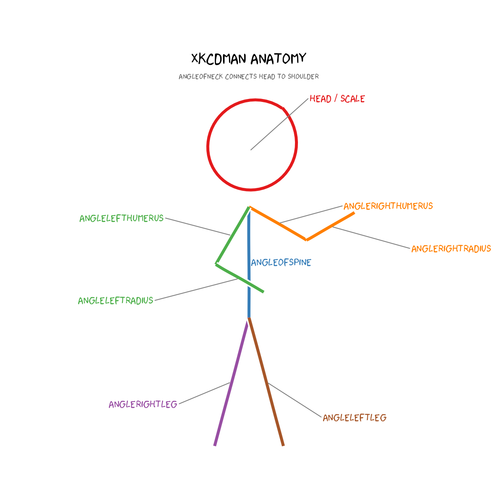
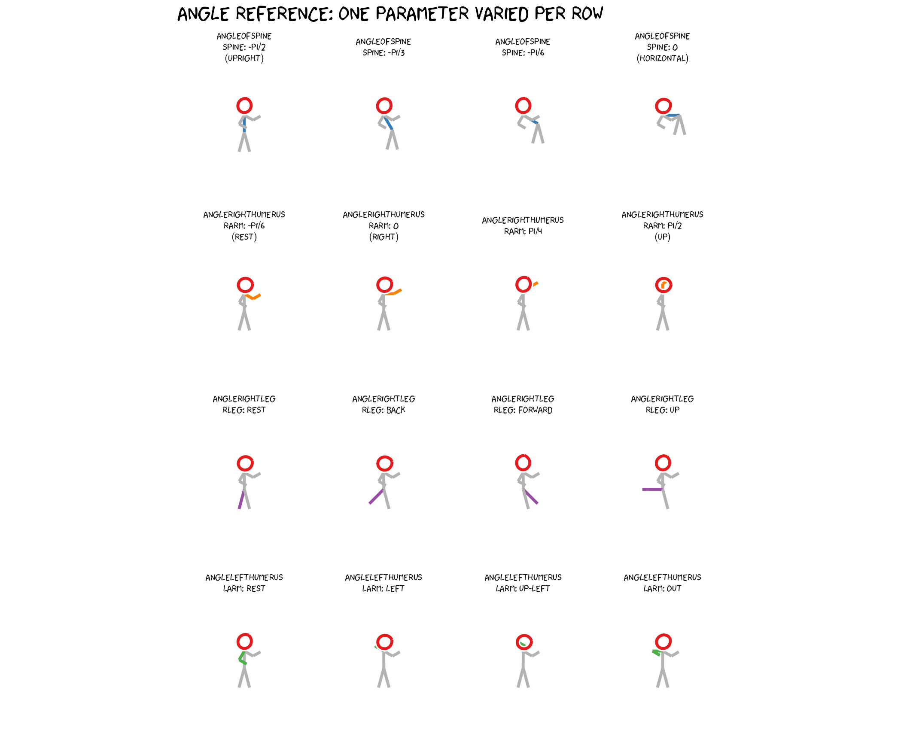

# xkcdman: The Stick Figure Guide

[`library`](https://rdrr.io/r/base/library.html)`(`[`xkcd`](https://github.com/ToledoEM/xkcd)`)`` `[`library`](https://rdrr.io/r/base/library.html)`(`[`ggplot2`](https://ggplot2.tidyverse.org)`)`

## How xkcdman works

The wild anatomy of a stick figure.

[`xkcdman()`](https://toledoem.github.io/xkcd/reference/xkcdman.md)
draws a stick figure defined entirely by **angles** (in radians) for
each body segment. The figure has 8 parts:

| Parameter           | Body part                            |
|---------------------|--------------------------------------|
| `angleofneck`       | neck — connects head to top of spine |
| `angleofspine`      | spine — main torso                   |
| `anglerighthumerus` | right upper arm                      |
| `anglerightradius`  | right forearm                        |
| `anglelefthumerus`  | left upper arm                       |
| `angleleftradius`   | left forearm                         |
| `anglerightleg`     | right leg                            |
| `angleleftleg`      | left leg                             |

Two other parameters control **size and proportion**:

- `scale` — diameter of the head (all other segments are proportional to
  it). Set it to roughly 10–15% of `diff(yrange)`.
- `ratioxy` — `diff(xrange) / diff(yrange)`. Corrects for axis scaling
  so the figure is not stretched horizontally or vertically.

All angles follow the standard mathematical convention: **0 = right, π/2
= up, π = left, 3π/2 (or −π/2) = down**.

------------------------------------------------------------------------

## Part 1 — Anatomy diagram

Each bone is drawn separately with its own color so you can see exactly
what each parameter controls. The helper below draws a single labeled
figure with colored segments.

`# --- geometry helper: compute bone endpoints from the same formulas as xkcdman`` ``make_figure`` ``<-`` ``function``(``x``, ``y``, ``scale``, ``ratioxy``,`` `` ``angleofneck``, ``angleofspine``,`` `` ``anglerighthumerus``, ``anglerightradius``,`` `` ``anglelefthumerus``, ``angleleftradius``,`` `` ``anglerightleg``, ``angleleftleg``)`` ``{`` `` `` ``dh`` ``<-`` ``scale`` ``# head diameter`` `` ``ls`` ``<-`` ``dh`` ``# spine length`` `` ``ll`` ``<-`` ``ls`` ``*`` ``1.2`` ``# leg length`` `` ``lh`` ``<-`` ``ls`` ``*`` ``0.6`` ``# humerus length`` `` ``lr`` ``<-`` ``ls`` ``*`` ``0.5`` ``# radius length`` `` `` ``# key joint positions`` `` ``shoulder`` ``<-`` `[`c`](https://rdrr.io/r/base/c.html)`(``x``, ``y``)`` ``+`` `` ``(``dh`` ``/`` ``2``)`` ``*`` `[`c`](https://rdrr.io/r/base/c.html)`(`[`cos`](https://rdrr.io/r/base/Trig.html)`(``angleofneck``)`` ``*`` ``ratioxy``, `[`sin`](https://rdrr.io/r/base/Trig.html)`(``angleofneck``)``)`` `` ``hip`` ``<-`` ``shoulder`` ``+`` `` ``ls`` ``*`` `[`c`](https://rdrr.io/r/base/c.html)`(`[`cos`](https://rdrr.io/r/base/Trig.html)`(``angleofspine``)`` ``*`` ``ratioxy``, `[`sin`](https://rdrr.io/r/base/Trig.html)`(``angleofspine``)``)`` `` ``end_rh`` ``<-`` ``shoulder`` ``+`` `` ``lh`` ``*`` `[`c`](https://rdrr.io/r/base/c.html)`(`[`cos`](https://rdrr.io/r/base/Trig.html)`(``anglerighthumerus``)`` ``*`` ``ratioxy``, `[`sin`](https://rdrr.io/r/base/Trig.html)`(``anglerighthumerus``)``)`` `` ``end_lh`` ``<-`` ``shoulder`` ``+`` `` ``lh`` ``*`` `[`c`](https://rdrr.io/r/base/c.html)`(`[`cos`](https://rdrr.io/r/base/Trig.html)`(``anglelefthumerus``)`` ``*`` ``ratioxy``, `[`sin`](https://rdrr.io/r/base/Trig.html)`(``anglelefthumerus``)``)`` `` `` ``seg`` ``<-`` ``function``(``from``, ``angle``, ``dist``)`` `` `[`data.frame`](https://rdrr.io/r/base/data.frame.html)`(`` `` x ``=`` ``from``[``1``]``,`` `` y ``=`` ``from``[``2``]``,`` `` xend ``=`` ``from``[``1``]`` ``+`` ``dist`` ``*`` `[`cos`](https://rdrr.io/r/base/Trig.html)`(``angle``)`` ``*`` ``ratioxy``,`` `` yend ``=`` ``from``[``2``]`` ``+`` ``dist`` ``*`` `[`sin`](https://rdrr.io/r/base/Trig.html)`(``angle``)`` `` ``)`` `` `` `[`list`](https://rdrr.io/r/base/list.html)`(`` `` head ``=`` `[`data.frame`](https://rdrr.io/r/base/data.frame.html)`(``x ``=`` ``x``, y ``=`` ``y``, diameter ``=`` ``dh``)``,`` `` spine ``=`` ``seg``(``shoulder``, ``angleofspine``, ``ls``)``,`` `` rarm1 ``=`` ``seg``(``shoulder``, ``anglerighthumerus``, ``lh``)``,`` `` rarm2 ``=`` ``seg``(``end_rh``, ``anglerightradius``, ``lr``)``,`` `` larm1 ``=`` ``seg``(``shoulder``, ``anglelefthumerus``, ``lh``)``,`` `` larm2 ``=`` ``seg``(``end_lh``, ``angleleftradius``, ``lr``)``,`` `` rleg ``=`` ``seg``(``hip``, ``anglerightleg``, ``ll``)``,`` `` lleg ``=`` ``seg``(``hip``, ``angleleftleg``, ``ll``)`` `` ``)`` ``}`` `` ``# Standard upright pose — large figure centred in the plot`` ``xrange`` ``<-`` `[`c`](https://rdrr.io/r/base/c.html)`(``0``, ``10``)`` ``yrange`` ``<-`` `[`c`](https://rdrr.io/r/base/c.html)`(``0``, ``10``)`` ``rxy`` ``<-`` `[`diff`](https://rdrr.io/r/base/diff.html)`(``xrange``)`` ``/`` `[`diff`](https://rdrr.io/r/base/diff.html)`(``yrange``)`` ``sc`` ``<-`` ``2.5`` ``# bigger figure fills the space`` `` ``f`` ``<-`` ``make_figure``(`` `` x ``=`` ``5``, y ``=`` ``7.2``, scale ``=`` ``sc``, ratioxy ``=`` ``rxy``,`` `` angleofneck ``=`` ``-``pi`` ``/`` ``2``,`` `` angleofspine ``=`` ``-``pi`` ``/`` ``2``,`` `` anglerighthumerus ``=`` ``-``pi`` ``/`` ``6``,`` `` anglerightradius ``=`` ``pi`` ``/`` ``6``,`` `` anglelefthumerus ``=`` ``-``pi`` ``/`` ``2`` ``-`` ``pi`` ``/`` ``6``,`` `` angleleftradius ``=`` ``-``pi`` ``/`` ``6``,`` `` anglerightleg ``=`` ``3`` ``*`` ``pi`` ``/`` ``2`` ``-`` ``pi`` ``/`` ``12``,`` `` angleleftleg ``=`` ``3`` ``*`` ``pi`` ``/`` ``2`` ``+`` ``pi`` ``/`` ``12`` ``)`` `` ``colours`` ``<-`` `[`c`](https://rdrr.io/r/base/c.html)`(`` `` head ``=`` ``"#e41a1c"``,`` `` spine ``=`` ``"#377eb8"``,`` `` rarm1 ``=`` ``"#ff7f00"``,`` `` rarm2 ``=`` ``"#ff7f00"``,`` `` larm1 ``=`` ``"#4daf4a"``,`` `` larm2 ``=`` ``"#4daf4a"``,`` `` rleg ``=`` ``"#984ea3"``,`` `` lleg ``=`` ``"#a65628"`` ``)`` `` `[`set.seed`](https://rdrr.io/r/base/Random.html)`(``99``)`` ``p_anat`` ``<-`` `[`ggplot`](https://ggplot2.tidyverse.org/reference/ggplot.html)`(``)`` ``+`` `[`coord_fixed`](https://ggplot2.tidyverse.org/reference/coord_fixed.html)`(``xlim ``=`` ``xrange``, ylim ``=`` ``yrange``)`` `` ``# head`` ``p_anat`` ``<-`` ``p_anat`` ``+`` `` `[`geom_xkcdpath`](https://toledoem.github.io/xkcd/reference/geom_xkcdpath.md)`(`[`aes`](https://ggplot2.tidyverse.org/reference/aes.html)`(``x ``=`` ``x``, y ``=`` ``y``, diameter ``=`` ``diameter``)``,`` `` data ``=`` ``f``$``head``, colour ``=`` ``colours``[``"head"``]``,`` `` linewidth ``=`` ``1.4``, ratioxy ``=`` ``rxy``, mask ``=`` ``FALSE``)`` `` ``# bones`` ``bones`` ``<-`` `[`c`](https://rdrr.io/r/base/c.html)`(``"spine"``, ``"rarm1"``, ``"rarm2"``, ``"larm1"``, ``"larm2"``, ``"rleg"``, ``"lleg"``)`` ``for`` ``(``b`` ``in`` ``bones``)`` ``{`` `` ``p_anat`` ``<-`` ``p_anat`` ``+`` `` `[`geom_xkcdpath`](https://toledoem.github.io/xkcd/reference/geom_xkcdpath.md)`(`[`aes`](https://ggplot2.tidyverse.org/reference/aes.html)`(``x ``=`` ``x``, y ``=`` ``y``, xend ``=`` ``xend``, yend ``=`` ``yend``)``,`` `` data ``=`` ``f``[[``b``]``]``, colour ``=`` ``colours``[``b``]``,`` `` linewidth ``=`` ``1.4``, mask ``=`` ``FALSE``,`` `` xjitteramount ``=`` ``0.02``, yjitteramount ``=`` ``0.02``)`` ``}`` `` `[`library`](https://rdrr.io/r/base/library.html)`(`[`ggrepel`](https://ggrepel.slowkow.com/)`)`` `` ``# Label origins at bone midpoints, nudged outward from figure centre`` ``labels_df`` ``<-`` `[`data.frame`](https://rdrr.io/r/base/data.frame.html)`(`` `` x ``=`` `[`c`](https://rdrr.io/r/base/c.html)`(`` `` ``f``$``head``$``x``,`` `` ``(``f``$``spine``$``x`` ``+`` ``f``$``spine``$``xend``)`` ``/`` ``2``,`` `` ``(``f``$``rarm1``$``x`` ``+`` ``f``$``rarm1``$``xend``)`` ``/`` ``2``,`` `` ``(``f``$``rarm2``$``x`` ``+`` ``f``$``rarm2``$``xend``)`` ``/`` ``2``,`` `` ``(``f``$``larm1``$``x`` ``+`` ``f``$``larm1``$``xend``)`` ``/`` ``2``,`` `` ``(``f``$``larm2``$``x`` ``+`` ``f``$``larm2``$``xend``)`` ``/`` ``2``,`` `` ``(``f``$``rleg``$``x`` ``+`` ``f``$``rleg``$``xend``)`` ``/`` ``2``,`` `` ``(``f``$``lleg``$``x`` ``+`` ``f``$``lleg``$``xend``)`` ``/`` ``2`` `` ``)``,`` `` y ``=`` `[`c`](https://rdrr.io/r/base/c.html)`(`` `` ``f``$``head``$``y``,`` `` ``(``f``$``spine``$``y`` ``+`` ``f``$``spine``$``yend``)`` ``/`` ``2``,`` `` ``(``f``$``rarm1``$``y`` ``+`` ``f``$``rarm1``$``yend``)`` ``/`` ``2``,`` `` ``(``f``$``rarm2``$``y`` ``+`` ``f``$``rarm2``$``yend``)`` ``/`` ``2``,`` `` ``(``f``$``larm1``$``y`` ``+`` ``f``$``larm1``$``yend``)`` ``/`` ``2``,`` `` ``(``f``$``larm2``$``y`` ``+`` ``f``$``larm2``$``yend``)`` ``/`` ``2``,`` `` ``(``f``$``rleg``$``y`` ``+`` ``f``$``rleg``$``yend``)`` ``/`` ``2``,`` `` ``(``f``$``lleg``$``y`` ``+`` ``f``$``lleg``$``yend``)`` ``/`` ``2`` `` ``)``,`` `` label ``=`` `[`c`](https://rdrr.io/r/base/c.html)`(``"head / scale"``, ``"angleofspine"``,`` `` ``"anglerighthumerus"``, ``"anglerightradius"``,`` `` ``"anglelefthumerus"``, ``"angleleftradius"``,`` `` ``"anglerightleg"``, ``"angleleftleg"``)``,`` `` col ``=`` `[`unname`](https://rdrr.io/r/base/unname.html)`(``colours``[`[`c`](https://rdrr.io/r/base/c.html)`(``"head"``,``"spine"``,``"rarm1"``,``"rarm2"``,``"larm1"``,``"larm2"``,``"rleg"``,``"lleg"``)``]``)``,`` `` ``# nudge labels away from figure: right side +x, left side -x, head up`` `` nx ``=`` `[`c`](https://rdrr.io/r/base/c.html)`(`` ``2.0``, ``0.3``, ``2.5``, ``2.8``, ``-``2.5``, ``-``2.8``, ``-``2.0``, ``2.0``)``,`` `` ny ``=`` `[`c`](https://rdrr.io/r/base/c.html)`(`` ``1.2``, ``0``, ``0.4``, ``-``0.5``, ``0.4``, ``-``0.5``, ``-``0.5``, ``-``0.8``)`` ``)`` `` ``p_anat`` ``<-`` ``p_anat`` ``+`` `` `[`geom_text_repel`](https://ggrepel.slowkow.com/reference/geom_text_repel.html)`(`` `` `[`aes`](https://ggplot2.tidyverse.org/reference/aes.html)`(``x ``=`` ``x``, y ``=`` ``y``, label ``=`` ``label``, colour ``=`` ``col``)``,`` `` data ``=`` ``labels_df``,`` `` nudge_x ``=`` ``labels_df``$``nx``,`` `` nudge_y ``=`` ``labels_df``$``ny``,`` `` family ``=`` ``"xkcd"``,`` `` size ``=`` ``4``,`` `` box.padding ``=`` `[`unit`](https://rdrr.io/r/grid/unit.html)`(``0.1``, ``"lines"``)``,`` `` point.padding ``=`` `[`unit`](https://rdrr.io/r/grid/unit.html)`(``0.1``, ``"lines"``)``,`` `` force ``=`` ``1``,`` `` min.segment.length ``=`` ``0.3``,`` `` segment.size ``=`` ``0.4``,`` `` segment.colour ``=`` ``"grey50"``,`` `` seed ``=`` ``42``,`` `` show.legend ``=`` ``FALSE`` `` ``)`` ``+`` `` `[`scale_colour_identity`](https://ggplot2.tidyverse.org/reference/scale_identity.html)`(``)`` `` ``p_anat`` ``<-`` ``p_anat`` ``+`` `` `[`annotate`](https://ggplot2.tidyverse.org/reference/annotate.html)`(``"text"``, x ``=`` ``5``, y ``=`` ``9.3``,`` `` label ``=`` ``"xkcdman anatomy"``, family ``=`` ``"xkcd"``, size ``=`` ``6``)`` ``+`` `` `[`annotate`](https://ggplot2.tidyverse.org/reference/annotate.html)`(``"text"``, x ``=`` ``5``, y ``=`` ``8.9``,`` `` label ``=`` ``"angleofneck connects head to shoulder"``,`` `` family ``=`` ``"xkcd"``, size ``=`` ``3``, colour ``=`` ``"grey40"``)`` ``+`` `` `[`theme_xkcd`](https://toledoem.github.io/xkcd/reference/theme_xkcd.md)`(``)`` ``+`` `` `[`theme`](https://ggplot2.tidyverse.org/reference/theme.html)`(``axis.text ``=`` `[`element_blank`](https://ggplot2.tidyverse.org/reference/element.html)`(``)``, axis.ticks ``=`` `[`element_blank`](https://ggplot2.tidyverse.org/reference/element.html)`(``)``,`` `` axis.title ``=`` `[`element_blank`](https://ggplot2.tidyverse.org/reference/element.html)`(``)``)`` `` ``p_anat`



------------------------------------------------------------------------

## Part 2 — Pose gallery

Six figures in a faceted layout, each with a different pose. Every
figure uses the same helper so we only specify the angles that change.

`# Helper: return list(segs = df, head = df) for one pose`` ``pose_segments`` ``<-`` ``function``(``pose_name``, ``x``, ``y``, ``scale``, ``ratioxy``,`` `` ``angleofneck``, ``angleofspine``,`` `` ``anglerighthumerus``, ``anglerightradius``,`` `` ``anglelefthumerus``, ``angleleftradius``,`` `` ``anglerightleg``, ``angleleftleg``)`` ``{`` `` `` ``f`` ``<-`` ``make_figure``(``x``, ``y``, ``scale``, ``ratioxy``,`` `` ``angleofneck``, ``angleofspine``,`` `` ``anglerighthumerus``, ``anglerightradius``,`` `` ``anglelefthumerus``, ``angleleftradius``,`` `` ``anglerightleg``, ``angleleftleg``)`` `` `` ``segs`` ``<-`` `[`do.call`](https://rdrr.io/r/base/do.call.html)`(``rbind``, `[`lapply`](https://rdrr.io/r/base/lapply.html)`(`` `` `[`c`](https://rdrr.io/r/base/c.html)`(``"spine"``,``"rarm1"``,``"rarm2"``,``"larm1"``,``"larm2"``,``"rleg"``,``"lleg"``)``,`` `` ``function``(``b``)`` ``{`` ``d`` ``<-`` ``f``[[``b``]``]``; ``d``$``part`` ``<-`` ``b``; ``d`` ``}`` `` ``)``)`` `` ``segs``$``pose`` ``<-`` ``pose_name`` `` `` ``head_df`` ``<-`` `[`data.frame`](https://rdrr.io/r/base/data.frame.html)`(``x ``=`` ``f``$``head``$``x``, y ``=`` ``f``$``head``$``y``,`` `` diameter ``=`` ``f``$``head``$``diameter``,`` `` xend ``=`` ``NA_real_``, yend ``=`` ``NA_real_``,`` `` part ``=`` ``"head"``, pose ``=`` ``pose_name``)`` `` `` `[`list`](https://rdrr.io/r/base/list.html)`(``segs ``=`` ``segs``, head ``=`` ``head_df``)`` ``}`` `` ``# Helper: vary one angle across values, return list(segs=df, heads=df)`` ``vary_angle`` ``<-`` ``function``(``param``, ``values``, ``labels``)`` ``{`` `` ``all_segs`` ``<-`` ``NULL`` `` ``all_heads`` ``<-`` ``NULL`` `` ``for`` ``(``i`` ``in`` `[`seq_along`](https://rdrr.io/r/base/seq.html)`(``values``)``)`` ``{`` `` ``args`` ``<-`` ``neutral`` `` ``args``[[``param``]``]`` ``<-`` ``values``[``i``]`` `` ``r`` ``<-`` ``pose_segments``(`` `` pose_name ``=`` ``labels``[``i``]``,`` `` x ``=`` ``5``, y ``=`` ``7.2``, scale ``=`` ``1.4``, ratioxy ``=`` ``1``,`` `` angleofneck ``=`` ``args``$``angleofneck``,`` `` angleofspine ``=`` ``args``$``angleofspine``,`` `` anglerighthumerus ``=`` ``args``$``anglerighthumerus``,`` `` anglerightradius ``=`` ``args``$``anglerightradius``,`` `` anglelefthumerus ``=`` ``args``$``anglelefthumerus``,`` `` angleleftradius ``=`` ``args``$``angleleftradius``,`` `` anglerightleg ``=`` ``args``$``anglerightleg``,`` `` angleleftleg ``=`` ``args``$``angleleftleg`` `` ``)`` `` ``all_segs`` ``<-`` `[`rbind`](https://rdrr.io/r/base/cbind.html)`(``all_segs``, ``r``$``segs``)`` `` ``all_heads`` ``<-`` `[`rbind`](https://rdrr.io/r/base/cbind.html)`(``all_heads``, ``r``$``head``)`` `` ``}`` `` `[`list`](https://rdrr.io/r/base/list.html)`(``segs ``=`` ``all_segs``, heads ``=`` ``all_heads``)`` ``}`` `` ``# Common geometry: square data space`` ``xr`` ``<-`` `[`c`](https://rdrr.io/r/base/c.html)`(``0``, ``10``)``; ``yr`` ``<-`` `[`c`](https://rdrr.io/r/base/c.html)`(``0``, ``10``)``; ``rxy`` ``<-`` ``1``; ``sc`` ``<-`` ``1.4`` `` ``poses`` ``<-`` `[`list`](https://rdrr.io/r/base/list.html)`(`` `` ``# 1. Standing at rest`` `` ``pose_segments``(``"Standing"``,`` `` x ``=`` ``5``, y ``=`` ``7.2``, scale ``=`` ``sc``, ratioxy ``=`` ``rxy``,`` `` angleofneck ``=`` ``-``pi``/``2``,`` `` angleofspine ``=`` ``-``pi``/``2``,`` `` anglerighthumerus ``=`` ``-``pi``/``6``,`` `` anglerightradius ``=`` ``pi``/``6``,`` `` anglelefthumerus ``=`` ``-``pi``/``2`` ``-`` ``pi``/``6``,`` `` angleleftradius ``=`` ``-``pi``/``6``,`` `` anglerightleg ``=`` ``3``*``pi``/``2`` ``-`` ``pi``/``12``,`` `` angleleftleg ``=`` ``3``*``pi``/``2`` ``+`` ``pi``/``12``)``,`` `` `` ``# 2. Arms raised (cheering)`` `` ``pose_segments``(``"Arms up"``,`` `` x ``=`` ``5``, y ``=`` ``7.2``, scale ``=`` ``sc``, ratioxy ``=`` ``rxy``,`` `` angleofneck ``=`` ``-``pi``/``2``,`` `` angleofspine ``=`` ``-``pi``/``2``,`` `` anglerighthumerus ``=`` ``pi``/``3``,`` `` anglerightradius ``=`` ``pi``/``2``,`` `` anglelefthumerus ``=`` ``pi`` ``-`` ``pi``/``3``,`` `` angleleftradius ``=`` ``pi``/``2``,`` `` anglerightleg ``=`` ``3``*``pi``/``2`` ``-`` ``pi``/``12``,`` `` angleleftleg ``=`` ``3``*``pi``/``2`` ``+`` ``pi``/``12``)``,`` `` `` ``# 3. Walking (leaning forward, legs apart)`` `` ``pose_segments``(``"Walking"``,`` `` x ``=`` ``5``, y ``=`` ``7.4``, scale ``=`` ``sc``, ratioxy ``=`` ``rxy``,`` `` angleofneck ``=`` ``-``pi``/``2`` ``+`` ``pi``/``10``,`` `` angleofspine ``=`` ``-``pi``/``2`` ``+`` ``pi``/``10``,`` `` anglerighthumerus ``=`` ``pi``/``2`` ``+`` ``pi``/``6``,`` `` anglerightradius ``=`` ``pi``/``2``,`` `` anglelefthumerus ``=`` ``-``pi``/``6``,`` `` angleleftradius ``=`` ``0``,`` `` anglerightleg ``=`` ``3``*``pi``/``2`` ``-`` ``pi``/``5``,`` `` angleleftleg ``=`` ``3``*``pi``/``2`` ``+`` ``pi``/``4``)``,`` `` `` ``# 4. Pointing right`` `` ``pose_segments``(``"Pointing"``,`` `` x ``=`` ``5``, y ``=`` ``7.2``, scale ``=`` ``sc``, ratioxy ``=`` ``rxy``,`` `` angleofneck ``=`` ``-``pi``/``2``,`` `` angleofspine ``=`` ``-``pi``/``2``,`` `` anglerighthumerus ``=`` ``0``,`` `` anglerightradius ``=`` ``0``,`` `` anglelefthumerus ``=`` ``-``pi``/``2`` ``-`` ``pi``/``6``,`` `` angleleftradius ``=`` ``-``pi``/``6``,`` `` anglerightleg ``=`` ``3``*``pi``/``2`` ``-`` ``pi``/``12``,`` `` angleleftleg ``=`` ``3``*``pi``/``2`` ``+`` ``pi``/``12``)``,`` `` `` ``# 5. Sitting (spine horizontal, legs bent)`` `` ``pose_segments``(``"Sitting"``,`` `` x ``=`` ``5``, y ``=`` ``5.8``, scale ``=`` ``sc``, ratioxy ``=`` ``rxy``,`` `` angleofneck ``=`` ``-``pi``/``2``,`` `` angleofspine ``=`` ``0``,`` `` anglerighthumerus ``=`` ``-``pi``/``2`` ``-`` ``pi``/``6``,`` `` anglerightradius ``=`` ``-``pi``/``2``,`` `` anglelefthumerus ``=`` ``-``pi``/``2`` ``+`` ``pi``/``6``,`` `` angleleftradius ``=`` ``-``pi``/``2``,`` `` anglerightleg ``=`` ``pi``/``2``,`` `` angleleftleg ``=`` ``pi``/``2`` ``+`` ``pi``/``2``)``,`` `` `` ``# 6. Falling / off-balance`` `` ``pose_segments``(``"Falling"``,`` `` x ``=`` ``5``, y ``=`` ``7.0``, scale ``=`` ``sc``, ratioxy ``=`` ``rxy``,`` `` angleofneck ``=`` ``-``pi``/``2`` ``-`` ``pi``/``4``,`` `` angleofspine ``=`` ``-``pi``/``2`` ``-`` ``pi``/``4``,`` `` anglerighthumerus ``=`` ``pi``/``4``,`` `` anglerightradius ``=`` ``pi``/``2``,`` `` anglelefthumerus ``=`` ``pi`` ``-`` ``pi``/``8``,`` `` angleleftradius ``=`` ``pi``/``2`` ``+`` ``pi``/``4``,`` `` anglerightleg ``=`` ``3``*``pi``/``2`` ``+`` ``pi``/``6``,`` `` angleleftleg ``=`` ``3``*``pi``/``2`` ``-`` ``pi``/``3``)`` ``)`` `` ``# Combine into one data frame`` ``all_segs`` ``<-`` `[`do.call`](https://rdrr.io/r/base/do.call.html)`(``rbind``, `[`lapply`](https://rdrr.io/r/base/lapply.html)`(``poses``, ``` `[[` ```, ``"segs"``)``)`` ``all_heads`` ``<-`` `[`do.call`](https://rdrr.io/r/base/do.call.html)`(``rbind``, `[`lapply`](https://rdrr.io/r/base/lapply.html)`(``poses``, ``` `[[` ```, ``"head"``)``)`` `` ``part_colours`` ``<-`` `[`c`](https://rdrr.io/r/base/c.html)`(`` `` head ``=`` ``"#e41a1c"``,`` `` spine ``=`` ``"#377eb8"``,`` `` rarm1 ``=`` ``"#ff7f00"``, rarm2 ``=`` ``"#ff7f00"``,`` `` larm1 ``=`` ``"#4daf4a"``, larm2 ``=`` ``"#4daf4a"``,`` `` rleg ``=`` ``"#984ea3"``,`` `` lleg ``=`` ``"#a65628"`` ``)`` `` ``all_segs``$``colour`` ``<-`` ``part_colours``[``all_segs``$``part``]`` ``all_heads``$``colour`` ``<-`` ``part_colours``[``"head"``]`` `` ``# Fix facet order`` ``pose_order`` ``<-`` `[`c`](https://rdrr.io/r/base/c.html)`(``"Standing"``,``"Arms up"``,``"Walking"``,``"Pointing"``,``"Sitting"``,``"Falling"``)`` ``all_segs``$``pose`` ``<-`` `[`factor`](https://rdrr.io/r/base/factor.html)`(``all_segs``$``pose``, levels ``=`` ``pose_order``)`` ``all_heads``$``pose`` ``<-`` `[`factor`](https://rdrr.io/r/base/factor.html)`(``all_heads``$``pose``, levels ``=`` ``pose_order``)`` `` `[`set.seed`](https://rdrr.io/r/base/Random.html)`(``42``)`` `` ``p_poses`` ``<-`` `[`ggplot`](https://ggplot2.tidyverse.org/reference/ggplot.html)`(``)`` ``+`` `` ``# draw each bone segment`` `` `[`geom_xkcdpath`](https://toledoem.github.io/xkcd/reference/geom_xkcdpath.md)`(`` `` `[`aes`](https://ggplot2.tidyverse.org/reference/aes.html)`(``x ``=`` ``x``, y ``=`` ``y``, xend ``=`` ``xend``, yend ``=`` ``yend``, colour ``=`` ``colour``)``,`` `` data ``=`` ``all_segs``,`` `` linewidth ``=`` ``1.3``, mask ``=`` ``FALSE``,`` `` xjitteramount ``=`` ``0.04``, yjitteramount ``=`` ``0.04``,`` `` inherit.aes ``=`` ``FALSE`` `` ``)`` ``+`` `` ``# draw each head circle`` `` `[`geom_xkcdpath`](https://toledoem.github.io/xkcd/reference/geom_xkcdpath.md)`(`` `` `[`aes`](https://ggplot2.tidyverse.org/reference/aes.html)`(``x ``=`` ``x``, y ``=`` ``y``, diameter ``=`` ``diameter``, colour ``=`` ``colour``)``,`` `` data ``=`` ``all_heads``,`` `` linewidth ``=`` ``1.3``, ratioxy ``=`` ``1``, mask ``=`` ``FALSE``,`` `` inherit.aes ``=`` ``FALSE`` `` ``)`` ``+`` `` `[`scale_colour_identity`](https://ggplot2.tidyverse.org/reference/scale_identity.html)`(`` `` guide ``=`` ``"legend"``,`` `` name ``=`` ``"Body part"``,`` `` breaks ``=`` ``part_colours``[`[`c`](https://rdrr.io/r/base/c.html)`(``"head"``,``"spine"``,``"rarm1"``,``"larm1"``,``"rleg"``,``"lleg"``)``]``,`` `` labels ``=`` `[`c`](https://rdrr.io/r/base/c.html)`(``"head / scale"``,``"spine"``,``"right arm"``,``"left arm"``,``"right leg"``,``"left leg"``)`` `` ``)`` ``+`` `` `[`facet_wrap`](https://ggplot2.tidyverse.org/reference/facet_wrap.html)`(``~`` ``pose``, ncol ``=`` ``3``)`` ``+`` `` `[`coord_fixed`](https://ggplot2.tidyverse.org/reference/coord_fixed.html)`(``xlim ``=`` ``xr``, ylim ``=`` ``yr``)`` ``+`` `` `[`theme_xkcd`](https://toledoem.github.io/xkcd/reference/theme_xkcd.md)`(``)`` ``+`` `` `[`theme`](https://ggplot2.tidyverse.org/reference/theme.html)`(`` `` axis.text ``=`` `[`element_blank`](https://ggplot2.tidyverse.org/reference/element.html)`(``)``,`` `` axis.ticks ``=`` `[`element_blank`](https://ggplot2.tidyverse.org/reference/element.html)`(``)``,`` `` axis.title ``=`` `[`element_blank`](https://ggplot2.tidyverse.org/reference/element.html)`(``)``,`` `` strip.text ``=`` `[`element_text`](https://ggplot2.tidyverse.org/reference/element.html)`(``family ``=`` ``"xkcd"``, size ``=`` ``13``)`` `` ``)`` ``+`` `` `[`labs`](https://ggplot2.tidyverse.org/reference/labs.html)`(``title ``=`` ``"xkcdman pose gallery"``)`` `` ``p_poses`


------------------------------------------------------------------------

## Part 3 — Angle reference

The figure below shows the same upright figure four times, varying one
parameter at a time across a row, so you can see directly how each angle
value changes the pose.

`# Neutral (upright) pose used as baseline`` ``neutral`` ``<-`` `[`list`](https://rdrr.io/r/base/list.html)`(`` `` angleofneck ``=`` ``-``pi``/``2``,`` `` angleofspine ``=`` ``-``pi``/``2``,`` `` anglerighthumerus ``=`` ``-``pi``/``6``,`` `` anglerightradius ``=`` ``pi``/``6``,`` `` anglelefthumerus ``=`` ``-``pi``/``2`` ``-`` ``pi``/``6``,`` `` angleleftradius ``=`` ``-``pi``/``6``,`` `` anglerightleg ``=`` ``3``*``pi``/``2`` ``-`` ``pi``/``12``,`` `` angleleftleg ``=`` ``3``*``pi``/``2`` ``+`` ``pi``/``12`` ``)`` `` ``params_to_vary`` ``<-`` `[`list`](https://rdrr.io/r/base/list.html)`(`` `` `[`list`](https://rdrr.io/r/base/list.html)`(``p ``=`` ``"angleofspine"``,`` `` v ``=`` `[`c`](https://rdrr.io/r/base/c.html)`(``-``pi``/``2``, ``-``pi``/``2`` ``+`` ``pi``/``6``, ``-``pi``/``2`` ``+`` ``pi``/``3``, ``0``)``,`` `` l ``=`` `[`c`](https://rdrr.io/r/base/c.html)`(``"spine: -pi/2\n(upright)"``, ``"spine: -pi/3"``, ``"spine: -pi/6"``, ``"spine: 0\n(horizontal)"``)``)``,`` `` `[`list`](https://rdrr.io/r/base/list.html)`(``p ``=`` ``"anglerighthumerus"``,`` `` v ``=`` `[`c`](https://rdrr.io/r/base/c.html)`(``-``pi``/``6``, ``0``, ``pi``/``4``, ``pi``/``2``)``,`` `` l ``=`` `[`c`](https://rdrr.io/r/base/c.html)`(``"rarm: -pi/6\n(rest)"``, ``"rarm: 0\n(right)"``, ``"rarm: pi/4"``, ``"rarm: pi/2\n(up)"``)``)``,`` `` `[`list`](https://rdrr.io/r/base/list.html)`(``p ``=`` ``"anglerightleg"``,`` `` v ``=`` `[`c`](https://rdrr.io/r/base/c.html)`(``3``*``pi``/``2`` ``-`` ``pi``/``12``, ``3``*``pi``/``2`` ``-`` ``pi``/``4``, ``3``*``pi``/``2`` ``+`` ``pi``/``4``, ``3``*``pi``/``2`` ``-`` ``pi``/``2``)``,`` `` l ``=`` `[`c`](https://rdrr.io/r/base/c.html)`(``"rleg: rest"``, ``"rleg: back"``, ``"rleg: forward"``, ``"rleg: up"``)``)``,`` `` `[`list`](https://rdrr.io/r/base/list.html)`(``p ``=`` ``"anglelefthumerus"``,`` `` v ``=`` `[`c`](https://rdrr.io/r/base/c.html)`(``-``pi``/``2``-``pi``/``6``, ``pi``-``pi``/``6``, ``pi``/``2``+``pi``/``6``, ``pi``)``,`` `` l ``=`` `[`c`](https://rdrr.io/r/base/c.html)`(``"larm: rest"``, ``"larm: left"``, ``"larm: up-left"``, ``"larm: out"``)``)`` ``)`` `` ``ref_segs`` ``<-`` `[`do.call`](https://rdrr.io/r/base/do.call.html)`(``rbind``, `[`lapply`](https://rdrr.io/r/base/lapply.html)`(``params_to_vary``, ``function``(``pv``)`` ``{`` `` ``r`` ``<-`` ``vary_angle``(``pv``$``p``, ``pv``$``v``, ``pv``$``l``)`` `` ``r``$``segs``$``group_param`` ``<-`` ``pv``$``p`` `` ``r``$``segs`` ``}``)``)`` `` ``ref_heads`` ``<-`` `[`do.call`](https://rdrr.io/r/base/do.call.html)`(``rbind``, `[`lapply`](https://rdrr.io/r/base/lapply.html)`(``params_to_vary``, ``function``(``pv``)`` ``{`` `` ``r`` ``<-`` ``vary_angle``(``pv``$``p``, ``pv``$``v``, ``pv``$``l``)`` `` ``r``$``heads``$``group_param`` ``<-`` ``pv``$``p`` `` ``r``$``heads`` ``}``)``)`` `` ``ref_segs``$``colour`` ``<-`` ``part_colours``[``ref_segs``$``part``]`` ``ref_heads``$``colour`` ``<-`` ``part_colours``[``"head"``]`` `` ``# highlighted part per param group`` ``highlight_map`` ``<-`` `[`c`](https://rdrr.io/r/base/c.html)`(`` `` angleofspine ``=`` ``"#377eb8"``,`` `` anglerighthumerus ``=`` ``"#ff7f00"``,`` `` anglerightleg ``=`` ``"#984ea3"``,`` `` anglelefthumerus ``=`` ``"#4daf4a"`` ``)`` `` ``ref_segs``$``colour`` ``<-`` `[`ifelse`](https://rdrr.io/r/base/ifelse.html)`(`` `` ``(``ref_segs``$``part`` ``==`` ``"spine"`` ``&`` ``ref_segs``$``group_param`` ``==`` ``"angleofspine"``)`` ``|`` `` ``(``ref_segs``$``part`` ``==`` ``"rarm1"`` ``&`` ``ref_segs``$``group_param`` ``==`` ``"anglerighthumerus"``)`` ``|`` `` ``(``ref_segs``$``part`` ``==`` ``"rarm2"`` ``&`` ``ref_segs``$``group_param`` ``==`` ``"anglerighthumerus"``)`` ``|`` `` ``(``ref_segs``$``part`` ``==`` ``"rleg"`` ``&`` ``ref_segs``$``group_param`` ``==`` ``"anglerightleg"``)`` ``|`` `` ``(``ref_segs``$``part`` ``==`` ``"larm1"`` ``&`` ``ref_segs``$``group_param`` ``==`` ``"anglelefthumerus"``)`` ``|`` `` ``(``ref_segs``$``part`` ``==`` ``"larm2"`` ``&`` ``ref_segs``$``group_param`` ``==`` ``"anglelefthumerus"``)``,`` `` ``ref_segs``$``colour``,`` `` ``"grey70"`` ``)`` `` ``# Facet label: combine group_param + pose`` ``ref_segs``$``facet_label`` ``<-`` `[`paste0`](https://rdrr.io/r/base/paste.html)`(``ref_segs``$``group_param``, ``"\n"``, ``ref_segs``$``pose``)`` ``ref_heads``$``facet_label`` ``<-`` `[`paste0`](https://rdrr.io/r/base/paste.html)`(``ref_heads``$``group_param``, ``"\n"``, ``ref_heads``$``pose``)`` `` ``# Build ordered factor across all 16 facets`` ``facet_order`` ``<-`` `[`unlist`](https://rdrr.io/r/base/unlist.html)`(`[`lapply`](https://rdrr.io/r/base/lapply.html)`(``params_to_vary``, ``function``(``pv``)`` `` `[`paste0`](https://rdrr.io/r/base/paste.html)`(``pv``$``p``, ``"\n"``, ``pv``$``l``)`` ``)``)`` ``ref_segs``$``facet_label`` ``<-`` `[`factor`](https://rdrr.io/r/base/factor.html)`(``ref_segs``$``facet_label``, levels ``=`` ``facet_order``)`` ``ref_heads``$``facet_label`` ``<-`` `[`factor`](https://rdrr.io/r/base/factor.html)`(``ref_heads``$``facet_label``, levels ``=`` ``facet_order``)`` `` `[`set.seed`](https://rdrr.io/r/base/Random.html)`(``7``)`` `` ``p_ref`` ``<-`` `[`ggplot`](https://ggplot2.tidyverse.org/reference/ggplot.html)`(``)`` ``+`` `` `[`geom_xkcdpath`](https://toledoem.github.io/xkcd/reference/geom_xkcdpath.md)`(`` `` `[`aes`](https://ggplot2.tidyverse.org/reference/aes.html)`(``x ``=`` ``x``, y ``=`` ``y``, xend ``=`` ``xend``, yend ``=`` ``yend``, colour ``=`` ``colour``)``,`` `` data ``=`` ``ref_segs``,`` `` linewidth ``=`` ``1.2``, mask ``=`` ``FALSE``,`` `` xjitteramount ``=`` ``0.03``, yjitteramount ``=`` ``0.03``,`` `` inherit.aes ``=`` ``FALSE`` `` ``)`` ``+`` `` `[`geom_xkcdpath`](https://toledoem.github.io/xkcd/reference/geom_xkcdpath.md)`(`` `` `[`aes`](https://ggplot2.tidyverse.org/reference/aes.html)`(``x ``=`` ``x``, y ``=`` ``y``, diameter ``=`` ``diameter``)``,`` `` data ``=`` ``ref_heads``,`` `` linewidth ``=`` ``1.2``, colour ``=`` ``"#e41a1c"``, ratioxy ``=`` ``1``, mask ``=`` ``FALSE``,`` `` inherit.aes ``=`` ``FALSE`` `` ``)`` ``+`` `` `[`scale_colour_identity`](https://ggplot2.tidyverse.org/reference/scale_identity.html)`(``)`` ``+`` `` `[`facet_wrap`](https://ggplot2.tidyverse.org/reference/facet_wrap.html)`(``~`` ``facet_label``, ncol ``=`` ``4``)`` ``+`` `` `[`coord_fixed`](https://ggplot2.tidyverse.org/reference/coord_fixed.html)`(``xlim ``=`` ``xr``, ylim ``=`` ``yr``)`` ``+`` `` `[`theme_xkcd`](https://toledoem.github.io/xkcd/reference/theme_xkcd.md)`(``)`` ``+`` `` `[`theme`](https://ggplot2.tidyverse.org/reference/theme.html)`(`` `` axis.text ``=`` `[`element_blank`](https://ggplot2.tidyverse.org/reference/element.html)`(``)``,`` `` axis.ticks ``=`` `[`element_blank`](https://ggplot2.tidyverse.org/reference/element.html)`(``)``,`` `` axis.title ``=`` `[`element_blank`](https://ggplot2.tidyverse.org/reference/element.html)`(``)``,`` `` strip.text ``=`` `[`element_text`](https://ggplot2.tidyverse.org/reference/element.html)`(``family ``=`` ``"xkcd"``, size ``=`` ``9``)`` `` ``)`` ``+`` `` `[`labs`](https://ggplot2.tidyverse.org/reference/labs.html)`(``title ``=`` ``"Angle reference: one parameter varied per row"``)`` `` ``p_ref`



------------------------------------------------------------------------

## Quick reference card

    angleofspine      -pi/2  upright  |  0  horizontal  |  pi/2  upside down
    angleofneck       match angleofspine for natural look
    anglerighthumerus -pi/6  hanging  |  0  right  |  pi/2  raised
    anglerightradius  follow anglerighthumerus + pi/6 for natural elbow bend
    anglelefthumerus  mirror of right: -pi/2 - anglerighthumerus
    angleleftradius   mirror of right
    anglerightleg     3*pi/2 - pi/12   (slight outward spread)
    angleleftleg      3*pi/2 + pi/12   (slight outward spread)

    scale     ~10-15% of diff(yrange)
    ratioxy   diff(xrange) / diff(yrange)   -- always set this!
