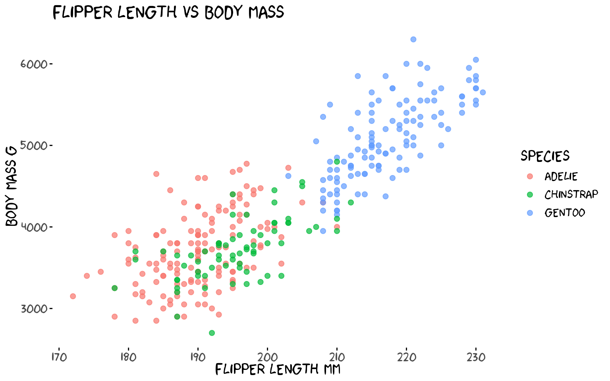
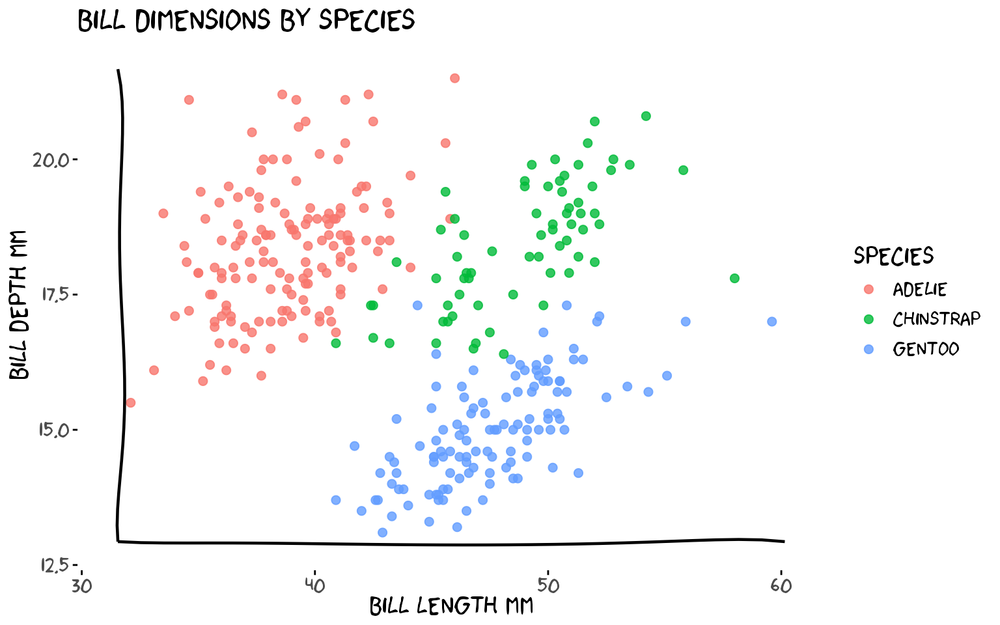
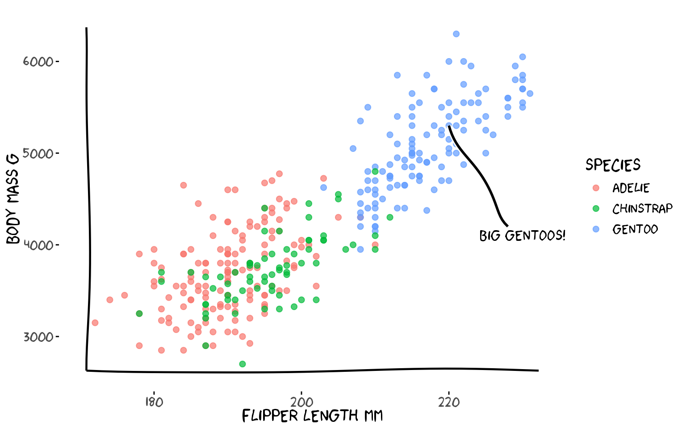
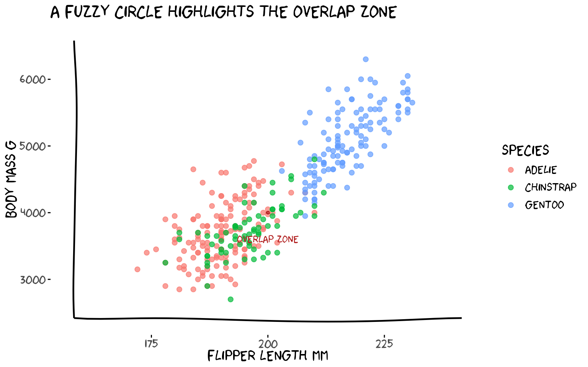
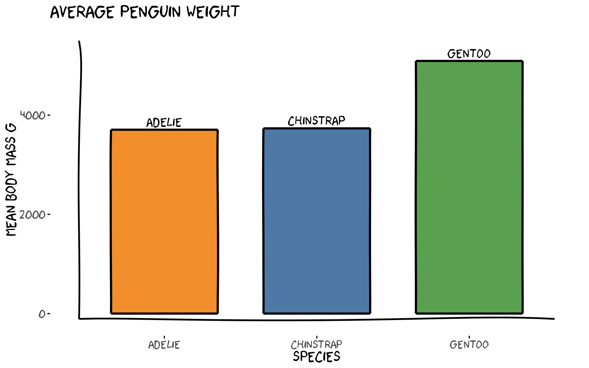
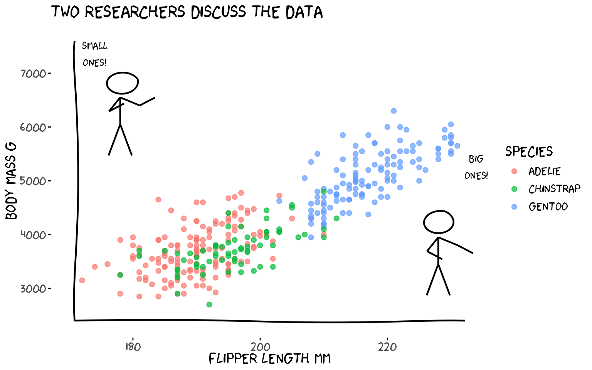
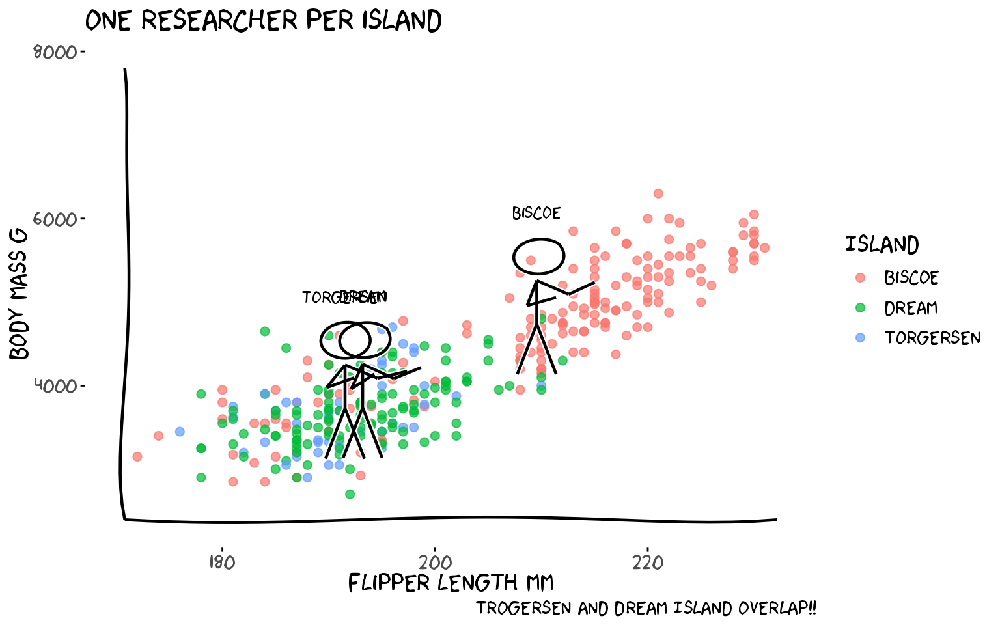
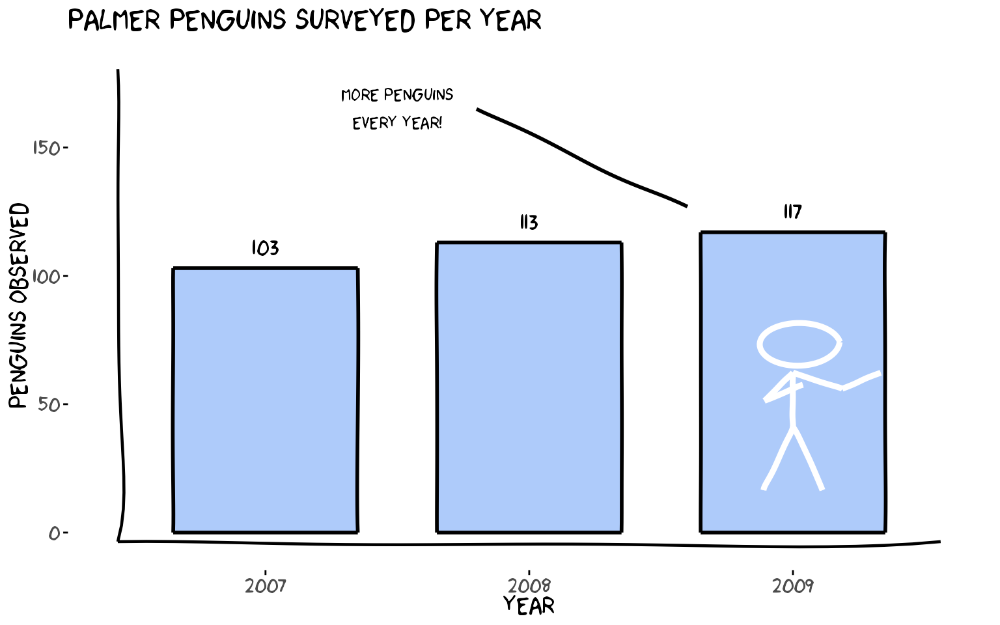

# Palmer Penguins with xkcd

## Overview

This vignette demonstrates every function in the **xkcd** package using
the [Palmer Penguins](https://allisonhorst.github.io/palmerpenguins/)
dataset — a fun alternative to `mtcars` featuring size measurements of
three penguin species observed on islands near Palmer Station,
Antarctica.

[`library`](https://rdrr.io/r/base/library.html)`(`[`xkcd`](https://github.com/ToledoEM/xkcd)`)`` `[`library`](https://rdrr.io/r/base/library.html)`(`[`dplyr`](https://dplyr.tidyverse.org)`)`` `[`library`](https://rdrr.io/r/base/library.html)`(`[`palmerpenguins`](https://allisonhorst.github.io/palmerpenguins/)`)`` `` ``# Drop rows with missing values for cleaner plots`` ``penguins`` ``<-`` `[`na.omit`](https://rdrr.io/r/stats/na.fail.html)`(``penguins``)`

> **Reproducibility note:** All plots use
> [`set.seed()`](https://rdrr.io/r/base/Random.html) because xkcd lines
> are drawn with random jitter — fix the seed to get the same figure
> every time.

------------------------------------------------------------------------

## 1. `theme_xkcd()` — The XKCD Look

[`theme_xkcd()`](https://toledoem.github.io/xkcd/reference/theme_xkcd.md)
applies a hand-drawn feel to any ggplot2 chart: no grid lines, black
axis ticks, and — if the xkcd font is installed — the iconic comic font.

[`set.seed`](https://rdrr.io/r/base/Random.html)`(``123456``)`` `[`ggplot`](https://ggplot2.tidyverse.org/reference/ggplot.html)`(``penguins``, `[`aes`](https://ggplot2.tidyverse.org/reference/aes.html)`(``flipper_length_mm``, ``body_mass_g``, colour ``=`` ``species``)``)`` ``+`` `` `[`geom_point`](https://ggplot2.tidyverse.org/reference/geom_point.html)`(``size ``=`` ``2``, alpha ``=`` ``0.7``)`` ``+`` `` `[`labs`](https://ggplot2.tidyverse.org/reference/labs.html)`(`` `` title ``=`` ``"Flipper length vs body mass"``,`` `` x ``=`` ``"Flipper length mm"``,`` `` y ``=`` ``"Body mass g"``,`` `` colour ``=`` ``"Species"`` `` ``)`` ``+`` `` `[`theme_xkcd`](https://toledoem.github.io/xkcd/reference/theme_xkcd.md)`(``)`

[`theme_xkcd()`](https://toledoem.github.io/xkcd/reference/theme_xkcd.md)
returns a standard ggplot2 `theme` object, so you can layer additional
[`theme()`](https://ggplot2.tidyverse.org/reference/theme.html) calls on
top of it.

------------------------------------------------------------------------

## 2. `xkcdaxis()` — Hand-Drawn Axes

[`xkcdaxis()`](https://toledoem.github.io/xkcd/reference/xkcdaxis.md)
replaces the default ggplot2 axis lines with wobbly, hand-drawn ones.
Pass the x and y ranges of your data and it adds jittered axis arrows, a
clipped coordinate system, and calls
[`theme_xkcd()`](https://toledoem.github.io/xkcd/reference/theme_xkcd.md)
internally.

`xrange`` ``<-`` `[`range`](https://rdrr.io/r/base/range.html)`(``penguins``$``bill_length_mm``)`` ``yrange`` ``<-`` `[`range`](https://rdrr.io/r/base/range.html)`(``penguins``$``bill_depth_mm``)`` `` `[`set.seed`](https://rdrr.io/r/base/Random.html)`(``7``)`` `[`ggplot`](https://ggplot2.tidyverse.org/reference/ggplot.html)`(``)`` ``+`` `` `[`geom_point`](https://ggplot2.tidyverse.org/reference/geom_point.html)`(`` `` `[`aes`](https://ggplot2.tidyverse.org/reference/aes.html)`(``bill_length_mm``, ``bill_depth_mm``, colour ``=`` ``species``)``,`` `` data ``=`` ``penguins``, size ``=`` ``2``, alpha ``=`` ``0.8`` `` ``)`` ``+`` `` `[`xkcdaxis`](https://toledoem.github.io/xkcd/reference/xkcdaxis.md)`(``xrange``, ``yrange``)`` ``+`` `` `[`labs`](https://ggplot2.tidyverse.org/reference/labs.html)`(`` `` x ``=`` ``"Bill length mm"``,`` `` y ``=`` ``"Bill depth mm"``,`` `` colour ``=`` ``"Species"``,`` `` title ``=`` ``"Bill dimensions by species"`` `` ``)`

[`xkcdaxis()`](https://toledoem.github.io/xkcd/reference/xkcdaxis.md)
returns a list of ggplot2 layers — just `+` it onto any plot.

------------------------------------------------------------------------

## 3. `geom_xkcdpath()` — Wobbly Lines and Segments

[`geom_xkcdpath()`](https://toledoem.github.io/xkcd/reference/geom_xkcdpath.md)
is the low-level building block used by the other functions. It draws
jittered, Bezier-smoothed line **segments** (using `x`, `y`, `xend`,
`yend`) or fuzzy **circles** (using `x`, `y`, `diameter`).

### 3a. Annotating a trend with a segment

`# Gentoo penguins — add an arrow-like segment pointing at the cluster`` ``xrange`` ``<-`` `[`range`](https://rdrr.io/r/base/range.html)`(``penguins``$``flipper_length_mm``)`` ``yrange`` ``<-`` `[`range`](https://rdrr.io/r/base/range.html)`(``penguins``$``body_mass_g``)`` `` ``arrow_df`` ``<-`` `[`data.frame`](https://rdrr.io/r/base/data.frame.html)`(`` `` x ``=`` ``228``, y ``=`` ``4200``,`` `` xend ``=`` ``220``, yend ``=`` ``5300`` ``)`` `` `[`set.seed`](https://rdrr.io/r/base/Random.html)`(``99``)`` `[`ggplot`](https://ggplot2.tidyverse.org/reference/ggplot.html)`(``)`` ``+`` `` `[`geom_point`](https://ggplot2.tidyverse.org/reference/geom_point.html)`(`` `` `[`aes`](https://ggplot2.tidyverse.org/reference/aes.html)`(``flipper_length_mm``, ``body_mass_g``, colour ``=`` ``species``)``,`` `` data ``=`` ``penguins``, size ``=`` ``2``, alpha ``=`` ``0.7`` `` ``)`` ``+`` `` `[`geom_xkcdpath`](https://toledoem.github.io/xkcd/reference/geom_xkcdpath.md)`(`` `` mapping ``=`` `[`aes`](https://ggplot2.tidyverse.org/reference/aes.html)`(``x ``=`` ``x``, y ``=`` ``y``, xend ``=`` ``xend``, yend ``=`` ``yend``)``,`` `` data ``=`` ``arrow_df``,`` `` linewidth ``=`` ``1``, xjitteramount ``=`` ``1``, yjitteramount ``=`` ``60``,`` `` mask ``=`` ``TRUE`` `` ``)`` ``+`` `` `[`annotate`](https://ggplot2.tidyverse.org/reference/annotate.html)`(``"text"``, x ``=`` ``230``, y ``=`` ``4100``,`` `` label ``=`` ``"Big Gentoos!"``, family ``=`` ``"xkcd"``, size ``=`` ``5``)`` ``+`` `` `[`xkcdaxis`](https://toledoem.github.io/xkcd/reference/xkcdaxis.md)`(``xrange``, ``yrange``)`` ``+`` `` `[`labs`](https://ggplot2.tidyverse.org/reference/labs.html)`(``x ``=`` ``"Flipper length mm"``, y ``=`` ``"Body mass g"``, colour ``=`` ``"Species"``)`

### 3b. Drawing a circle

Use `diameter` instead of `xend`/`yend` to draw a fuzzy circle. The
`ratioxy` aesthetic keeps the circle from looking like an ellipse when x
and y have different scales.

`xrange`` ``<-`` `[`c`](https://rdrr.io/r/base/c.html)`(``160``, ``240``)`` ``yrange`` ``<-`` `[`c`](https://rdrr.io/r/base/c.html)`(``2500``, ``6500``)`` ``ratioxy`` ``<-`` `[`diff`](https://rdrr.io/r/base/diff.html)`(``xrange``)`` ``/`` `[`diff`](https://rdrr.io/r/base/diff.html)`(``yrange``)`` `` ``# diameter is in x-axis units; ratioxy corrects for the different x/y scales`` ``# so the circle appears round on screen`` ``circle_df`` ``<-`` `[`data.frame`](https://rdrr.io/r/base/data.frame.html)`(``x ``=`` ``200``, y ``=`` ``4000``, diameter ``=`` ``20``)`` `` `[`set.seed`](https://rdrr.io/r/base/Random.html)`(``5``)`` `[`ggplot`](https://ggplot2.tidyverse.org/reference/ggplot.html)`(``)`` ``+`` `` `[`geom_point`](https://ggplot2.tidyverse.org/reference/geom_point.html)`(`` `` `[`aes`](https://ggplot2.tidyverse.org/reference/aes.html)`(``flipper_length_mm``, ``body_mass_g``, colour ``=`` ``species``)``,`` `` data ``=`` ``penguins``, size ``=`` ``2``, alpha ``=`` ``0.7`` `` ``)`` ``+`` `` `[`geom_xkcdpath`](https://toledoem.github.io/xkcd/reference/geom_xkcdpath.md)`(`` `` `[`aes`](https://ggplot2.tidyverse.org/reference/aes.html)`(``x ``=`` ``x``, y ``=`` ``y``, diameter ``=`` ``diameter``)``,`` `` data ``=`` ``circle_df``, linewidth ``=`` ``1.2``, colour ``=`` ``"firebrick"``,`` `` ratioxy ``=`` ``ratioxy``, mask ``=`` ``FALSE`` `` ``)`` ``+`` `` `[`annotate`](https://ggplot2.tidyverse.org/reference/annotate.html)`(``"text"``, x ``=`` ``200``, y ``=`` ``3600``,`` `` label ``=`` ``"Overlap zone"``, family ``=`` ``"xkcd"``, size ``=`` ``4``, colour ``=`` ``"firebrick"``)`` ``+`` `` `[`xkcdaxis`](https://toledoem.github.io/xkcd/reference/xkcdaxis.md)`(``xrange``, ``yrange``)`` ``+`` `` `[`labs`](https://ggplot2.tidyverse.org/reference/labs.html)`(``x ``=`` ``"Flipper length mm"``, y ``=`` ``"Body mass g"``, colour ``=`` ``"Species"``,`` `` title ``=`` ``"A fuzzy circle highlights the overlap zone"``)`

------------------------------------------------------------------------

## 4. `xkcdrect()` — Fuzzy Rectangles

[`xkcdrect()`](https://toledoem.github.io/xkcd/reference/xkcdrect.md)
draws filled rectangles with wobbly hand-drawn borders, perfect for
bar-chart-style plots. Required aesthetics: `xmin`, `xmax`, `ymin`,
`ymax`.

`# Average body mass per species as a bar chart using fuzzy rectangles`` ``avg_mass`` ``<-`` ``penguins`` ``|>`` `` `[`group_by`](https://dplyr.tidyverse.org/reference/group_by.html)`(``species``)`` ``|>`` `` `[`summarise`](https://dplyr.tidyverse.org/reference/summarise.html)`(``mean_mass ``=`` `[`mean`](https://rdrr.io/r/base/mean.html)`(``body_mass_g``)``, .groups ``=`` ``"drop"``)`` ``|>`` `` `[`mutate`](https://dplyr.tidyverse.org/reference/mutate.html)`(`` `` xmin ``=`` `[`as.numeric`](https://rdrr.io/r/base/numeric.html)`(``species``)`` ``-`` ``0.35``,`` `` xmax ``=`` `[`as.numeric`](https://rdrr.io/r/base/numeric.html)`(``species``)`` ``+`` ``0.35``,`` `` ymin ``=`` ``0``,`` `` ymax ``=`` ``mean_mass`` `` ``)`` `` ``xrange`` ``<-`` `[`c`](https://rdrr.io/r/base/c.html)`(``0.5``, ``3.5``)`` ``yrange`` ``<-`` `[`c`](https://rdrr.io/r/base/c.html)`(``0``, `[`max`](https://rdrr.io/r/base/Extremes.html)`(``avg_mass``$``mean_mass``)`` ``+`` ``300``)`` `` `[`set.seed`](https://rdrr.io/r/base/Random.html)`(``11``)`` `[`ggplot`](https://ggplot2.tidyverse.org/reference/ggplot.html)`(``)`` ``+`` `` `[`xkcdrect`](https://toledoem.github.io/xkcd/reference/xkcdrect.md)`(`` `` `[`aes`](https://ggplot2.tidyverse.org/reference/aes.html)`(``xmin ``=`` ``xmin``, xmax ``=`` ``xmax``, ymin ``=`` ``ymin``, ymax ``=`` ``ymax``)``,`` `` data ``=`` ``avg_mass``,`` `` fill ``=`` `[`c`](https://rdrr.io/r/base/c.html)`(``"#f28e2b"``, ``"#4e79a7"``, ``"#59a14f"``)``,`` `` colour ``=`` ``"black"``,`` `` linewidth ``=`` ``1`` `` ``)`` ``+`` `` `[`annotate`](https://ggplot2.tidyverse.org/reference/annotate.html)`(``"text"``,`` `` x ``=`` ``1``:``3``,`` `` y ``=`` ``avg_mass``$``mean_mass`` ``+`` ``150``,`` `` label ``=`` `[`levels`](https://rdrr.io/r/base/levels.html)`(``penguins``$``species``)``,`` `` family ``=`` ``"xkcd"``, size ``=`` ``5``)`` ``+`` `` `[`xkcdaxis`](https://toledoem.github.io/xkcd/reference/xkcdaxis.md)`(``xrange``, ``yrange``)`` ``+`` `` `[`scale_x_continuous`](https://ggplot2.tidyverse.org/reference/scale_continuous.html)`(``breaks ``=`` ``1``:``3``, labels ``=`` `[`levels`](https://rdrr.io/r/base/levels.html)`(``penguins``$``species``)``)`` ``+`` `` `[`labs`](https://ggplot2.tidyverse.org/reference/labs.html)`(`` `` x ``=`` ``"Species"``,`` `` y ``=`` ``"Mean body mass g"``,`` `` title ``=`` ``"Average penguin weight"`` `` ``)`

------------------------------------------------------------------------

## 5. `xkcdman()` — Stick Figures

[`xkcdman()`](https://toledoem.github.io/xkcd/reference/xkcdman.md)
draws a customisable stick figure. Every body part (spine, arms, legs,
neck) is controlled by an angle. The key parameters are:

| Aesthetic | Meaning |
|----|----|
| `x`, `y` | Head position |
| `scale` | Overall size |
| `ratioxy` | x/y scale ratio (keeps figure from being distorted) |
| `angleofspine` | Spine angle (−π/2 = upright) |
| `anglerighthumerus` / `anglelefthumerus` | Upper arm angles |
| `anglerightradius` / `angleleftradius` | Lower arm angles |
| `anglerightleg` / `angleleftleg` | Leg angles |
| `angleofneck` | Neck angle |

### 5a. Two penguin researchers

The key to well-proportioned stick figures is `scale` and `ratioxy`.
`scale` should be ~10–15% of `diff(yrange)` so the figure is visible.
`ratioxy = diff(xrange) / diff(yrange)` corrects for axis distortion so
limbs don’t look stretched. Place figures **above** the data cloud,
inside the plot limits, and expand `yrange` to make room.

`xrange`` ``<-`` `[`range`](https://rdrr.io/r/base/range.html)`(``penguins``$``flipper_length_mm``)`` ``# Expand y upward to give room for figures above the data`` ``yrange`` ``<-`` `[`c`](https://rdrr.io/r/base/c.html)`(`[`min`](https://rdrr.io/r/base/Extremes.html)`(``penguins``$``body_mass_g``)`` ``-`` ``200``, `[`max`](https://rdrr.io/r/base/Extremes.html)`(``penguins``$``body_mass_g``)`` ``+`` ``1200``)`` ``ratioxy`` ``<-`` `[`diff`](https://rdrr.io/r/base/diff.html)`(``xrange``)`` ``/`` `[`diff`](https://rdrr.io/r/base/diff.html)`(``yrange``)`` `` ``# scale ≈ 10% of yrange so figures are clearly visible`` ``scale_val`` ``<-`` `[`diff`](https://rdrr.io/r/base/diff.html)`(``yrange``)`` ``*`` ``0.10`` `` ``dataman`` ``<-`` `[`data.frame`](https://rdrr.io/r/base/data.frame.html)`(`` `` x ``=`` `[`c`](https://rdrr.io/r/base/c.html)`(``178``, ``228``)``,`` `` y ``=`` `[`c`](https://rdrr.io/r/base/c.html)`(`[`max`](https://rdrr.io/r/base/Extremes.html)`(``penguins``$``body_mass_g``)`` ``+`` ``500``,`` `` `[`min`](https://rdrr.io/r/base/Extremes.html)`(``penguins``$``body_mass_g``)`` ``+`` ``1500``)``,`` `` scale ``=`` ``scale_val``,`` `` ratioxy ``=`` ``ratioxy``,`` `` angleofspine ``=`` ``-``pi`` ``/`` ``2``,`` `` anglerighthumerus ``=`` `[`c`](https://rdrr.io/r/base/c.html)`(``-``pi`` ``/`` ``6``, ``-``pi`` ``/`` ``6``)``,`` `` anglelefthumerus ``=`` `[`c`](https://rdrr.io/r/base/c.html)`(``-``pi`` ``/`` ``2`` ``-`` ``pi`` ``/`` ``6``, ``-``pi`` ``/`` ``2`` ``-`` ``pi`` ``/`` ``6``)``,`` `` anglerightradius ``=`` `[`c`](https://rdrr.io/r/base/c.html)`(``pi`` ``/`` ``5``, ``-``pi`` ``/`` ``5``)``,`` `` angleleftradius ``=`` `[`c`](https://rdrr.io/r/base/c.html)`(``pi`` ``/`` ``5``, ``-``pi`` ``/`` ``5``)``,`` `` anglerightleg ``=`` ``3`` ``*`` ``pi`` ``/`` ``2`` ``-`` ``pi`` ``/`` ``12``,`` `` angleleftleg ``=`` ``3`` ``*`` ``pi`` ``/`` ``2`` ``+`` ``pi`` ``/`` ``12``,`` `` angleofneck ``=`` ``-``pi`` ``/`` ``2`` ``)`` `` ``mapping`` ``<-`` `[`aes`](https://ggplot2.tidyverse.org/reference/aes.html)`(`` `` x ``=`` ``x``, y ``=`` ``y``, scale ``=`` ``scale``, ratioxy ``=`` ``ratioxy``,`` `` angleofspine ``=`` ``angleofspine``,`` `` anglerighthumerus ``=`` ``anglerighthumerus``,`` `` anglelefthumerus ``=`` ``anglelefthumerus``,`` `` anglerightradius ``=`` ``anglerightradius``,`` `` angleleftradius ``=`` ``angleleftradius``,`` `` anglerightleg ``=`` ``anglerightleg``,`` `` angleleftleg ``=`` ``angleleftleg``,`` `` angleofneck ``=`` ``angleofneck`` ``)`` `` `[`set.seed`](https://rdrr.io/r/base/Random.html)`(``22``)`` `[`ggplot`](https://ggplot2.tidyverse.org/reference/ggplot.html)`(``)`` ``+`` `` `[`geom_point`](https://ggplot2.tidyverse.org/reference/geom_point.html)`(`` `` `[`aes`](https://ggplot2.tidyverse.org/reference/aes.html)`(``flipper_length_mm``, ``body_mass_g``, colour ``=`` ``species``)``,`` `` data ``=`` ``penguins``, size ``=`` ``2``, alpha ``=`` ``0.7`` `` ``)`` ``+`` `` `[`xkcdaxis`](https://toledoem.github.io/xkcd/reference/xkcdaxis.md)`(``xrange``, ``yrange``)`` ``+`` `` `[`xkcdman`](https://toledoem.github.io/xkcd/reference/xkcdman.md)`(``mapping``, ``dataman``)`` ``+`` `` `[`annotate`](https://ggplot2.tidyverse.org/reference/annotate.html)`(``"text"``, x ``=`` ``174``, y ``=`` `[`max`](https://rdrr.io/r/base/Extremes.html)`(``penguins``$``body_mass_g``)`` ``+`` ``1050``,`` `` label ``=`` ``"Small\nones!"``, family ``=`` ``"xkcd"``, size ``=`` ``4``)`` ``+`` `` `[`annotate`](https://ggplot2.tidyverse.org/reference/annotate.html)`(``"text"``, x ``=`` ``234``, y ``=`` `[`max`](https://rdrr.io/r/base/Extremes.html)`(``penguins``$``body_mass_g``)`` ``-`` ``1050``,`` `` label ``=`` ``"Big\nones!"``, family ``=`` ``"xkcd"``, size ``=`` ``4``)`` ``+`` `` `[`labs`](https://ggplot2.tidyverse.org/reference/labs.html)`(``x ``=`` ``"Flipper length mm"``, y ``=`` ``"Body mass g"``, colour ``=`` ``"Species"``,`` `` title ``=`` ``"Two researchers discuss the data"``)`

### 5b. One stick figure per island

One figure stands at the centroid of each island’s data.
[`runif()`](https://rdrr.io/r/stats/Uniform.html) gives each figure a
slightly different pose.

`island_means`` ``<-`` ``penguins`` ``|>`` `` `[`group_by`](https://dplyr.tidyverse.org/reference/group_by.html)`(``island``)`` ``|>`` `` `[`summarise`](https://dplyr.tidyverse.org/reference/summarise.html)`(`` `` mx ``=`` `[`mean`](https://rdrr.io/r/base/mean.html)`(``flipper_length_mm``)``,`` `` my ``=`` `[`mean`](https://rdrr.io/r/base/mean.html)`(``body_mass_g``)``,`` `` .groups ``=`` ``"drop"`` `` ``)`` `` ``xrange`` ``<-`` `[`range`](https://rdrr.io/r/base/range.html)`(``penguins``$``flipper_length_mm``)`` ``yrange`` ``<-`` `[`c`](https://rdrr.io/r/base/c.html)`(`[`min`](https://rdrr.io/r/base/Extremes.html)`(``penguins``$``body_mass_g``)`` ``-`` ``200``, `[`max`](https://rdrr.io/r/base/Extremes.html)`(``penguins``$``body_mass_g``)`` ``+`` ``1400``)`` ``ratioxy`` ``<-`` `[`diff`](https://rdrr.io/r/base/diff.html)`(``xrange``)`` ``/`` `[`diff`](https://rdrr.io/r/base/diff.html)`(``yrange``)`` ``scale_val`` ``<-`` `[`diff`](https://rdrr.io/r/base/diff.html)`(``yrange``)`` ``*`` ``0.10`` `` `[`set.seed`](https://rdrr.io/r/base/Random.html)`(``33``)`` ``dataman`` ``<-`` `[`data.frame`](https://rdrr.io/r/base/data.frame.html)`(`` `` x ``=`` ``island_means``$``mx``,`` `` y ``=`` ``island_means``$``my`` ``+`` ``800``,`` `` scale ``=`` ``scale_val``,`` `` ratioxy ``=`` ``ratioxy``,`` `` angleofspine ``=`` ``-``pi`` ``/`` ``2``,`` `` anglerighthumerus ``=`` `[`runif`](https://rdrr.io/r/stats/Uniform.html)`(``3``, ``-``pi`` ``/`` ``6`` ``-`` ``pi`` ``/`` ``10``, ``-``pi`` ``/`` ``6`` ``+`` ``pi`` ``/`` ``10``)``,`` `` anglelefthumerus ``=`` `[`runif`](https://rdrr.io/r/stats/Uniform.html)`(``3``, ``-``pi`` ``/`` ``2`` ``-`` ``pi`` ``/`` ``6`` ``-`` ``pi`` ``/`` ``10``, ``-``pi`` ``/`` ``2`` ``-`` ``pi`` ``/`` ``6`` ``+`` ``pi`` ``/`` ``10``)``,`` `` anglerightradius ``=`` `[`runif`](https://rdrr.io/r/stats/Uniform.html)`(``3``, ``pi`` ``/`` ``5`` ``-`` ``pi`` ``/`` ``10``, ``pi`` ``/`` ``5`` ``+`` ``pi`` ``/`` ``10``)``,`` `` angleleftradius ``=`` `[`runif`](https://rdrr.io/r/stats/Uniform.html)`(``3``, ``pi`` ``/`` ``5`` ``-`` ``pi`` ``/`` ``10``, ``pi`` ``/`` ``5`` ``+`` ``pi`` ``/`` ``10``)``,`` `` anglerightleg ``=`` ``3`` ``*`` ``pi`` ``/`` ``2`` ``-`` ``pi`` ``/`` ``12``,`` `` angleleftleg ``=`` ``3`` ``*`` ``pi`` ``/`` ``2`` ``+`` ``pi`` ``/`` ``12``,`` `` angleofneck ``=`` ``-``pi`` ``/`` ``2`` ``)`` `` ``mapping`` ``<-`` `[`aes`](https://ggplot2.tidyverse.org/reference/aes.html)`(`` `` x ``=`` ``x``, y ``=`` ``y``, scale ``=`` ``scale``, ratioxy ``=`` ``ratioxy``,`` `` angleofspine ``=`` ``angleofspine``,`` `` anglerighthumerus ``=`` ``anglerighthumerus``,`` `` anglelefthumerus ``=`` ``anglelefthumerus``,`` `` anglerightradius ``=`` ``anglerightradius``,`` `` angleleftradius ``=`` ``angleleftradius``,`` `` anglerightleg ``=`` ``anglerightleg``,`` `` angleleftleg ``=`` ``angleleftleg``,`` `` angleofneck ``=`` ``angleofneck`` ``)`` `` `[`set.seed`](https://rdrr.io/r/base/Random.html)`(``33``)`` `[`ggplot`](https://ggplot2.tidyverse.org/reference/ggplot.html)`(``)`` ``+`` `` `[`geom_point`](https://ggplot2.tidyverse.org/reference/geom_point.html)`(`` `` `[`aes`](https://ggplot2.tidyverse.org/reference/aes.html)`(``flipper_length_mm``, ``body_mass_g``, colour ``=`` ``island``)``,`` `` data ``=`` ``penguins``, size ``=`` ``2``, alpha ``=`` ``0.7`` `` ``)`` ``+`` `` `[`xkcdaxis`](https://toledoem.github.io/xkcd/reference/xkcdaxis.md)`(``xrange``, ``yrange``)`` ``+`` `` `[`xkcdman`](https://toledoem.github.io/xkcd/reference/xkcdman.md)`(``mapping``, ``dataman``)`` ``+`` `` `[`annotate`](https://ggplot2.tidyverse.org/reference/annotate.html)`(``"text"``,`` `` x ``=`` ``island_means``$``mx``,`` `` y ``=`` ``island_means``$``my`` ``+`` ``1350``,`` `` label ``=`` ``island_means``$``island``,`` `` family ``=`` ``"xkcd"``, size ``=`` ``4``)`` ``+`` `` `[`labs`](https://ggplot2.tidyverse.org/reference/labs.html)`(``x ``=`` ``"Flipper length mm"``, y ``=`` ``"Body mass g"``, colour ``=`` ``"Island"``,`` `` title ``=`` ``"One researcher per island"``,caption ``=`` ``"Trogersen and Dream Island overlap!!"``)`

------------------------------------------------------------------------

## 6. Putting It All Together

A single plot that uses every function:
[`theme_xkcd()`](https://toledoem.github.io/xkcd/reference/theme_xkcd.md),
[`xkcdaxis()`](https://toledoem.github.io/xkcd/reference/xkcdaxis.md),
[`xkcdrect()`](https://toledoem.github.io/xkcd/reference/xkcdrect.md),
[`xkcdman()`](https://toledoem.github.io/xkcd/reference/xkcdman.md), and
[`geom_xkcdpath()`](https://toledoem.github.io/xkcd/reference/geom_xkcdpath.md).

`# Yearly penguin count as fuzzy bars + a stick figure + annotation arrow`` ``counts`` ``<-`` ``penguins`` ``|>`` `` `[`group_by`](https://dplyr.tidyverse.org/reference/group_by.html)`(``year``, ``species``)`` ``|>`` `` `[`summarise`](https://dplyr.tidyverse.org/reference/summarise.html)`(``n ``=`` `[`n`](https://dplyr.tidyverse.org/reference/context.html)`(``)``, .groups ``=`` ``"drop"``)`` ``|>`` `` `[`group_by`](https://dplyr.tidyverse.org/reference/group_by.html)`(``year``)`` ``|>`` `` `[`summarise`](https://dplyr.tidyverse.org/reference/summarise.html)`(``total ``=`` `[`sum`](https://rdrr.io/r/base/sum.html)`(``n``)``, .groups ``=`` ``"drop"``)`` ``|>`` `` `[`mutate`](https://dplyr.tidyverse.org/reference/mutate.html)`(`` `` xmin ``=`` ``year`` ``-`` ``0.35``,`` `` xmax ``=`` ``year`` ``+`` ``0.35``,`` `` ymin ``=`` ``0``,`` `` ymax ``=`` ``total`` `` ``)`` `` ``xrange`` ``<-`` `[`c`](https://rdrr.io/r/base/c.html)`(``2006.5``, ``2009.5``)`` ``# Expand y to give the figure room above the tallest bar`` ``yrange`` ``<-`` `[`c`](https://rdrr.io/r/base/c.html)`(``0``, `[`max`](https://rdrr.io/r/base/Extremes.html)`(``counts``$``total``)`` ``+`` ``60``)`` ``ratioxy`` ``<-`` `[`diff`](https://rdrr.io/r/base/diff.html)`(``xrange``)`` ``/`` `[`diff`](https://rdrr.io/r/base/diff.html)`(``yrange``)`` ``scale_val`` ``<-`` `[`diff`](https://rdrr.io/r/base/diff.html)`(``yrange``)`` ``*`` ``0.12`` ``# ~12% of y range = clearly visible`` `` ``# Figure stands above the 2009 bar (tallest), pointing left`` ``dataman`` ``<-`` `[`data.frame`](https://rdrr.io/r/base/data.frame.html)`(`` `` x ``=`` ``2009``,`` `` y ``=`` `[`min`](https://rdrr.io/r/base/Extremes.html)`(``counts``$``total``)`` ``-`` ``30``,`` `` scale ``=`` ``scale_val``,`` `` ratioxy ``=`` ``ratioxy``,`` `` angleofspine ``=`` ``-``pi`` ``/`` ``2``,`` `` anglerighthumerus ``=`` ``-``pi`` ``/`` ``6``,`` `` anglelefthumerus ``=`` ``-``pi`` ``/`` ``2`` ``-`` ``pi`` ``/`` ``6``,`` `` anglerightradius ``=`` ``pi`` ``/`` ``5``,`` `` angleleftradius ``=`` ``pi`` ``/`` ``5``,`` `` anglerightleg ``=`` ``3`` ``*`` ``pi`` ``/`` ``2`` ``-`` ``pi`` ``/`` ``12``,`` `` angleleftleg ``=`` ``3`` ``*`` ``pi`` ``/`` ``2`` ``+`` ``pi`` ``/`` ``12``,`` `` angleofneck ``=`` ``-``pi`` ``/`` ``2`` ``)`` `` ``man_mapping`` ``<-`` `[`aes`](https://ggplot2.tidyverse.org/reference/aes.html)`(`` `` x ``=`` ``x``, y ``=`` ``y``, scale ``=`` ``scale``, ratioxy ``=`` ``ratioxy``,`` `` angleofspine ``=`` ``angleofspine``,`` `` anglerighthumerus ``=`` ``anglerighthumerus``,`` `` anglelefthumerus ``=`` ``anglelefthumerus``,`` `` anglerightradius ``=`` ``anglerightradius``,`` `` angleleftradius ``=`` ``angleleftradius``,`` `` anglerightleg ``=`` ``anglerightleg``,`` `` angleleftleg ``=`` ``angleleftleg``,`` `` angleofneck ``=`` ``angleofneck`` ``)`` `` ``# Arrow from annotation label to 2009 bar top`` ``arrow_df`` ``<-`` `[`data.frame`](https://rdrr.io/r/base/data.frame.html)`(`` `` x ``=`` ``2007.8``, y ``=`` `[`max`](https://rdrr.io/r/base/Extremes.html)`(``counts``$``total``)`` ``+`` ``48``,`` `` xend ``=`` ``2008.6``, yend ``=`` `[`max`](https://rdrr.io/r/base/Extremes.html)`(``counts``$``total``)`` ``+`` ``10`` ``)`` `` `[`set.seed`](https://rdrr.io/r/base/Random.html)`(``55``)`` `[`ggplot`](https://ggplot2.tidyverse.org/reference/ggplot.html)`(``)`` ``+`` `` `[`xkcdrect`](https://toledoem.github.io/xkcd/reference/xkcdrect.md)`(`` `` `[`aes`](https://ggplot2.tidyverse.org/reference/aes.html)`(``xmin ``=`` ``xmin``, xmax ``=`` ``xmax``, ymin ``=`` ``ymin``, ymax ``=`` ``ymax``)``,`` `` data ``=`` ``counts``,`` `` fill ``=`` ``"#aecbfa"``, colour ``=`` ``"black"``, linewidth ``=`` ``1`` `` ``)`` ``+`` `` `[`geom_xkcdpath`](https://toledoem.github.io/xkcd/reference/geom_xkcdpath.md)`(`` `` `[`aes`](https://ggplot2.tidyverse.org/reference/aes.html)`(``x ``=`` ``x``, y ``=`` ``y``, xend ``=`` ``xend``, yend ``=`` ``yend``)``,`` `` data ``=`` ``arrow_df``,`` `` linewidth ``=`` ``1``, xjitteramount ``=`` ``0.03``, yjitteramount ``=`` ``3``, mask ``=`` ``TRUE`` `` ``)`` ``+`` `` `[`xkcdman`](https://toledoem.github.io/xkcd/reference/xkcdman.md)`(``man_mapping``, ``dataman``,color``=``"white"``)`` ``+`` `` `[`xkcdaxis`](https://toledoem.github.io/xkcd/reference/xkcdaxis.md)`(``xrange``, ``yrange``)`` ``+`` `` `[`annotate`](https://ggplot2.tidyverse.org/reference/annotate.html)`(``"text"``, x ``=`` ``2007.5``, y ``=`` `[`max`](https://rdrr.io/r/base/Extremes.html)`(``counts``$``total``)`` ``+`` ``48``,`` `` label ``=`` ``"More penguins\nevery year!"``, family ``=`` ``"xkcd"``, size ``=`` ``4``)`` ``+`` `` `[`annotate`](https://ggplot2.tidyverse.org/reference/annotate.html)`(``"text"``, x ``=`` ``counts``$``year``, y ``=`` ``counts``$``total`` ``+`` ``8``,`` `` label ``=`` ``counts``$``total``, family ``=`` ``"xkcd"``, size ``=`` ``5``)`` ``+`` `` `[`scale_x_continuous`](https://ggplot2.tidyverse.org/reference/scale_continuous.html)`(``breaks ``=`` `[`c`](https://rdrr.io/r/base/c.html)`(``2007``, ``2008``, ``2009``)``)`` ``+`` `` `[`labs`](https://ggplot2.tidyverse.org/reference/labs.html)`(``x ``=`` ``"Year"``, y ``=`` ``"Penguins observed"``,`` `` title ``=`` ``"Palmer penguins surveyed per year"``)`

------------------------------------------------------------------------

## Function Quick Reference

| Function | What it does |
|----|----|
| [`theme_xkcd()`](https://toledoem.github.io/xkcd/reference/theme_xkcd.md) | Applies XKCD theme (no grid, comic font if available) |
| `xkcdaxis(xrange, yrange)` | Draws wobbly hand-drawn axes |
| [`geom_xkcdpath()`](https://toledoem.github.io/xkcd/reference/geom_xkcdpath.md) | Draws jittered segments or circles |
| [`xkcdrect()`](https://toledoem.github.io/xkcd/reference/xkcdrect.md) | Draws fuzzy filled rectangles |
| [`xkcdman()`](https://toledoem.github.io/xkcd/reference/xkcdman.md) | Draws a customisable stick figure |

All functions are ggplot2-compatible and can be combined freely with
standard `geom_*`,
[`annotate()`](https://ggplot2.tidyverse.org/reference/annotate.html),
`scale_*`, and `facet_*` calls.
