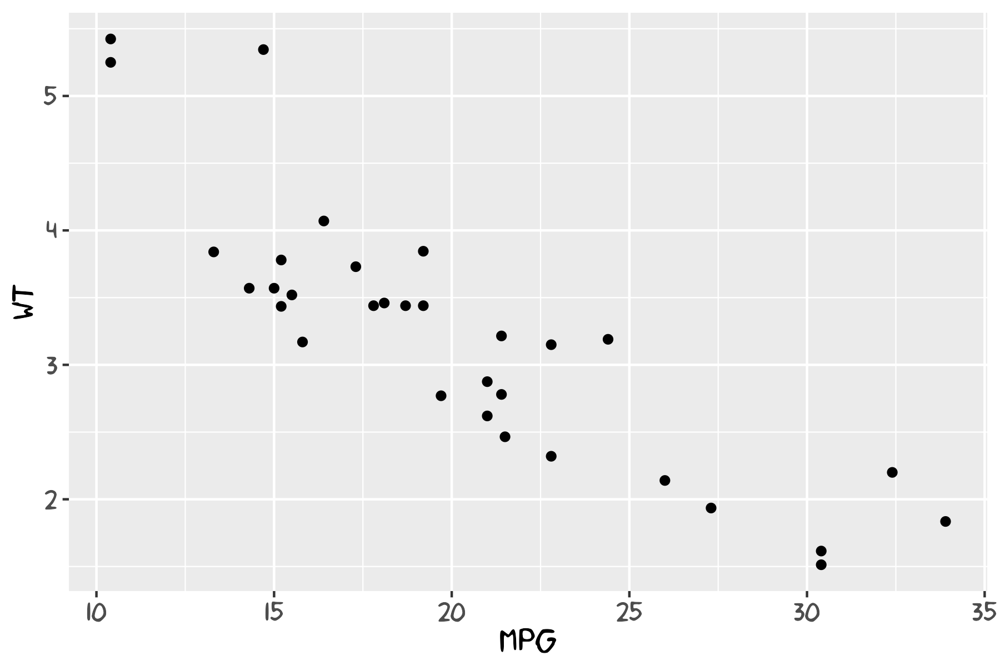
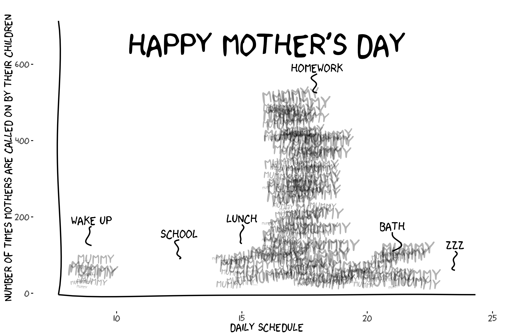
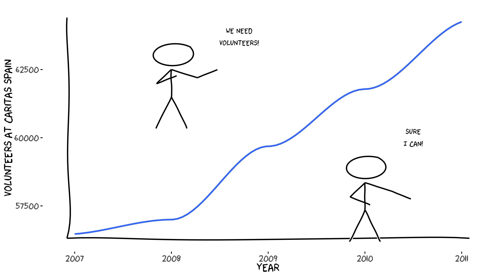

# xkcd

[](https://CRAN.R-project.org/package=xkcd)
[](https://CRAN.R-project.org/package=xkcd)
[](https://opensource.org/licenses/MIT)
[](https://lifecycle.r-lib.org/articles/stages.html#stable)


xkcd package logo

An R package to create hand-drawn (xkcd-style) plots and elements for
ggplot2.

This repository contains the source for the `xkcd` package (development
version). Originally from <https://r-forge.r-project.org/projects/xkcd/>
which is deprecated and now maintained independently.

## Install

Install the latest CRAN version:

[`install.packages`](https://rdrr.io/r/utils/install.packages.html)`(``"xkcd"``)`

Install the current development version from GitHub:

`# using remotes`` ``remotes``::`[`install_github`](https://remotes.r-lib.org/reference/install_github.html)`(``"ToledoEM/xkcd"``)`` `` ``# or using devtools`` ``devtools``::`[`install_github`](https://devtools.r-lib.org/reference/install-deprecated.html)`(``"ToledoEM/xkcd"``)`

## Quick Start

[`library`](https://rdrr.io/r/base/library.html)`(`[`xkcd`](https://github.com/ToledoEM/xkcd)`)`` `[`library`](https://rdrr.io/r/base/library.html)`(`[`ggplot2`](https://ggplot2.tidyverse.org)`)`` `` ``df`` ``<-`` `[`data.frame`](https://rdrr.io/r/base/data.frame.html)`(``x ``=`` ``1``:``10``, y ``=`` `[`cumsum`](https://rdrr.io/r/base/cumsum.html)`(`[`runif`](https://rdrr.io/r/stats/Uniform.html)`(``10``, ``-``0.5``, ``0.8``)``)``)`` `` `[`ggplot`](https://ggplot2.tidyverse.org/reference/ggplot.html)`(``df``, `[`aes`](https://ggplot2.tidyverse.org/reference/aes.html)`(``x ``=`` ``x``, y ``=`` ``y``)``)`` ``+`` `` `[`geom_xkcdpath`](https://toledoem.github.io/xkcd/reference/geom_xkcdpath.md)`(``linewidth ``=`` ``1``, colour ``=`` ``"black"``)`` ``+`` `` `[`theme_xkcd`](https://toledoem.github.io/xkcd/reference/theme_xkcd.md)`(``)`

## Key Notes

- The package uses
  [`Hmisc::bezier()`](https://rdrr.io/pkg/Hmisc/man/labcurve.html)
  internally for smoothing paths.
- Uses `linewidth` (ggplot2 \>= 3.4.0) for line thickness; older code
  using `size` is supported where possible.
- Requires xkcd fonts to be installed; see **Fonts** section below.

### New in 0.1.1

- **Reproducible plots.**
  [`geom_xkcdpath()`](https://toledoem.github.io/xkcd/reference/geom_xkcdpath.md),
  [`xkcdrect()`](https://toledoem.github.io/xkcd/reference/xkcdrect.md)
  and
  [`xkcdman()`](https://toledoem.github.io/xkcd/reference/xkcdman.md)
  take a `seed` argument, so the same plot renders identically every
  time. The global random state is left untouched.

  [`ggplot`](https://ggplot2.tidyverse.org/reference/ggplot.html)`(``df``, `[`aes`](https://ggplot2.tidyverse.org/reference/aes.html)`(``x ``=`` ``x``, y ``=`` ``y``)``)`` ``+`` `` `[`geom_xkcdpath`](https://toledoem.github.io/xkcd/reference/geom_xkcdpath.md)`(``linewidth ``=`` ``1``, seed ``=`` ``42``)`` ``+`` `` `[`theme_xkcd`](https://toledoem.github.io/xkcd/reference/theme_xkcd.md)`(``)`

- **`wobble` argument** scales how much the lines wander. `1` is the
  default look, `0` draws them straight.

- **[`xkcdrect()`](https://toledoem.github.io/xkcd/reference/xkcdrect.md)
  is now a standard geom** (breaking change). It returns a single layer
  and uses the usual `fill`, `colour` and `linewidth` aesthetics, which
  can be mapped to variables. Faceting and plot-level aesthetics now
  work.

  `# before`` `[`xkcdrect`](https://toledoem.github.io/xkcd/reference/xkcdrect.md)`(``mapping``, ``data``, fillcolour ``=`` ``"pink"``, borderlinewidth ``=`` ``1``)`` `` ``# now`` `[`xkcdrect`](https://toledoem.github.io/xkcd/reference/xkcdrect.md)`(``mapping``, ``data``, fill ``=`` ``"pink"``, linewidth ``=`` ``1``)`

  The old `fillcolour` / `bordercolour` / `borderlinewidth` arguments
  still work for one release but warn.

- **[`xkcdline()`](https://toledoem.github.io/xkcd/reference/xkcdline.md)
  is deprecated** in favour of
  [`geom_xkcdpath()`](https://toledoem.github.io/xkcd/reference/geom_xkcdpath.md)
  and warns when used.

## Fonts

To use xkcd fonts in your plots, you need to install and register them
with R’s graphics system.

### Install xkcd Fonts

If xkcd fonts are not already installed on your system:

[`library`](https://rdrr.io/r/base/library.html)`(`[`extrafont`](https://github.com/fbertran/extrafont)`)`` `` ``# Download and install the font`` `[`download.file`](https://rdrr.io/r/utils/download.file.html)`(`` `` ``"https://toledoem.github.io/img/xkcd.ttf"``,`` `` dest ``=`` ``"xkcd.ttf"``, mode ``=`` ``"wb"`` ``)`` `[`font_import`](https://rdrr.io/pkg/extrafont/man/font_import.html)`(``pattern ``=`` ``"[X/x]kcd"``, prompt ``=`` ``FALSE``)`

You can also download the font from the iphyton repository XKCD-font:
[xkcd.ttf](https://github.com/ipython/xkcd-font/blob/master/xkcd-script/font/xkcd-script.ttf?raw=true)

### Quick font-check (fundamental)

Run this small example to verify the `xkcd` font is available and to
produce a quick check plot. This should be run locally after installing
the font and registering it with `extrafont`.

`# Font availability check and example plot`` `[`library`](https://rdrr.io/r/base/library.html)`(`[`extrafont`](https://github.com/fbertran/extrafont)`)`` `[`library`](https://rdrr.io/r/base/library.html)`(`[`ggplot2`](https://ggplot2.tidyverse.org)`)`` `` ``if`` ``(``'xkcd'`` `[`%in%`](https://rdrr.io/r/base/match.html)` ``extrafont``::`[`fonts`](https://rdrr.io/pkg/extrafont/man/fonts.html)`(``)``)`` ``{`` `` ``p`` ``<-`` `[`ggplot`](https://ggplot2.tidyverse.org/reference/ggplot.html)`(``)`` ``+`` `[`geom_point`](https://ggplot2.tidyverse.org/reference/geom_point.html)`(`[`aes`](https://ggplot2.tidyverse.org/reference/aes.html)`(``x ``=`` ``mpg``, y ``=`` ``wt``)``, data ``=`` ``mtcars``)`` ``+`` `` `[`theme`](https://ggplot2.tidyverse.org/reference/theme.html)`(``text ``=`` `[`element_text`](https://ggplot2.tidyverse.org/reference/element.html)`(``size ``=`` ``16``, family ``=`` ``"xkcd"``)``)`` ``}`` ``else`` ``{`` `` `[`warning`](https://rdrr.io/r/base/warning.html)`(``"xkcd fonts are not installed; using default font for plot."``)`` `` ``p`` ``<-`` `[`ggplot`](https://ggplot2.tidyverse.org/reference/ggplot.html)`(``)`` ``+`` `[`geom_point`](https://ggplot2.tidyverse.org/reference/geom_point.html)`(`[`aes`](https://ggplot2.tidyverse.org/reference/aes.html)`(``x ``=`` ``mpg``, y ``=`` ``wt``)``, data ``=`` ``mtcars``)`` ``}`` `` `[`print`](https://rdrr.io/r/base/print.html)`(``p``)`` `` ``` # Optionally save a small PNG to `vignettes/` for documentation purposes ``` `[`try`](https://rdrr.io/r/base/try.html)`(``{`` `` `[`ggsave`](https://ggplot2.tidyverse.org/reference/ggsave.html)`(``filename ``=`` `[`file.path`](https://rdrr.io/r/base/file.path.html)`(``"vignettes"``, ``"font_check.png"``)``, plot ``=`` ``p``, width ``=`` ``6``, height ``=`` ``4``)`` ``}``, silent ``=`` ``TRUE``)`



Font check example plot

### Load Fonts for Plotting

Before plotting, register fonts with your graphics device:

[`library`](https://rdrr.io/r/base/library.html)`(`[`xkcd`](https://github.com/ToledoEM/xkcd)`)`` `[`library`](https://rdrr.io/r/base/library.html)`(`[`extrafont`](https://github.com/fbertran/extrafont)`)`` `` ``# Load fonts for your output device`` ``extrafont``::`[`loadfonts`](https://rdrr.io/pkg/extrafont/man/loadfonts.html)`(``device ``=`` ``"win"``, quiet ``=`` ``TRUE``)`` ``# or "pdf" or "postscript"`` `` ``# Then create your plot`` `[`ggplot`](https://ggplot2.tidyverse.org/reference/ggplot.html)`(``...``)`` ``+`` `[`theme_xkcd`](https://toledoem.github.io/xkcd/reference/theme_xkcd.md)`(``)`

### Automatic Font Loading (opt-in)

To automatically load fonts when the package is attached (opt-in):

`# Set before loading the package`` `[`options`](https://rdrr.io/r/base/options.html)`(``xkcd.auto_load_fonts ``=`` ``TRUE``)`` `[`library`](https://rdrr.io/r/base/library.html)`(`[`xkcd`](https://github.com/ToledoEM/xkcd)`)`

This is opt-in to avoid surprising side-effects during package attach.

## Figure Pose Helper

An interactive browser tool to design
[`xkcdman()`](https://toledoem.github.io/xkcd/reference/xkcdman.md)
poses visually — drag limbs, adjust sliders, and copy the generated R
code directly into your script.

**[Open the Figure Pose
Helper](https://toledoem.github.io/xkcd/stickfigurehelper/index.html)**

## Example Images

Below are two examples from the vignette:



Mother’s Day example (mommy_plot)



Caritas volunteers example (caritas_plot)

## Development

Set up a development workflow with:

**Note:** A TeX distribution (for example, MacTeX or TinyTeX) is
required to compile vignettes or to build the PDF manual during
development. If LaTeX is not available you can either skip the manual
with `--no-manual` when checking or install TinyTeX from R:

`# from R: install tinytex and the TinyTeX distribution`` `[`install.packages`](https://rdrr.io/r/utils/install.packages.html)`(``"tinytex"``)`` ``tinytex``::`[`install_tinytex`](https://rdrr.io/pkg/tinytex/man/install_tinytex.html)`(``)`

`# Regenerate documentation from roxygen comments`` ``devtools``::`[`document`](https://devtools.r-lib.org/reference/document.html)`(``)`` `` ``# Run package checks (skip PDF manual if LaTeX not installed)`` ``devtools``::`[`check`](https://devtools.r-lib.org/reference/check.html)`(``args ``=`` ``"--no-manual"``)`` `` ``# Build vignettes`` ``devtools``::`[`build_vignettes`](https://devtools.r-lib.org/reference/build_vignettes.html)`(``)`` `` ``# Install from local source`` ``devtools``::`[`install_local`](https://devtools.r-lib.org/reference/install-deprecated.html)`(``)`

To render the vignettes directly:

`rmarkdown``::`[`render`](https://pkgs.rstudio.com/rmarkdown/reference/render.html)`(``"vignettes/xkcd-intro.Rmd"``)`` ``rmarkdown``::`[`render`](https://pkgs.rstudio.com/rmarkdown/reference/render.html)`(``"vignettes/xkcd-figure.Rmd"``)`` ``rmarkdown``::`[`render`](https://pkgs.rstudio.com/rmarkdown/reference/render.html)`(``"vignettes/xkcd-penguins.Rmd"``)`

Three vignettes are available:

- **xkcd-intro** — Introduction and basic usage
- **xkcd-figure** — Drawing xkcd-style stick figures
- **xkcd-penguins** — Example with the Palmer Penguins dataset

## Dependencies

The package requires:

- **ggplot2** — Graphics framework
- **Hmisc** — Bezier curve interpolation
- **grid** — Low-level graphics primitives (ships with R, no install
  needed)
- **extrafont** — Font management

Install dependencies with:

[`install.packages`](https://rdrr.io/r/utils/install.packages.html)`(`[`c`](https://rdrr.io/r/base/c.html)`(``"ggplot2"``, ``"Hmisc"``, ``"extrafont"``)``)`

## Contributing

Contributions, bug reports, and pull requests are welcome. Please open
an issue with a description and minimal reproducible example if
relevant.

## License

This package is released under the **MIT License**. See the
[LICENSE](https://toledoem.github.io/xkcd/LICENSE) file for details.
